---

## 00 Introducción a la práctica y librerías

Para la práctica hemos seleccionado una base de datos obtenida de Kaggle con los precios de viviendas del barrio King County en el estado de Washington (EEUU). Esta base de datos es de dominio público y consta de 21 variables con 21.613 observaciones.

La base de datos puede descargarse en el siguiente enlace: https://www.kaggle.com/swathiachath/kc-housesales-data


Las librerias usadas para esta práctica son las siguientes:

 - Amelia
 - brew
 - bsplus
 - DMwR2
 - car
 - carData
 - caret
 - cluster
 - dplyr
 - egg
 - expss
 - faraway
 - gclus
 - GGally
 - ggplot2
 - gridExtra
 - Hmisc
 - htmltools
 - ISLR
 - kableExtra
 - knitr
 - lattice
 - magrittr
 - mice
 - mlbench
 - RColorBrewer
 - readr
 - sos
 - tidyr
 - VIM
 

<br/>

## 01 Definición de objetivos
Dado que la base de datos elegida ha sido elaborada por una inmobiliaria, consideramos la variable "price", la cual representa el valor de venta de la vivienda, como la variable objetivo de la práctica.
<br/>

### Objetivos generales
- Analizar las variables de la base de datos seleccionada para su comprensión y posterior estudio.
- Aplicar el módelo de regresión lineal múltiple para inferir la variable "price" seleccionada, que corresponde al precio de la vivienda.
<br/>

### Objetivos específicos
1. Separar de los datos en 2 grupos de datos: trainning, control y testing.
    - El grupo training + control contiene el 90% de los datos, con el cual entrenaremos el modelo. 
    - El grupo test contiene el 10% de los datos y se dejará como conjunto aislado hasta el final de la práctica como simulación de datos reales.

2. Realizar un análisis exploratorio inicial de cada una de las variables de la base de datos.
    - Se llevará a cabo separando las variables categóricas de las cualitativas para su posterior estudio.
    
3. Imputar las varaibles faltantes de la base de datos previo estudio
4. Aplicar las transformaciones necesarias a cada una de las variables.
5. Entrenar el modelo matemático de regresión múltiple para la predicción de la varaible precio.
<br/>

## 02 Carga y aislamiento de datos TEST
Carga de los datos (para la lectura correcta asegurarse de tener el archivo "kc_house_data.csv")

```r
relPath <- getwd()
setwd(relPath)
price_tplusc <- read.csv(file="./kc_house_data_missing.csv", sep = ";", header=TRUE, na = c("", "NA"), )
head(price_tplusc)
```

```
##           id       date   price bedrooms bathrooms sqft_living sqft_lot floors
## 1 7129300520 10/13/2014  221900        3      1.00        1180     5650      1
## 2 6414100192 12/09/2014  538000        3      2.25        2570     7242      2
## 3 5631500400  2/25/2015  180000        2      1.00         770    10000      1
## 4 2487200875 12/09/2014  604000        4      3.00          NA     5000      1
## 5 1954400510  2/18/2015  510000        3      2.00        1680     8080      1
## 6 7237550310 05/12/2014 1230000        4      4.50        5420   101930      1
##   waterfront view condition grade sqft_above sqft_basement yr_built
## 1          0    0         3     7       1180             0     1955
## 2          0    0         3     7       2170           400     1951
## 3          0    0         3     6        770             0     1933
## 4          0    0         5     7       1050           910     1965
## 5         NA    0         3     8       1680             0     1987
## 6          0    0         3    11       3890          1530     2001
##   yr_renovated zipcode     lat     long sqft_living15 sqft_lot15
## 1            0   98178 475.112 -122.257          1340       5650
## 2         1991   98125  47.721 -122.319          1690       7639
## 3            0   98028 477.379 -122.233          2720       8062
## 4            0   98136 475.208 -122.393          1360       5000
## 5            0   98074 476.168 -122.045          1800       7503
## 6            0   98053 476.561 -122.005          4760     101930
```

Como ya hemos mencionado anteriormente, en este apartado excluimos de la base de datos el grupo TESTING (10% de los datos) para seguir trabajando con los grupos TRAINING + CONTROL a lo largo de la práctica.

- Training + control: "price_tplusc" (90% de observaciones)
- Testing: "price_testing" (10% de observaciones)


```r
set.seed(737)
inTraining     <- createDataPartition(pull(price_tplusc), p = .9, list = FALSE, times = 1)
price_tplusc   <- slice(price_tplusc, inTraining)
price_testing  <- slice(price_tplusc, -inTraining)
```

Finalmente obtenemos los siguientes grupos de observaciones
<table class="table" style="margin-left: auto; margin-right: auto;">
 <thead>
  <tr>
   <th style="text-align:left;"> Nombre del grupo </th>
   <th style="text-align:left;"> observaciones </th>
  </tr>
 </thead>
<tbody>
  <tr>
   <td style="text-align:left;"> Grupo TRAINING + CONTROL 90% </td>
   <td style="text-align:left;"> 19439 </td>
  </tr>
  <tr>
   <td style="text-align:left;"> Grupo TESTING 10% </td>
   <td style="text-align:left;"> 1941 </td>
  </tr>
</tbody>
</table>
<br/>

## 03 Análisis exploratorio inicial. EDA
En este apartado realizamos un primer análisis para comprender las variables y el estado original en el que se encuentra la base de datos.


```r
#Muestra de las primeras 5 filas de la base de datos
kable(head(price_tplusc)) %>%
  kable_styling() %>%
  scroll_box(width = "100%", height = TRUE)
```

<div style="border: 1px solid #ddd; padding: 0px; overflow-y: scroll; height:TRUE; overflow-x: scroll; width:100%; "><table class="table" style="margin-left: auto; margin-right: auto;">
 <thead>
  <tr>
   <th style="text-align:right;position: sticky; top:0; background-color: #FFFFFF;"> id </th>
   <th style="text-align:left;position: sticky; top:0; background-color: #FFFFFF;"> date </th>
   <th style="text-align:right;position: sticky; top:0; background-color: #FFFFFF;"> price </th>
   <th style="text-align:right;position: sticky; top:0; background-color: #FFFFFF;"> bedrooms </th>
   <th style="text-align:right;position: sticky; top:0; background-color: #FFFFFF;"> bathrooms </th>
   <th style="text-align:right;position: sticky; top:0; background-color: #FFFFFF;"> sqft_living </th>
   <th style="text-align:right;position: sticky; top:0; background-color: #FFFFFF;"> sqft_lot </th>
   <th style="text-align:right;position: sticky; top:0; background-color: #FFFFFF;"> floors </th>
   <th style="text-align:right;position: sticky; top:0; background-color: #FFFFFF;"> waterfront </th>
   <th style="text-align:right;position: sticky; top:0; background-color: #FFFFFF;"> view </th>
   <th style="text-align:right;position: sticky; top:0; background-color: #FFFFFF;"> condition </th>
   <th style="text-align:left;position: sticky; top:0; background-color: #FFFFFF;"> grade </th>
   <th style="text-align:right;position: sticky; top:0; background-color: #FFFFFF;"> sqft_above </th>
   <th style="text-align:right;position: sticky; top:0; background-color: #FFFFFF;"> sqft_basement </th>
   <th style="text-align:right;position: sticky; top:0; background-color: #FFFFFF;"> yr_built </th>
   <th style="text-align:right;position: sticky; top:0; background-color: #FFFFFF;"> yr_renovated </th>
   <th style="text-align:right;position: sticky; top:0; background-color: #FFFFFF;"> zipcode </th>
   <th style="text-align:right;position: sticky; top:0; background-color: #FFFFFF;"> lat </th>
   <th style="text-align:right;position: sticky; top:0; background-color: #FFFFFF;"> long </th>
   <th style="text-align:right;position: sticky; top:0; background-color: #FFFFFF;"> sqft_living15 </th>
   <th style="text-align:right;position: sticky; top:0; background-color: #FFFFFF;"> sqft_lot15 </th>
  </tr>
 </thead>
<tbody>
  <tr>
   <td style="text-align:right;"> 6414100192 </td>
   <td style="text-align:left;"> 12/09/2014 </td>
   <td style="text-align:right;"> 538000 </td>
   <td style="text-align:right;"> 3 </td>
   <td style="text-align:right;"> 2.25 </td>
   <td style="text-align:right;"> 2570 </td>
   <td style="text-align:right;"> 7242 </td>
   <td style="text-align:right;"> 2 </td>
   <td style="text-align:right;"> 0 </td>
   <td style="text-align:right;"> 0 </td>
   <td style="text-align:right;"> 3 </td>
   <td style="text-align:left;"> 7 </td>
   <td style="text-align:right;"> 2170 </td>
   <td style="text-align:right;"> 400 </td>
   <td style="text-align:right;"> 1951 </td>
   <td style="text-align:right;"> 1991 </td>
   <td style="text-align:right;"> 98125 </td>
   <td style="text-align:right;"> 47.721 </td>
   <td style="text-align:right;"> -122.319 </td>
   <td style="text-align:right;"> 1690 </td>
   <td style="text-align:right;"> 7639 </td>
  </tr>
  <tr>
   <td style="text-align:right;"> 5631500400 </td>
   <td style="text-align:left;"> 2/25/2015 </td>
   <td style="text-align:right;"> 180000 </td>
   <td style="text-align:right;"> 2 </td>
   <td style="text-align:right;"> 1.00 </td>
   <td style="text-align:right;"> 770 </td>
   <td style="text-align:right;"> 10000 </td>
   <td style="text-align:right;"> 1 </td>
   <td style="text-align:right;"> 0 </td>
   <td style="text-align:right;"> 0 </td>
   <td style="text-align:right;"> 3 </td>
   <td style="text-align:left;"> 6 </td>
   <td style="text-align:right;"> 770 </td>
   <td style="text-align:right;"> 0 </td>
   <td style="text-align:right;"> 1933 </td>
   <td style="text-align:right;"> 0 </td>
   <td style="text-align:right;"> 98028 </td>
   <td style="text-align:right;"> 477.379 </td>
   <td style="text-align:right;"> -122.233 </td>
   <td style="text-align:right;"> 2720 </td>
   <td style="text-align:right;"> 8062 </td>
  </tr>
  <tr>
   <td style="text-align:right;"> 2487200875 </td>
   <td style="text-align:left;"> 12/09/2014 </td>
   <td style="text-align:right;"> 604000 </td>
   <td style="text-align:right;"> 4 </td>
   <td style="text-align:right;"> 3.00 </td>
   <td style="text-align:right;"> NA </td>
   <td style="text-align:right;"> 5000 </td>
   <td style="text-align:right;"> 1 </td>
   <td style="text-align:right;"> 0 </td>
   <td style="text-align:right;"> 0 </td>
   <td style="text-align:right;"> 5 </td>
   <td style="text-align:left;"> 7 </td>
   <td style="text-align:right;"> 1050 </td>
   <td style="text-align:right;"> 910 </td>
   <td style="text-align:right;"> 1965 </td>
   <td style="text-align:right;"> 0 </td>
   <td style="text-align:right;"> 98136 </td>
   <td style="text-align:right;"> 475.208 </td>
   <td style="text-align:right;"> -122.393 </td>
   <td style="text-align:right;"> 1360 </td>
   <td style="text-align:right;"> 5000 </td>
  </tr>
  <tr>
   <td style="text-align:right;"> 1954400510 </td>
   <td style="text-align:left;"> 2/18/2015 </td>
   <td style="text-align:right;"> 510000 </td>
   <td style="text-align:right;"> 3 </td>
   <td style="text-align:right;"> 2.00 </td>
   <td style="text-align:right;"> 1680 </td>
   <td style="text-align:right;"> 8080 </td>
   <td style="text-align:right;"> 1 </td>
   <td style="text-align:right;"> NA </td>
   <td style="text-align:right;"> 0 </td>
   <td style="text-align:right;"> 3 </td>
   <td style="text-align:left;"> 8 </td>
   <td style="text-align:right;"> 1680 </td>
   <td style="text-align:right;"> 0 </td>
   <td style="text-align:right;"> 1987 </td>
   <td style="text-align:right;"> 0 </td>
   <td style="text-align:right;"> 98074 </td>
   <td style="text-align:right;"> 476.168 </td>
   <td style="text-align:right;"> -122.045 </td>
   <td style="text-align:right;"> 1800 </td>
   <td style="text-align:right;"> 7503 </td>
  </tr>
  <tr>
   <td style="text-align:right;"> 7237550310 </td>
   <td style="text-align:left;"> 05/12/2014 </td>
   <td style="text-align:right;"> 1230000 </td>
   <td style="text-align:right;"> 4 </td>
   <td style="text-align:right;"> 4.50 </td>
   <td style="text-align:right;"> 5420 </td>
   <td style="text-align:right;"> 101930 </td>
   <td style="text-align:right;"> 1 </td>
   <td style="text-align:right;"> 0 </td>
   <td style="text-align:right;"> 0 </td>
   <td style="text-align:right;"> 3 </td>
   <td style="text-align:left;"> 11 </td>
   <td style="text-align:right;"> 3890 </td>
   <td style="text-align:right;"> 1530 </td>
   <td style="text-align:right;"> 2001 </td>
   <td style="text-align:right;"> 0 </td>
   <td style="text-align:right;"> 98053 </td>
   <td style="text-align:right;"> 476.561 </td>
   <td style="text-align:right;"> -122.005 </td>
   <td style="text-align:right;"> 4760 </td>
   <td style="text-align:right;"> 101930 </td>
  </tr>
  <tr>
   <td style="text-align:right;"> 1321400060 </td>
   <td style="text-align:left;"> 6/27/2014 </td>
   <td style="text-align:right;"> 257500 </td>
   <td style="text-align:right;"> 3 </td>
   <td style="text-align:right;"> 2.25 </td>
   <td style="text-align:right;"> 1715 </td>
   <td style="text-align:right;"> 6819 </td>
   <td style="text-align:right;"> 2 </td>
   <td style="text-align:right;"> 0 </td>
   <td style="text-align:right;"> 0 </td>
   <td style="text-align:right;"> 3 </td>
   <td style="text-align:left;"> 7 </td>
   <td style="text-align:right;"> 1715 </td>
   <td style="text-align:right;"> 0 </td>
   <td style="text-align:right;"> 1995 </td>
   <td style="text-align:right;"> 0 </td>
   <td style="text-align:right;"> 98003 </td>
   <td style="text-align:right;"> 473.097 </td>
   <td style="text-align:right;"> -122.327 </td>
   <td style="text-align:right;"> 2238 </td>
   <td style="text-align:right;"> 6819 </td>
  </tr>
</tbody>
</table></div>

```r
#Muestra de variables de la base de datos seleccionada
show_df = data.frame(variable = names(price_tplusc),
           classe = sapply(price_tplusc, typeof),
           first_values = sapply(price_tplusc, function(x) paste0(head(x),  collapse = ", ")),
           row.names = NULL)
kable(show_df) %>%
  kable_styling()
```

<table class="table" style="margin-left: auto; margin-right: auto;">
 <thead>
  <tr>
   <th style="text-align:left;"> variable </th>
   <th style="text-align:left;"> classe </th>
   <th style="text-align:left;"> first_values </th>
  </tr>
 </thead>
<tbody>
  <tr>
   <td style="text-align:left;"> id </td>
   <td style="text-align:left;"> double </td>
   <td style="text-align:left;"> 6414100192, 5631500400, 2487200875, 1954400510, 7237550310, 1321400060 </td>
  </tr>
  <tr>
   <td style="text-align:left;"> date </td>
   <td style="text-align:left;"> integer </td>
   <td style="text-align:left;"> 12/09/2014, 2/25/2015, 12/09/2014, 2/18/2015, 05/12/2014, 6/27/2014 </td>
  </tr>
  <tr>
   <td style="text-align:left;"> price </td>
   <td style="text-align:left;"> double </td>
   <td style="text-align:left;"> 538000, 180000, 604000, 510000, 1230000, 257500 </td>
  </tr>
  <tr>
   <td style="text-align:left;"> bedrooms </td>
   <td style="text-align:left;"> integer </td>
   <td style="text-align:left;"> 3, 2, 4, 3, 4, 3 </td>
  </tr>
  <tr>
   <td style="text-align:left;"> bathrooms </td>
   <td style="text-align:left;"> double </td>
   <td style="text-align:left;"> 2.25, 1, 3, 2, 4.5, 2.25 </td>
  </tr>
  <tr>
   <td style="text-align:left;"> sqft_living </td>
   <td style="text-align:left;"> integer </td>
   <td style="text-align:left;"> 2570, 770, NA, 1680, 5420, 1715 </td>
  </tr>
  <tr>
   <td style="text-align:left;"> sqft_lot </td>
   <td style="text-align:left;"> integer </td>
   <td style="text-align:left;"> 7242, 10000, 5000, 8080, 101930, 6819 </td>
  </tr>
  <tr>
   <td style="text-align:left;"> floors </td>
   <td style="text-align:left;"> double </td>
   <td style="text-align:left;"> 2, 1, 1, 1, 1, 2 </td>
  </tr>
  <tr>
   <td style="text-align:left;"> waterfront </td>
   <td style="text-align:left;"> integer </td>
   <td style="text-align:left;"> 0, 0, 0, NA, 0, 0 </td>
  </tr>
  <tr>
   <td style="text-align:left;"> view </td>
   <td style="text-align:left;"> integer </td>
   <td style="text-align:left;"> 0, 0, 0, 0, 0, 0 </td>
  </tr>
  <tr>
   <td style="text-align:left;"> condition </td>
   <td style="text-align:left;"> integer </td>
   <td style="text-align:left;"> 3, 3, 5, 3, 3, 3 </td>
  </tr>
  <tr>
   <td style="text-align:left;"> grade </td>
   <td style="text-align:left;"> integer </td>
   <td style="text-align:left;"> 7, 6, 7, 8, 11, 7 </td>
  </tr>
  <tr>
   <td style="text-align:left;"> sqft_above </td>
   <td style="text-align:left;"> integer </td>
   <td style="text-align:left;"> 2170, 770, 1050, 1680, 3890, 1715 </td>
  </tr>
  <tr>
   <td style="text-align:left;"> sqft_basement </td>
   <td style="text-align:left;"> integer </td>
   <td style="text-align:left;"> 400, 0, 910, 0, 1530, 0 </td>
  </tr>
  <tr>
   <td style="text-align:left;"> yr_built </td>
   <td style="text-align:left;"> integer </td>
   <td style="text-align:left;"> 1951, 1933, 1965, 1987, 2001, 1995 </td>
  </tr>
  <tr>
   <td style="text-align:left;"> yr_renovated </td>
   <td style="text-align:left;"> integer </td>
   <td style="text-align:left;"> 1991, 0, 0, 0, 0, 0 </td>
  </tr>
  <tr>
   <td style="text-align:left;"> zipcode </td>
   <td style="text-align:left;"> integer </td>
   <td style="text-align:left;"> 98125, 98028, 98136, 98074, 98053, 98003 </td>
  </tr>
  <tr>
   <td style="text-align:left;"> lat </td>
   <td style="text-align:left;"> double </td>
   <td style="text-align:left;"> 47.721, 477.379, 475.208, 476.168, 476.561, 473.097 </td>
  </tr>
  <tr>
   <td style="text-align:left;"> long </td>
   <td style="text-align:left;"> double </td>
   <td style="text-align:left;"> -122.319, -122.233, -122.393, -122.045, -122.005, -122.327 </td>
  </tr>
  <tr>
   <td style="text-align:left;"> sqft_living15 </td>
   <td style="text-align:left;"> integer </td>
   <td style="text-align:left;"> 1690, 2720, 1360, 1800, 4760, 2238 </td>
  </tr>
  <tr>
   <td style="text-align:left;"> sqft_lot15 </td>
   <td style="text-align:left;"> integer </td>
   <td style="text-align:left;"> 7639, 8062, 5000, 7503, 101930, 6819 </td>
  </tr>
</tbody>
</table>

```r
#Tabla resumen con los principales estadísticos
kable(summary(price_tplusc)) %>%
  kable_styling() %>%
  scroll_box(width = "100%", height = TRUE)
```

<div style="border: 1px solid #ddd; padding: 0px; overflow-y: scroll; height:TRUE; overflow-x: scroll; width:100%; "><table class="table" style="margin-left: auto; margin-right: auto;">
 <thead>
  <tr>
   <th style="text-align:left;position: sticky; top:0; background-color: #FFFFFF;">   </th>
   <th style="text-align:left;position: sticky; top:0; background-color: #FFFFFF;">       id </th>
   <th style="text-align:left;position: sticky; top:0; background-color: #FFFFFF;">         date </th>
   <th style="text-align:left;position: sticky; top:0; background-color: #FFFFFF;">     price </th>
   <th style="text-align:left;position: sticky; top:0; background-color: #FFFFFF;">    bedrooms </th>
   <th style="text-align:left;position: sticky; top:0; background-color: #FFFFFF;">   bathrooms </th>
   <th style="text-align:left;position: sticky; top:0; background-color: #FFFFFF;">  sqft_living </th>
   <th style="text-align:left;position: sticky; top:0; background-color: #FFFFFF;">    sqft_lot </th>
   <th style="text-align:left;position: sticky; top:0; background-color: #FFFFFF;">     floors </th>
   <th style="text-align:left;position: sticky; top:0; background-color: #FFFFFF;">   waterfront </th>
   <th style="text-align:left;position: sticky; top:0; background-color: #FFFFFF;">      view </th>
   <th style="text-align:left;position: sticky; top:0; background-color: #FFFFFF;">   condition </th>
   <th style="text-align:left;position: sticky; top:0; background-color: #FFFFFF;">     grade </th>
   <th style="text-align:left;position: sticky; top:0; background-color: #FFFFFF;">   sqft_above </th>
   <th style="text-align:left;position: sticky; top:0; background-color: #FFFFFF;"> sqft_basement </th>
   <th style="text-align:left;position: sticky; top:0; background-color: #FFFFFF;">    yr_built </th>
   <th style="text-align:left;position: sticky; top:0; background-color: #FFFFFF;">  yr_renovated </th>
   <th style="text-align:left;position: sticky; top:0; background-color: #FFFFFF;">    zipcode </th>
   <th style="text-align:left;position: sticky; top:0; background-color: #FFFFFF;">      lat </th>
   <th style="text-align:left;position: sticky; top:0; background-color: #FFFFFF;">      long </th>
   <th style="text-align:left;position: sticky; top:0; background-color: #FFFFFF;"> sqft_living15 </th>
   <th style="text-align:left;position: sticky; top:0; background-color: #FFFFFF;">   sqft_lot15 </th>
  </tr>
 </thead>
<tbody>
  <tr>
   <td style="text-align:left;">  </td>
   <td style="text-align:left;"> Min.   :1.000e+06 </td>
   <td style="text-align:left;"> 6/23/2014 :  127 </td>
   <td style="text-align:left;"> Min.   :  78000 </td>
   <td style="text-align:left;"> Min.   : 1.000 </td>
   <td style="text-align:left;"> Min.   :0.500 </td>
   <td style="text-align:left;"> Min.   :  370 </td>
   <td style="text-align:left;"> Min.   :    520 </td>
   <td style="text-align:left;"> Min.   :1.000 </td>
   <td style="text-align:left;"> Min.   :0.000000 </td>
   <td style="text-align:left;"> Min.   :0.0000 </td>
   <td style="text-align:left;"> Min.   :1.000 </td>
   <td style="text-align:left;"> 7      :8081 </td>
   <td style="text-align:left;"> Min.   : 370 </td>
   <td style="text-align:left;"> Min.   :   0.0 </td>
   <td style="text-align:left;"> Min.   :1900 </td>
   <td style="text-align:left;"> Min.   :   0.00 </td>
   <td style="text-align:left;"> Min.   :98001 </td>
   <td style="text-align:left;"> Min.   : 47.18 </td>
   <td style="text-align:left;"> Min.   :-122.5 </td>
   <td style="text-align:left;"> Min.   : 399 </td>
   <td style="text-align:left;"> Min.   :   651 </td>
  </tr>
  <tr>
   <td style="text-align:left;">  </td>
   <td style="text-align:left;"> 1st Qu.:2.125e+09 </td>
   <td style="text-align:left;"> 6/25/2014 :  116 </td>
   <td style="text-align:left;"> 1st Qu.: 322000 </td>
   <td style="text-align:left;"> 1st Qu.: 3.000 </td>
   <td style="text-align:left;"> 1st Qu.:1.750 </td>
   <td style="text-align:left;"> 1st Qu.: 1420 </td>
   <td style="text-align:left;"> 1st Qu.:   5040 </td>
   <td style="text-align:left;"> 1st Qu.:1.000 </td>
   <td style="text-align:left;"> 1st Qu.:0.000000 </td>
   <td style="text-align:left;"> 1st Qu.:0.0000 </td>
   <td style="text-align:left;"> 1st Qu.:3.000 </td>
   <td style="text-align:left;"> 8      :5446 </td>
   <td style="text-align:left;"> 1st Qu.:1200 </td>
   <td style="text-align:left;"> 1st Qu.:   0.0 </td>
   <td style="text-align:left;"> 1st Qu.:1951 </td>
   <td style="text-align:left;"> 1st Qu.:   0.00 </td>
   <td style="text-align:left;"> 1st Qu.:98033 </td>
   <td style="text-align:left;"> 1st Qu.:473.85 </td>
   <td style="text-align:left;"> 1st Qu.:-122.3 </td>
   <td style="text-align:left;"> 1st Qu.:1490 </td>
   <td style="text-align:left;"> 1st Qu.:  5100 </td>
  </tr>
  <tr>
   <td style="text-align:left;">  </td>
   <td style="text-align:left;"> Median :3.905e+09 </td>
   <td style="text-align:left;"> 6/26/2014 :  115 </td>
   <td style="text-align:left;"> Median : 450000 </td>
   <td style="text-align:left;"> Median : 3.000 </td>
   <td style="text-align:left;"> Median :2.250 </td>
   <td style="text-align:left;"> Median : 1910 </td>
   <td style="text-align:left;"> Median :   7618 </td>
   <td style="text-align:left;"> Median :1.500 </td>
   <td style="text-align:left;"> Median :0.000000 </td>
   <td style="text-align:left;"> Median :0.0000 </td>
   <td style="text-align:left;"> Median :3.000 </td>
   <td style="text-align:left;"> 9      :2333 </td>
   <td style="text-align:left;"> Median :1560 </td>
   <td style="text-align:left;"> Median :   0.0 </td>
   <td style="text-align:left;"> Median :1975 </td>
   <td style="text-align:left;"> Median :   0.00 </td>
   <td style="text-align:left;"> Median :98065 </td>
   <td style="text-align:left;"> Median :475.52 </td>
   <td style="text-align:left;"> Median :-122.2 </td>
   <td style="text-align:left;"> Median :1840 </td>
   <td style="text-align:left;"> Median :  7620 </td>
  </tr>
  <tr>
   <td style="text-align:left;">  </td>
   <td style="text-align:left;"> Mean   :4.590e+09 </td>
   <td style="text-align:left;"> 4/27/2015 :  114 </td>
   <td style="text-align:left;"> Mean   : 540976 </td>
   <td style="text-align:left;"> Mean   : 3.371 </td>
   <td style="text-align:left;"> Mean   :2.116 </td>
   <td style="text-align:left;"> Mean   : 2079 </td>
   <td style="text-align:left;"> Mean   :  15084 </td>
   <td style="text-align:left;"> Mean   :1.494 </td>
   <td style="text-align:left;"> Mean   :0.007674 </td>
   <td style="text-align:left;"> Mean   :0.2359 </td>
   <td style="text-align:left;"> Mean   :3.411 </td>
   <td style="text-align:left;"> 6      :1839 </td>
   <td style="text-align:left;"> Mean   :1788 </td>
   <td style="text-align:left;"> Mean   : 290.4 </td>
   <td style="text-align:left;"> Mean   :1971 </td>
   <td style="text-align:left;"> Mean   :  85.37 </td>
   <td style="text-align:left;"> Mean   :98078 </td>
   <td style="text-align:left;"> Mean   :431.00 </td>
   <td style="text-align:left;"> Mean   :-122.2 </td>
   <td style="text-align:left;"> Mean   :1986 </td>
   <td style="text-align:left;"> Mean   : 12800 </td>
  </tr>
  <tr>
   <td style="text-align:left;">  </td>
   <td style="text-align:left;"> 3rd Qu.:7.335e+09 </td>
   <td style="text-align:left;"> 3/25/2015 :  113 </td>
   <td style="text-align:left;"> 3rd Qu.: 645000 </td>
   <td style="text-align:left;"> 3rd Qu.: 4.000 </td>
   <td style="text-align:left;"> 3rd Qu.:2.500 </td>
   <td style="text-align:left;"> 3rd Qu.: 2550 </td>
   <td style="text-align:left;"> 3rd Qu.:  10640 </td>
   <td style="text-align:left;"> 3rd Qu.:2.000 </td>
   <td style="text-align:left;"> 3rd Qu.:0.000000 </td>
   <td style="text-align:left;"> 3rd Qu.:0.0000 </td>
   <td style="text-align:left;"> 3rd Qu.:4.000 </td>
   <td style="text-align:left;"> 10     :1018 </td>
   <td style="text-align:left;"> 3rd Qu.:2210 </td>
   <td style="text-align:left;"> 3rd Qu.: 560.0 </td>
   <td style="text-align:left;"> 3rd Qu.:1997 </td>
   <td style="text-align:left;"> 3rd Qu.:   0.00 </td>
   <td style="text-align:left;"> 3rd Qu.:98118 </td>
   <td style="text-align:left;"> 3rd Qu.:476.69 </td>
   <td style="text-align:left;"> 3rd Qu.:-122.1 </td>
   <td style="text-align:left;"> 3rd Qu.:2360 </td>
   <td style="text-align:left;"> 3rd Qu.: 10082 </td>
  </tr>
  <tr>
   <td style="text-align:left;">  </td>
   <td style="text-align:left;"> Max.   :9.900e+09 </td>
   <td style="text-align:left;"> 07/08/2014:  110 </td>
   <td style="text-align:left;"> Max.   :7700000 </td>
   <td style="text-align:left;"> Max.   :33.000 </td>
   <td style="text-align:left;"> Max.   :8.000 </td>
   <td style="text-align:left;"> Max.   :13540 </td>
   <td style="text-align:left;"> Max.   :1651359 </td>
   <td style="text-align:left;"> Max.   :3.500 </td>
   <td style="text-align:left;"> Max.   :1.000000 </td>
   <td style="text-align:left;"> Max.   :4.0000 </td>
   <td style="text-align:left;"> Max.   :5.000 </td>
   <td style="text-align:left;"> (Other): 704 </td>
   <td style="text-align:left;"> Max.   :9410 </td>
   <td style="text-align:left;"> Max.   :4820.0 </td>
   <td style="text-align:left;"> Max.   :2015 </td>
   <td style="text-align:left;"> Max.   :2015.00 </td>
   <td style="text-align:left;"> Max.   :98199 </td>
   <td style="text-align:left;"> Max.   :477.78 </td>
   <td style="text-align:left;"> Max.   :-121.3 </td>
   <td style="text-align:left;"> Max.   :6210 </td>
   <td style="text-align:left;"> Max.   :871200 </td>
  </tr>
  <tr>
   <td style="text-align:left;">  </td>
   <td style="text-align:left;"> NA </td>
   <td style="text-align:left;"> (Other)   :18744 </td>
   <td style="text-align:left;"> NA </td>
   <td style="text-align:left;"> NA's   :51 </td>
   <td style="text-align:left;"> NA's   :35 </td>
   <td style="text-align:left;"> NA's   :36 </td>
   <td style="text-align:left;"> NA's   :53 </td>
   <td style="text-align:left;"> NA's   :23 </td>
   <td style="text-align:left;"> NA's   :23 </td>
   <td style="text-align:left;"> NA's   :18 </td>
   <td style="text-align:left;"> NA's   :27 </td>
   <td style="text-align:left;"> NA's   :  18 </td>
   <td style="text-align:left;"> NA's   :36 </td>
   <td style="text-align:left;"> NA's   :36 </td>
   <td style="text-align:left;"> NA's   :14 </td>
   <td style="text-align:left;"> NA's   :10 </td>
   <td style="text-align:left;"> NA </td>
   <td style="text-align:left;"> NA's   :1 </td>
   <td style="text-align:left;"> NA </td>
   <td style="text-align:left;"> NA </td>
   <td style="text-align:left;"> NA </td>
  </tr>
</tbody>
</table></div>
<br/>

### Descripción de variables
- id: valor único (Primary key).
- date: fecha de venta de la vivienda.
- price: precio de venta. Variable seleccionada para la aplicación del modelo y su posterior predicción.
- bedrooms: número de habitaciones por vivienda.
- bathrooms: número de baños por vivienda.
- sqft_living: superficie de la vivienda en pies cuadrados (superficie escriturada).
- sqft_lot: superficie de la parcela de la vivienda en pies cuadrados (superficie parcelaria).
- floors: número de plantas por vivienda.
- waterfront: si la vivienda tiene vistas al mar.
- view: el número de veces que se ha visitado la vivienda desde su puesta en venta.
- condition*: el estado de la vivienda establecido mediante una variable numérica del 1 al 5.
- grade*: nota general de la vivienda propuesta por el sistema de puntuación de la zona del 1 al 13.
- sqft_above: superficie de la huella perimetral de la vivienda sobre rasante en pies cuadrados.
- sqft_basement: superficie de la vivienda bajo rasante en piés cuadrados
- yr_built: año de construcción de la vivienda
- yr_renovated: año de la renovación de la vivienda. En caso de no haber sido renovada este parámetro se ha igualado a 0.
- zipcode: codigo postal de la vivienda.
- lat: latitud de la coordenada de la vivienda medida en pies.
- long: longitud de la coordenada de la vivienda medida en pies.
- sqft_living15: superficie de la vivienda en el año 2015 (admite renovaciones).
- sqft_lot15: superficie de la parcela en el año 2015 (admite modificaciones)

  \* *http://info.kingcounty.gov/assessor/esales/Glossary.aspx?type=r#g*


<br/>

### A. Análisis univariante cuantitativo


```r
#Obtención de variables cuantitativas
df_cuantitativas = price_tplusc %>% select(3, 6, 7, 13:16, 18:dim(price_tplusc)[2])

data.frame(variable = names(df_cuantitativas),
           classe = sapply(df_cuantitativas, typeof),
           first_values = sapply(df_cuantitativas, function(x) paste0(head(x),  collapse = ", ")),
           row.names = NULL) %>% kable() %>% kable_styling()
```

<table class="table" style="margin-left: auto; margin-right: auto;">
 <thead>
  <tr>
   <th style="text-align:left;"> variable </th>
   <th style="text-align:left;"> classe </th>
   <th style="text-align:left;"> first_values </th>
  </tr>
 </thead>
<tbody>
  <tr>
   <td style="text-align:left;"> price </td>
   <td style="text-align:left;"> double </td>
   <td style="text-align:left;"> 538000, 180000, 604000, 510000, 1230000, 257500 </td>
  </tr>
  <tr>
   <td style="text-align:left;"> sqft_living </td>
   <td style="text-align:left;"> integer </td>
   <td style="text-align:left;"> 2570, 770, NA, 1680, 5420, 1715 </td>
  </tr>
  <tr>
   <td style="text-align:left;"> sqft_lot </td>
   <td style="text-align:left;"> integer </td>
   <td style="text-align:left;"> 7242, 10000, 5000, 8080, 101930, 6819 </td>
  </tr>
  <tr>
   <td style="text-align:left;"> sqft_above </td>
   <td style="text-align:left;"> integer </td>
   <td style="text-align:left;"> 2170, 770, 1050, 1680, 3890, 1715 </td>
  </tr>
  <tr>
   <td style="text-align:left;"> sqft_basement </td>
   <td style="text-align:left;"> integer </td>
   <td style="text-align:left;"> 400, 0, 910, 0, 1530, 0 </td>
  </tr>
  <tr>
   <td style="text-align:left;"> yr_built </td>
   <td style="text-align:left;"> integer </td>
   <td style="text-align:left;"> 1951, 1933, 1965, 1987, 2001, 1995 </td>
  </tr>
  <tr>
   <td style="text-align:left;"> yr_renovated </td>
   <td style="text-align:left;"> integer </td>
   <td style="text-align:left;"> 1991, 0, 0, 0, 0, 0 </td>
  </tr>
  <tr>
   <td style="text-align:left;"> lat </td>
   <td style="text-align:left;"> double </td>
   <td style="text-align:left;"> 47.721, 477.379, 475.208, 476.168, 476.561, 473.097 </td>
  </tr>
  <tr>
   <td style="text-align:left;"> long </td>
   <td style="text-align:left;"> double </td>
   <td style="text-align:left;"> -122.319, -122.233, -122.393, -122.045, -122.005, -122.327 </td>
  </tr>
  <tr>
   <td style="text-align:left;"> sqft_living15 </td>
   <td style="text-align:left;"> integer </td>
   <td style="text-align:left;"> 1690, 2720, 1360, 1800, 4760, 2238 </td>
  </tr>
  <tr>
   <td style="text-align:left;"> sqft_lot15 </td>
   <td style="text-align:left;"> integer </td>
   <td style="text-align:left;"> 7639, 8062, 5000, 7503, 101930, 6819 </td>
  </tr>
</tbody>
</table>
<br/>

**Estudio de la variable "price" (precio de venta).**

```r
var_price = df_cuantitativas$price
name = "price"

# Descripción de la variable
describe(var_price)
```

```
## var_price 
##        n  missing distinct     Info     Mean      Gmd      .05      .10 
##    19439        0     3410        1   540976   331230   210000   245000 
##      .25      .50      .75      .90      .95 
##   322000   450000   645000   889000  1170000 
## 
## lowest :   78000   80000   81000   83000   84000
## highest: 5350000 5570000 6890000 7060000 7700000
```

```r
# Visualización de la variable
p1 <- phist(df_cuantitativas, ., name)
p2 <- pbox(var_price, name)
grid.arrange(p1, p2, nrow=1)
```

```
## `stat_bin()` using `bins = 30`. Pick better value with `binwidth`.
```

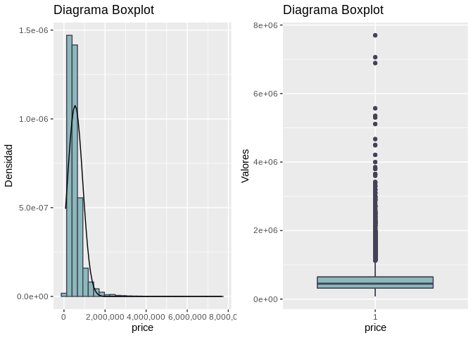<!-- -->

Tras la visualización de la variable "price" mediente el histograma de frecuencias y el diagrama de caja, se puede observar que la variable no sigue una distribución normal y contiene múltiples outliars.

Las posibles soluciones a plantearnos para su transformación son:  
1. Transformacion logaritmico 10  
2. Raiz cuadrada  
3. Inversa 1/x  
<br/>

**Estudio de las variables "sqft_living"  y "sqft_living15" (Superficie de la vivienda).**
variable "sqft_living": superficie de la vivienda en pies cuadrados (superficie escriturada).

```r
var_sqft = df_cuantitativas$sqft_living
name = "sqft_living"

# Descripción de la variable
de <- unlist(describe(df_cuantitativas$sqft_living))
de[1:5]
```

```
##                       descript                       counts.n 
## "df_cuantitativas$sqft_living"                        "19403" 
##                 counts.missing                counts.distinct 
##                           "36"                          "975" 
##                    counts.Info 
##                            "1"
```

```r
summary(var_sqft)
```

```
##    Min. 1st Qu.  Median    Mean 3rd Qu.    Max.    NA's 
##     370    1420    1910    2079    2550   13540      36
```

```r
# Visualización de la variable
p1 <- phist(df_cuantitativas, ., name)
p2 <- pbox(var_sqft, name)
grid.arrange(p1, p2, nrow=1)
```

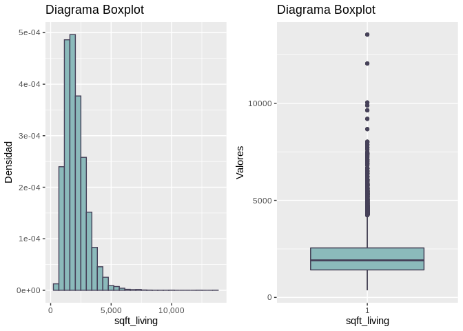<!-- -->

variable "sqft_living15": superficie de la vivienda en pies cuadrados (superficie escriturada).

```r
var_sqft15 = df_cuantitativas$sqft_living15
name = "sqft_living15"

# Descripción de la variable
de <- unlist(describe(var_sqft15))
de[1:5]
```

```
##        descript        counts.n  counts.missing counts.distinct     counts.Info 
##    "var_sqft15"         "19439"             "0"           "745"             "1"
```

```r
summary(var_sqft15)
```

```
##    Min. 1st Qu.  Median    Mean 3rd Qu.    Max. 
##     399    1490    1840    1986    2360    6210
```

```r
# Visualización de la variable
p1 <- phist(df_cuantitativas, 50, name)
p2 <- pbox(var_sqft15, name)
grid.arrange(p1, p2, nrow=1)
```

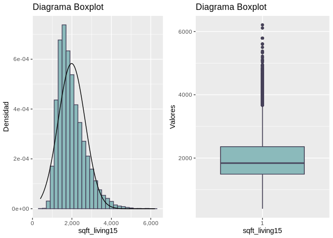<!-- -->

Tras la visualización de la variable "sqft_living" mediente el histograma de frecuencias y el diagrama de caja, se puede observar que la variable no sigue una distribución normal y contiene múltiples outliars.

Las posibles soluciones a plantearnos para su transformación son:  
1. Transformacion logaritmico 10  
2. Raiz cuadrada  
3. Inversa 1/x  

**Estudio de las variables "sqft_lot" y "sqft_lot15 (superficie de la parcela de la vivienda).**
Variables "sqft_lot": superficie de la parcela de la vivienda en pies cuadrados (superficie parcelaria).

```r
knitr::opts_chunk$set(message = FALSE)
var_lot = df_cuantitativas$sqft_lot
name = "sqft_lot"

# Descripción de la variable
describe(var_lot)
```

```
## var_lot 
##        n  missing distinct     Info     Mean      Gmd      .05      .10 
##    19386       53     9066        1    15084    17823     1821     3324 
##      .25      .50      .75      .90      .95 
##     5040     7618    10640    21342    43124 
## 
## lowest :     520     572     600     609     635
## highest:  982998 1024068 1074218 1164794 1651359
```

```r
summary(var_lot)
```

```
##    Min. 1st Qu.  Median    Mean 3rd Qu.    Max.    NA's 
##     520    5040    7618   15084   10640 1651359      53
```

```r
# Visualización de la variable
p1 <- phist(df_cuantitativas, ., name)
p2 <- pbox(var_lot, name)
grid.arrange(p1, p2, nrow=1)
```

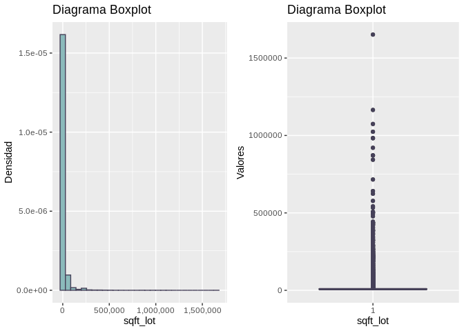<!-- -->

Variable "sqft_lot15":  superficie de la parcela en el año 2015 (admite modificaciones)

```r
var_lot15 = df_cuantitativas$sqft_lot15
name = "sqft_lot15"

# Descripción de la variable
describe(var_lot15)
```

```
## var_lot15 
##        n  missing distinct     Info     Mean      Gmd      .05      .10 
##    19439        0     8131        1    12800    13474     1991     3668 
##      .25      .50      .75      .90      .95 
##     5100     7620    10082    17811    37035 
## 
## lowest :    651    659    660    748    750, highest: 434728 438213 560617 858132 871200
```

```r
summary(var_lot15)
```

```
##    Min. 1st Qu.  Median    Mean 3rd Qu.    Max. 
##     651    5100    7620   12800   10082  871200
```

```r
# Visualización de la variable
p1 <- phist(df_cuantitativas, ., name)
p2 <- pbox(var_lot15, name)
grid.arrange(p1, p2, nrow=1)
```

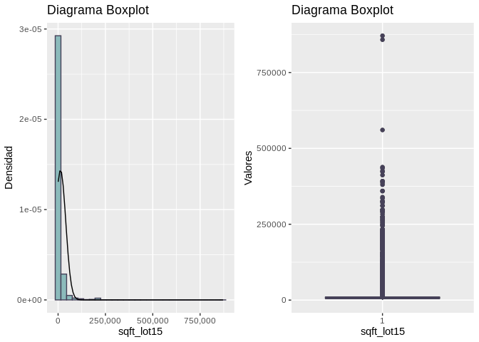<!-- -->

Aunque a primera vista, se aprecian muchos valores cercanos al cero. Aunque si observamos el resultado de la función summary el valor mínimo es igual a una parcela de 651 pies cuadrados mientras el máximo es de 871.200 sqft. A esto hay que sumarle que el 75% de los valores se encuentran por debajo de los 10.083 sqft, por lo que sería conveniente categorizar esta variable por rangos.

En los apartados de transformación nos plantearemos las posibles soluciones a aplicar.

**Estudio de la variable "sqft_above" (superficie de la huella de la vivienda).**

```r
var_above = df_cuantitativas$sqft_above
name = "sqft_above"

# Descripción de la variable
describe(var_above)
```

```
## var_above 
##        n  missing distinct     Info     Mean      Gmd      .05      .10 
##    19403       36      890        1     1788      876      850      960 
##      .25      .50      .75      .90      .95 
##     1200     1560     2210     2940     3400 
## 
## lowest :  370  380  390  410  420, highest: 7880 8020 8570 8860 9410
```

```r
# Visualización de la variable
p1 <- phist(df_cuantitativas, 50, name)
p2 <- pbox(var_above, name)
grid.arrange(p1, p2, nrow=1)
```

<!-- -->

Al tratarse de una variable de superficie de la huella, la variable coincidirá con la superficie de la vivienda en aquellos casos en los que la vivienda tenga una planta. De esta manera "sqft_above" al igual que "sqft_living" no puede aceptarse como una variable de distribución normal y probablemente se aplique sobre ambas la misma solución. 

En los apartados de transformación nos plantearemos las posibles soluciones a aplicar.

**Estudio de la variable "sqft_basement" (superficie bajo rasante).**

```r
var_base = df_cuantitativas$sqft_basement
name = "sqft_basement"

# Descripción de la variable
describe(var_base)
```

```
## var_base 
##        n  missing distinct     Info     Mean      Gmd      .05      .10 
##    19403       36      297    0.776    290.4    420.9        0        0 
##      .25      .50      .75      .90      .95 
##        0        0      560      960     1180 
## 
## lowest :    0   10   20   40   50, highest: 3260 3480 3500 4130 4820
```

```r
summary(var_base)
```

```
##    Min. 1st Qu.  Median    Mean 3rd Qu.    Max.    NA's 
##     0.0     0.0     0.0   290.4   560.0  4820.0      36
```

```r
# Visualización de la variable
p1 <- phist(df_cuantitativas, 50, name)
p2 <- pbox(var_base, name)
grid.arrange(p1, p2, nrow=1)
```

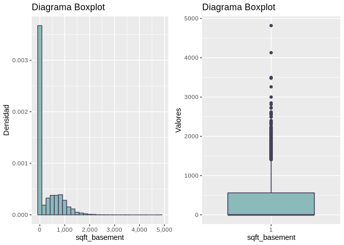<!-- -->

En esta variable se han igualado a 0 aquellos casos en los que la vivienda no tenga sótano. Por otro lado hay que contar con que en la mayoría de los casos la superficie de sótano no computa con la de vivienda, aunque si puede influir en el valor de la vivienda. Probablemente deba categorizarse ya que el 50% de los valores son iguales a 0.

En los apartados de transformación nos plantearemos las posibles soluciones a aplicar.

**Estudio de la variable "yr_built" (año de construcción de la vivienda).**

```r
var_year = df_cuantitativas$yr_built
name = "yr_built"

# Descripción de la variable
describe(var_year)
```

```
## var_year 
##        n  missing distinct     Info     Mean      Gmd      .05      .10 
##    19425       14      116        1     1971    33.42     1915     1926 
##      .25      .50      .75      .90      .95 
##     1951     1975     1997     2007     2011 
## 
## lowest : 1900 1901 1902 1903 1904, highest: 2011 2012 2013 2014 2015
```

```r
summary(var_year)
```

```
##    Min. 1st Qu.  Median    Mean 3rd Qu.    Max.    NA's 
##    1900    1951    1975    1971    1997    2015      14
```

```r
# Visualización de la variable
p1 <- phist(df_cuantitativas, 50, "yr_built")
p2 <- pbox(var_year, "yr_built")
grid.arrange(p1, p2, nrow=1)
```

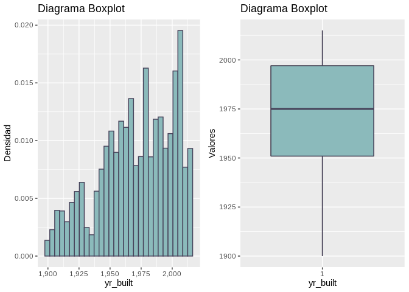<!-- -->

Se puede observar que hay mayor cantidad de viviendas modernas que de antiguas en la base de datos sin seguir una distribución normal, registranto el máximo entre el año 2000 y 2010. Probablemente haya que categorizarla en grupos de antigüedad

En los apartados de transformación nos plantearemos las posibles soluciones a aplicar.

**Estudio de la variable "yr_renovated" (año de renovación de la vivienda).**

```r
var_renove = df_cuantitativas$yr_renovated
name = "yr_renovated"

# Descripción de la variable
describe(var_renove)
```

```
## var_renove 
##        n  missing distinct     Info     Mean      Gmd      .05      .10 
##    19429       10       70    0.123    85.37    163.5        0        0 
##      .25      .50      .75      .90      .95 
##        0        0        0        0        0 
## 
## lowest :    0 1934 1940 1944 1945, highest: 2011 2012 2013 2014 2015
##                                                                             
## Value          0  1935  1940  1945  1950  1955  1960  1965  1970  1975  1980
## Frequency  18598     1     2     5     4    13    10    14    21    22    40
## Proportion 0.957 0.000 0.000 0.000 0.000 0.001 0.001 0.001 0.001 0.001 0.002
##                                                     
## Value       1985  1990  1995  2000  2005  2010  2015
## Frequency     81    90    79   103   138    74   134
## Proportion 0.004 0.005 0.004 0.005 0.007 0.004 0.007
## 
## For the frequency table, variable is rounded to the nearest 5
```

```r
# Visualización de la variable
p1 <- phist(df_cuantitativas, 25, name)
p2 <- pbox(var_renove, name)
grid.arrange(p1, p2, nrow=1)
```

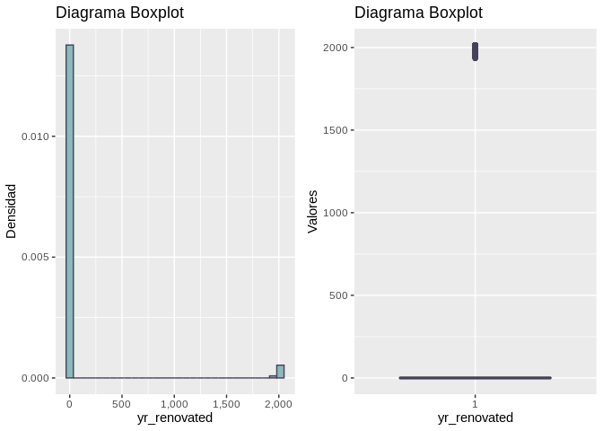<!-- -->

El problema que observamos en esta variable es que aquellas viviendas que no han sido renovadas se han igualado a 0, no permitiendo visualizar la variable correctamente. En el apartado de transformación de variables estudiaremos tratarla como una categórica.

### B. Analisis univariante cualitativo

```r
#Obtención de variables cuantitativas
df_cualitativas = price_tplusc %>% select(2, 4, 5, 8:12, 17)

data.frame(variable = names(df_cualitativas),
           classe = sapply(df_cualitativas, typeof),
           first_values = sapply(df_cualitativas, function(x) paste0(head(x),  collapse = ", ")),
           row.names = NULL) %>% kable() %>% kable_styling()
```

<table class="table" style="margin-left: auto; margin-right: auto;">
 <thead>
  <tr>
   <th style="text-align:left;"> variable </th>
   <th style="text-align:left;"> classe </th>
   <th style="text-align:left;"> first_values </th>
  </tr>
 </thead>
<tbody>
  <tr>
   <td style="text-align:left;"> date </td>
   <td style="text-align:left;"> integer </td>
   <td style="text-align:left;"> 12/09/2014, 2/25/2015, 12/09/2014, 2/18/2015, 05/12/2014, 6/27/2014 </td>
  </tr>
  <tr>
   <td style="text-align:left;"> bedrooms </td>
   <td style="text-align:left;"> integer </td>
   <td style="text-align:left;"> 3, 2, 4, 3, 4, 3 </td>
  </tr>
  <tr>
   <td style="text-align:left;"> bathrooms </td>
   <td style="text-align:left;"> double </td>
   <td style="text-align:left;"> 2.25, 1, 3, 2, 4.5, 2.25 </td>
  </tr>
  <tr>
   <td style="text-align:left;"> floors </td>
   <td style="text-align:left;"> double </td>
   <td style="text-align:left;"> 2, 1, 1, 1, 1, 2 </td>
  </tr>
  <tr>
   <td style="text-align:left;"> waterfront </td>
   <td style="text-align:left;"> integer </td>
   <td style="text-align:left;"> 0, 0, 0, NA, 0, 0 </td>
  </tr>
  <tr>
   <td style="text-align:left;"> view </td>
   <td style="text-align:left;"> integer </td>
   <td style="text-align:left;"> 0, 0, 0, 0, 0, 0 </td>
  </tr>
  <tr>
   <td style="text-align:left;"> condition </td>
   <td style="text-align:left;"> integer </td>
   <td style="text-align:left;"> 3, 3, 5, 3, 3, 3 </td>
  </tr>
  <tr>
   <td style="text-align:left;"> grade </td>
   <td style="text-align:left;"> integer </td>
   <td style="text-align:left;"> 7, 6, 7, 8, 11, 7 </td>
  </tr>
  <tr>
   <td style="text-align:left;"> zipcode </td>
   <td style="text-align:left;"> integer </td>
   <td style="text-align:left;"> 98125, 98028, 98136, 98074, 98053, 98003 </td>
  </tr>
</tbody>
</table>


**Estudio de la variable "date" (fecha de venta de la vivienda):**
Dado que el objetivo de la práctica es poder predecir el precio de la vivienda, sería interesante para nuestro modelo separar esta variable en mes y año ya que el precio de venta se puede ver influido por la estación y por el año en el que se realizó la venta.


```r
dates = data.frame(date = as.Date(df_cualitativas$date,"%m/%d/%Y"))
df_cualitativas$dates_m = format(dates,"%m")
df_cualitativas$dates_y = format(dates,"%Y")

# Límites del campo date
dates %>% summarise(min = min(date), max = max(date))
```

```
##          min        max
## 1 2014-05-02 2015-05-27
```

```r
# Tablas de frecuencias en función al mes y al año
table(df_cualitativas$dates_y) %>% kable(., col.names = c('Años', 'Frecuencia'))
```

<table>
 <thead>
  <tr>
   <th style="text-align:left;"> Años </th>
   <th style="text-align:right;"> Frecuencia </th>
  </tr>
 </thead>
<tbody>
  <tr>
   <td style="text-align:left;"> 2014 </td>
   <td style="text-align:right;"> 13163 </td>
  </tr>
  <tr>
   <td style="text-align:left;"> 2015 </td>
   <td style="text-align:right;"> 6276 </td>
  </tr>
</tbody>
</table>

```r
table(df_cualitativas$dates_m) %>% kable(., col.names = c('Meses', 'Frecuencia'))
```

<table>
 <thead>
  <tr>
   <th style="text-align:left;"> Meses </th>
   <th style="text-align:right;"> Frecuencia </th>
  </tr>
 </thead>
<tbody>
  <tr>
   <td style="text-align:left;"> 01 </td>
   <td style="text-align:right;"> 877 </td>
  </tr>
  <tr>
   <td style="text-align:left;"> 02 </td>
   <td style="text-align:right;"> 1118 </td>
  </tr>
  <tr>
   <td style="text-align:left;"> 03 </td>
   <td style="text-align:right;"> 1681 </td>
  </tr>
  <tr>
   <td style="text-align:left;"> 04 </td>
   <td style="text-align:right;"> 2006 </td>
  </tr>
  <tr>
   <td style="text-align:left;"> 05 </td>
   <td style="text-align:right;"> 2197 </td>
  </tr>
  <tr>
   <td style="text-align:left;"> 06 </td>
   <td style="text-align:right;"> 1951 </td>
  </tr>
  <tr>
   <td style="text-align:left;"> 07 </td>
   <td style="text-align:right;"> 1976 </td>
  </tr>
  <tr>
   <td style="text-align:left;"> 08 </td>
   <td style="text-align:right;"> 1743 </td>
  </tr>
  <tr>
   <td style="text-align:left;"> 09 </td>
   <td style="text-align:right;"> 1599 </td>
  </tr>
  <tr>
   <td style="text-align:left;"> 10 </td>
   <td style="text-align:right;"> 1712 </td>
  </tr>
  <tr>
   <td style="text-align:left;"> 11 </td>
   <td style="text-align:right;"> 1253 </td>
  </tr>
  <tr>
   <td style="text-align:left;"> 12 </td>
   <td style="text-align:right;"> 1326 </td>
  </tr>
</tbody>
</table>

```r
# Diagrama de barras con los meses del año y el número de viviendas vendidas
p_barras2(df_cualitativas, df_cualitativas$dates_m, df_cualitativas$dates_y, xlab = 'Mes')
```

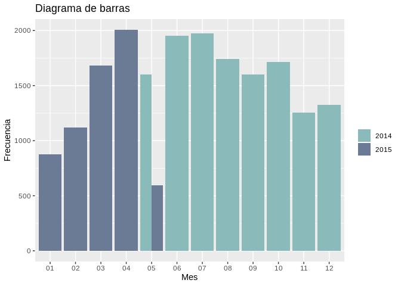<!-- -->
De la variable fecha de venta de la vivienda, probablemente seleccionemos solo el año en el que se produjo la venta dado que los precios en el mercado suelen verse influidos por este parámetro.


**Estudio de la variable "bedrooms" (Número de habitaciones por vivienda):**

```r
var_rooms = df_cualitativas$bedrooms
name = "bedrooms"

# Tablas de frecuencias en función al mes y al año
summary(var_rooms)
```

```
##    Min. 1st Qu.  Median    Mean 3rd Qu.    Max.    NA's 
##   1.000   3.000   3.000   3.371   4.000  33.000      51
```

```r
table(var_rooms) %>% kable(., col.names = c(name, 'Frecuencia'))
```

<table>
 <thead>
  <tr>
   <th style="text-align:left;"> bedrooms </th>
   <th style="text-align:right;"> Frecuencia </th>
  </tr>
 </thead>
<tbody>
  <tr>
   <td style="text-align:left;"> 1 </td>
   <td style="text-align:right;"> 172 </td>
  </tr>
  <tr>
   <td style="text-align:left;"> 2 </td>
   <td style="text-align:right;"> 2512 </td>
  </tr>
  <tr>
   <td style="text-align:left;"> 3 </td>
   <td style="text-align:right;"> 8805 </td>
  </tr>
  <tr>
   <td style="text-align:left;"> 4 </td>
   <td style="text-align:right;"> 6164 </td>
  </tr>
  <tr>
   <td style="text-align:left;"> 5 </td>
   <td style="text-align:right;"> 1435 </td>
  </tr>
  <tr>
   <td style="text-align:left;"> 6 </td>
   <td style="text-align:right;"> 239 </td>
  </tr>
  <tr>
   <td style="text-align:left;"> 7 </td>
   <td style="text-align:right;"> 38 </td>
  </tr>
  <tr>
   <td style="text-align:left;"> 8 </td>
   <td style="text-align:right;"> 12 </td>
  </tr>
  <tr>
   <td style="text-align:left;"> 9 </td>
   <td style="text-align:right;"> 6 </td>
  </tr>
  <tr>
   <td style="text-align:left;"> 10 </td>
   <td style="text-align:right;"> 3 </td>
  </tr>
  <tr>
   <td style="text-align:left;"> 11 </td>
   <td style="text-align:right;"> 1 </td>
  </tr>
  <tr>
   <td style="text-align:left;"> 33 </td>
   <td style="text-align:right;"> 1 </td>
  </tr>
</tbody>
</table>

```r
# Diagrama de barras con los meses del año y el número de viviendas vendidas
p_barras(df_cualitativas, var_rooms, xlab = name)
```

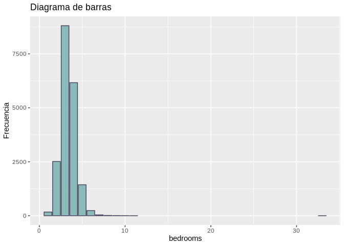<!-- -->

La frecuencia máxima de habitaciones por vivienda se localiza en 3 habitaciones, probablemente deban categorizarse debido a que la distribución no es normal y contiene multiples outliers que la desequilibran.

**Estudio de la variable "bathrooms" (Número de baños/aseos por vivienda):**

```r
var_bathrooms = df_cualitativas$bathrooms
name = "bathrooms"

# Tablas de frecuencias en función al mes y al año
table(var_bathrooms) %>% kable(., col.names = c(name, 'Frecuencia'))
```

<table>
 <thead>
  <tr>
   <th style="text-align:left;"> bathrooms </th>
   <th style="text-align:right;"> Frecuencia </th>
  </tr>
 </thead>
<tbody>
  <tr>
   <td style="text-align:left;"> 0.5 </td>
   <td style="text-align:right;"> 4 </td>
  </tr>
  <tr>
   <td style="text-align:left;"> 0.75 </td>
   <td style="text-align:right;"> 64 </td>
  </tr>
  <tr>
   <td style="text-align:left;"> 1 </td>
   <td style="text-align:right;"> 3474 </td>
  </tr>
  <tr>
   <td style="text-align:left;"> 1.25 </td>
   <td style="text-align:right;"> 7 </td>
  </tr>
  <tr>
   <td style="text-align:left;"> 1.5 </td>
   <td style="text-align:right;"> 1282 </td>
  </tr>
  <tr>
   <td style="text-align:left;"> 1.75 </td>
   <td style="text-align:right;"> 2754 </td>
  </tr>
  <tr>
   <td style="text-align:left;"> 2 </td>
   <td style="text-align:right;"> 1722 </td>
  </tr>
  <tr>
   <td style="text-align:left;"> 2.25 </td>
   <td style="text-align:right;"> 1843 </td>
  </tr>
  <tr>
   <td style="text-align:left;"> 2.5 </td>
   <td style="text-align:right;"> 4848 </td>
  </tr>
  <tr>
   <td style="text-align:left;"> 2.75 </td>
   <td style="text-align:right;"> 1051 </td>
  </tr>
  <tr>
   <td style="text-align:left;"> 3 </td>
   <td style="text-align:right;"> 652 </td>
  </tr>
  <tr>
   <td style="text-align:left;"> 3.25 </td>
   <td style="text-align:right;"> 535 </td>
  </tr>
  <tr>
   <td style="text-align:left;"> 3.5 </td>
   <td style="text-align:right;"> 661 </td>
  </tr>
  <tr>
   <td style="text-align:left;"> 3.75 </td>
   <td style="text-align:right;"> 140 </td>
  </tr>
  <tr>
   <td style="text-align:left;"> 4 </td>
   <td style="text-align:right;"> 121 </td>
  </tr>
  <tr>
   <td style="text-align:left;"> 4.25 </td>
   <td style="text-align:right;"> 72 </td>
  </tr>
  <tr>
   <td style="text-align:left;"> 4.5 </td>
   <td style="text-align:right;"> 89 </td>
  </tr>
  <tr>
   <td style="text-align:left;"> 4.75 </td>
   <td style="text-align:right;"> 23 </td>
  </tr>
  <tr>
   <td style="text-align:left;"> 5 </td>
   <td style="text-align:right;"> 21 </td>
  </tr>
  <tr>
   <td style="text-align:left;"> 5.25 </td>
   <td style="text-align:right;"> 11 </td>
  </tr>
  <tr>
   <td style="text-align:left;"> 5.5 </td>
   <td style="text-align:right;"> 10 </td>
  </tr>
  <tr>
   <td style="text-align:left;"> 5.75 </td>
   <td style="text-align:right;"> 4 </td>
  </tr>
  <tr>
   <td style="text-align:left;"> 6 </td>
   <td style="text-align:right;"> 6 </td>
  </tr>
  <tr>
   <td style="text-align:left;"> 6.25 </td>
   <td style="text-align:right;"> 2 </td>
  </tr>
  <tr>
   <td style="text-align:left;"> 6.5 </td>
   <td style="text-align:right;"> 2 </td>
  </tr>
  <tr>
   <td style="text-align:left;"> 6.75 </td>
   <td style="text-align:right;"> 2 </td>
  </tr>
  <tr>
   <td style="text-align:left;"> 7.5 </td>
   <td style="text-align:right;"> 1 </td>
  </tr>
  <tr>
   <td style="text-align:left;"> 7.75 </td>
   <td style="text-align:right;"> 1 </td>
  </tr>
  <tr>
   <td style="text-align:left;"> 8 </td>
   <td style="text-align:right;"> 2 </td>
  </tr>
</tbody>
</table>

```r
# Diagrama de barras con los meses del año y el número de viviendas vendidas
p_barras(df_cualitativas, var_bathrooms, xlab = name)
```

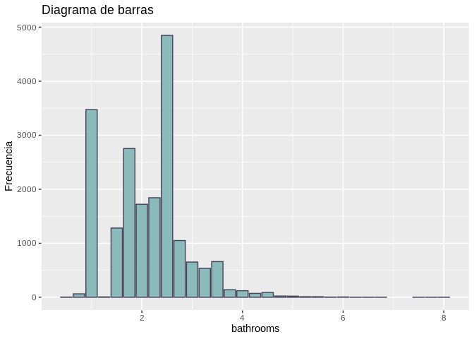<!-- -->

```r
var_bathrooms = df_cualitativas$bathrooms %>% ceiling()
```

La variable bathrooms es decimal, podríamos pensar que es un error, pero al ser decimales basados en múltiplos de 25 probablemente contabilizasen el aseo estandar como 0.25 y el baño estandar como 1 categorizando el resto en función a su superficie. Sería bueno redondear estos números a la alza ya que un aseo sigue siendo un estancia más.

La variable "bathrooms" sigue una distribución muy similar a la de la variable "bedrooms" por lo que aplicaremos las mismas soluciones.

**Estudio de la variable "floors" (Número de plantas por vivienda):**
Como en los casos anteriores la variable "floors" es decimal, pero a diferencia de los anteriores solo encontramos decimales con saltos de 0.5 por lo que redondearlos hacia arriba o hacia abajo todos podría perjudicarnos posteriormente en el modelo. De esta manera mantendremos los datos como en el origen para su correcta visualización.

```r
var_floors = df_cualitativas$floors
name = "floors"

# Tablas de frecuencias en función al mes y al año
table(var_floors) %>% kable(., col.names = c(name, 'Frecuencia'))
```

<table>
 <thead>
  <tr>
   <th style="text-align:left;"> floors </th>
   <th style="text-align:right;"> Frecuencia </th>
  </tr>
 </thead>
<tbody>
  <tr>
   <td style="text-align:left;"> 1 </td>
   <td style="text-align:right;"> 9587 </td>
  </tr>
  <tr>
   <td style="text-align:left;"> 1.5 </td>
   <td style="text-align:right;"> 1715 </td>
  </tr>
  <tr>
   <td style="text-align:left;"> 2 </td>
   <td style="text-align:right;"> 7430 </td>
  </tr>
  <tr>
   <td style="text-align:left;"> 2.5 </td>
   <td style="text-align:right;"> 147 </td>
  </tr>
  <tr>
   <td style="text-align:left;"> 3 </td>
   <td style="text-align:right;"> 531 </td>
  </tr>
  <tr>
   <td style="text-align:left;"> 3.5 </td>
   <td style="text-align:right;"> 6 </td>
  </tr>
</tbody>
</table>

```r
# Diagrama de barras con los meses del año y el número de viviendas vendidas
p_barras(df_cualitativas, var_floors, xlab = name)
```

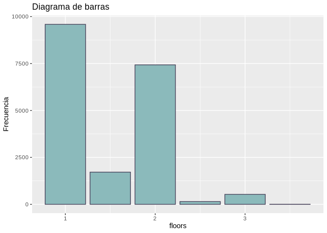<!-- -->

Se puede observar que el número de valores decimales es reducido en comparación con el resto, pero creemos que deberían mantenerse sin redondear ya que una vivienda de dos plantas con la misma superficie y otra con la mitad de la superficie en su planta superior pueden discrepar mucho en el precio.

**Estudio de la variable "waterfront" (viviendas frente a grandes masas de agua):**

```r
var_waterfront = df_cualitativas$waterfront
name = "waterfront"

# Tablas de frecuencias en función al mes y al año
table(var_waterfront) %>% kable(., col.names = c(name, 'Frecuencia'))
```

<table>
 <thead>
  <tr>
   <th style="text-align:left;"> waterfront </th>
   <th style="text-align:right;"> Frecuencia </th>
  </tr>
 </thead>
<tbody>
  <tr>
   <td style="text-align:left;"> 0 </td>
   <td style="text-align:right;"> 19267 </td>
  </tr>
  <tr>
   <td style="text-align:left;"> 1 </td>
   <td style="text-align:right;"> 149 </td>
  </tr>
</tbody>
</table>

```r
# Diagrama de barras con los meses del año y el número de viviendas vendidas
p_barras(df_cualitativas, var_waterfront, xlab = name)
```

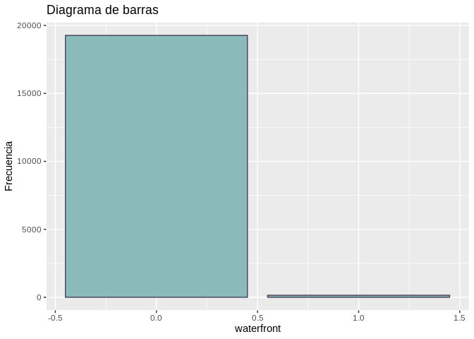<!-- -->

Esta variable es de tipo dummy por lo que no necesitaría modificación alguna salvo por la imputación de datos faltantes. Se puede observar que tan solo el 1% de las viviendas de la base de datos están ubicadas frente a grandes masas de agua.

**Estudio de la variable "view" (número de visitas que ha recibido la vivienda):**

```r
var_view = df_cualitativas$view
name = "waterfront"

# Tablas de frecuencias en función al mes y al año
table(var_view) %>% kable(., col.names = c(name, 'Frecuencia'))
```

<table>
 <thead>
  <tr>
   <th style="text-align:left;"> waterfront </th>
   <th style="text-align:right;"> Frecuencia </th>
  </tr>
 </thead>
<tbody>
  <tr>
   <td style="text-align:left;"> 0 </td>
   <td style="text-align:right;"> 17505 </td>
  </tr>
  <tr>
   <td style="text-align:left;"> 1 </td>
   <td style="text-align:right;"> 302 </td>
  </tr>
  <tr>
   <td style="text-align:left;"> 2 </td>
   <td style="text-align:right;"> 859 </td>
  </tr>
  <tr>
   <td style="text-align:left;"> 3 </td>
   <td style="text-align:right;"> 458 </td>
  </tr>
  <tr>
   <td style="text-align:left;"> 4 </td>
   <td style="text-align:right;"> 297 </td>
  </tr>
</tbody>
</table>

```r
# Diagrama de barras con los meses del año y el número de viviendas vendidas
p_barras(df_cualitativas, var_view, xlab = name)
```

<!-- -->

Dado que la mayoría de las viviendas no han recibido visitas, inicialmente no parece una variable que pueda afectar mucho al precio de la vivienda por lo que podría ser deshechada o convertida en dummy tras el análisis multivariante.

**Estudio de la variable "condition" (estado de la vivienda del 1 al 5):**

```r
var_condition = df_cualitativas$condition
name = "condition"

# Tablas de frecuencias en función al mes y al año
table(var_condition) %>% kable(., col.names = c(name, 'Frecuencia'))
```

<table>
 <thead>
  <tr>
   <th style="text-align:left;"> condition </th>
   <th style="text-align:right;"> Frecuencia </th>
  </tr>
 </thead>
<tbody>
  <tr>
   <td style="text-align:left;"> 1 </td>
   <td style="text-align:right;"> 28 </td>
  </tr>
  <tr>
   <td style="text-align:left;"> 2 </td>
   <td style="text-align:right;"> 161 </td>
  </tr>
  <tr>
   <td style="text-align:left;"> 3 </td>
   <td style="text-align:right;"> 12564 </td>
  </tr>
  <tr>
   <td style="text-align:left;"> 4 </td>
   <td style="text-align:right;"> 5120 </td>
  </tr>
  <tr>
   <td style="text-align:left;"> 5 </td>
   <td style="text-align:right;"> 1539 </td>
  </tr>
</tbody>
</table>

```r
# Diagrama de barras con los meses del año y el número de viviendas vendidas
p_barras(df_cualitativas, var_condition, xlab = name)
```

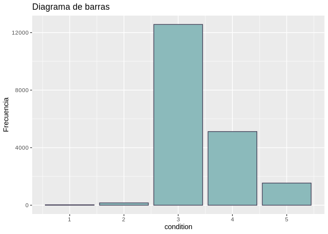<!-- -->

La variable "condition" determina el estado de la vivienda clasificándola en una puntuación del 1 al 5, dado que la mayor parte de las viviendas se distribuyen en los puntos 3 y 4 podríamos simplificarla categorizándola nuevamente.

**Estudio de la variable "grade" (nota general de la vivienda del 1 al 13):**

```r
var_grade = df_cualitativas$grade
name = "grade"

# Tablas de frecuencias en función al mes y al año
table(var_grade) %>% kable(., col.names = c(name, 'Frecuencia'))
```

<table>
 <thead>
  <tr>
   <th style="text-align:left;"> grade </th>
   <th style="text-align:right;"> Frecuencia </th>
  </tr>
 </thead>
<tbody>
  <tr>
   <td style="text-align:left;"> 10 </td>
   <td style="text-align:right;"> 1018 </td>
  </tr>
  <tr>
   <td style="text-align:left;"> 11 </td>
   <td style="text-align:right;"> 368 </td>
  </tr>
  <tr>
   <td style="text-align:left;"> 12 </td>
   <td style="text-align:right;"> 79 </td>
  </tr>
  <tr>
   <td style="text-align:left;"> 13 </td>
   <td style="text-align:right;"> 12 </td>
  </tr>
  <tr>
   <td style="text-align:left;"> 3 </td>
   <td style="text-align:right;"> 1 </td>
  </tr>
  <tr>
   <td style="text-align:left;"> 4 </td>
   <td style="text-align:right;"> 26 </td>
  </tr>
  <tr>
   <td style="text-align:left;"> 5 </td>
   <td style="text-align:right;"> 217 </td>
  </tr>
  <tr>
   <td style="text-align:left;"> 6 </td>
   <td style="text-align:right;"> 1839 </td>
  </tr>
  <tr>
   <td style="text-align:left;"> 7 </td>
   <td style="text-align:right;"> 8081 </td>
  </tr>
  <tr>
   <td style="text-align:left;"> 8 </td>
   <td style="text-align:right;"> 5446 </td>
  </tr>
  <tr>
   <td style="text-align:left;"> 9 </td>
   <td style="text-align:right;"> 2333 </td>
  </tr>
  <tr>
   <td style="text-align:left;"> s </td>
   <td style="text-align:right;"> 1 </td>
  </tr>
</tbody>
</table>

```r
# Diagrama de barras con los meses del año y el número de viviendas vendidas
p_barras(df_cualitativas, var_grade, xlab = name)
```

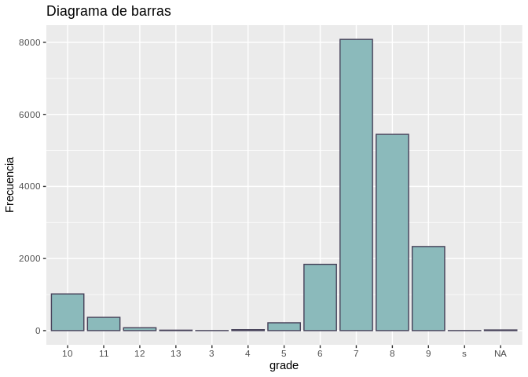<!-- -->

Al igual que la anterior, la variable "grade" determina la nota general de la vivienda propuesta por la zona, dado que la mayor parte de las viviendas se distribuyen entre los valores del 6 al 10 podríamos simplificarla creando nuevas categorías.

**Estudio de la variable "zipcode" (código postal):**

```r
var_zipcode = df_cualitativas$view
name = "zipcode"

# Tablas de frecuencias en función al mes y al año
table(var_zipcode) %>% kable(., col.names = c(name, 'Frecuencia'))
```

<table>
 <thead>
  <tr>
   <th style="text-align:left;"> zipcode </th>
   <th style="text-align:right;"> Frecuencia </th>
  </tr>
 </thead>
<tbody>
  <tr>
   <td style="text-align:left;"> 0 </td>
   <td style="text-align:right;"> 17505 </td>
  </tr>
  <tr>
   <td style="text-align:left;"> 1 </td>
   <td style="text-align:right;"> 302 </td>
  </tr>
  <tr>
   <td style="text-align:left;"> 2 </td>
   <td style="text-align:right;"> 859 </td>
  </tr>
  <tr>
   <td style="text-align:left;"> 3 </td>
   <td style="text-align:right;"> 458 </td>
  </tr>
  <tr>
   <td style="text-align:left;"> 4 </td>
   <td style="text-align:right;"> 297 </td>
  </tr>
</tbody>
</table>

```r
# Diagrama de barras con los meses del año y el número de viviendas vendidas
p_barras(df_cualitativas, var_zipcode, xlab = name)
```

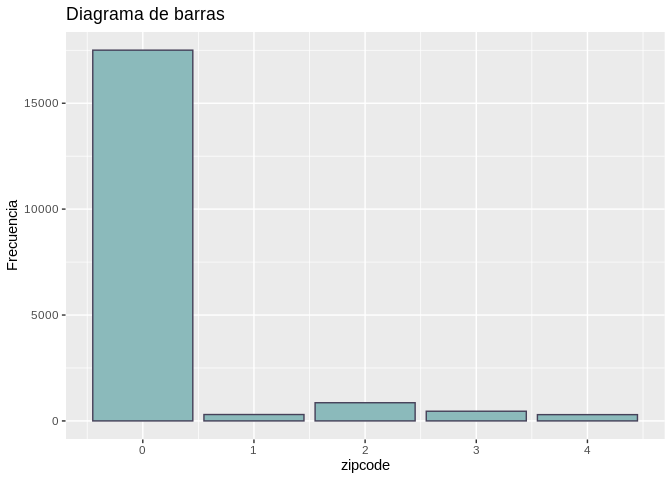<!-- -->

La variable "zipcode" podría ser de ayuda pero debido a que el 90% de las viviendas en la base de datos se ubican bajo el mismo código postal, ésta podría ser deshechada.

### c. Análisis multivariante cuantitativo
Comentar procedimiento

```r
numeric_cols <- c("sqft_living", "sqft_lot", "sqft_living15", "price", "sqft_basement", "sqft_above")
numeric_cols2 <- c("yr_built", "yr_renovated", 'lat', 'long', "price")

df_cuantitativas %>% select(numeric_cols) %>%
  na.omit() %>%
  ggpairs(columns=1:6)
```

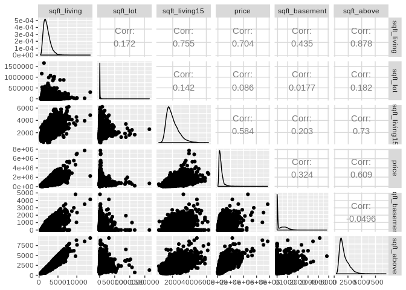<!-- -->

```r
df_cuantitativas %>% select(numeric_cols2) %>%
  na.omit() %>%
  ggpairs(columns=1:5)
```

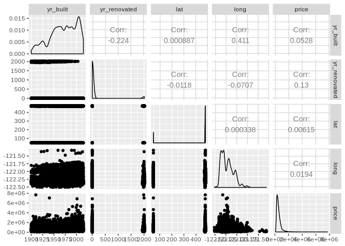<!-- -->

```r
p1 <- df_cuantitativas %>% select(numeric_cols) %>%
  na.omit() %>%
  ggcorr()

p2 <- df_cuantitativas %>% select(numeric_cols2) %>%
  na.omit() %>%
  ggcorr()

grid.arrange(p1, p2, nrow=1)
```

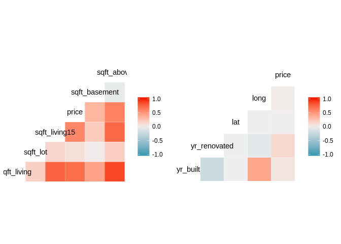<!-- -->

Correlaciones superiores al 40%:

```r
all_cols <- c("sqft_living", "sqft_lot", "sqft_living15", "price", "sqft_basement", "sqft_above", "yr_built", "yr_renovated", 'lat', 'long', "price")

# Correlaciones numéricas de las variables
z <- df_cuantitativas %>% select(all_cols) %>%
  na.omit() %>%
  cor()

# Tabla de correlaciones
as.data.frame(as.table(z)) %>% subset(., abs(Freq) > 0.4) %>% subset(., abs(Freq) != 1) %>% .[order(.$Freq, decreasing = TRUE),] %>%
  .[c(seq(1, nrow(.), by=2)),]
```

```
##             Var1          Var2      Freq
## 6     sqft_above   sqft_living 0.8778606
## 3  sqft_living15   sqft_living 0.7549953
## 26    sqft_above sqft_living15 0.7296436
## 4          price   sqft_living 0.7039337
## 36    sqft_above         price 0.6085944
## 24         price sqft_living15 0.5838456
## 5  sqft_basement   sqft_living 0.4346360
## 57      yr_built    sqft_above 0.4219294
## 70          long      yr_built 0.4110889
```

Tras este primer análisisi podemos observar que las variables que tienen mayor correlación son:
- "sqft_above" y "sqft_living" (0.87): tiene sentido que la mayor relación se produzca entre la superficie de la vivienda y de la azotea o huella en el terreno.
- "sqft_living" y "sqft_living15" (0.75): esta correlación es obvia dado que son las mismas variables de superficie de la vivienda actualizadas a 2015.
- "price" y "sqft_living" (0.70): tiene también mucho sentido que el precio tenga una gran relación con la superficie de vivienda.
- "price" y "sqft_above" (0.60): al igual que en la anterior el precio también tendrá una gran relación con la superficie de la huella.
- "sqft_living" y "sqft_basement" (0.43): en los casos en los hay sótano parece que también hay mucha relación con la superficie de la vivienda por lo que sería interesante no convertir esta variable en variable dummy.
- "sqft_above" y "yr_built" (0.42): curiosamente hay una correlación del 40% entre los metros cuadrados de huella y el año de construcción, probablemente por la normativa y por las promotoras que actuaron en esos momentos.
- "long" y "yr_built" (0.41): además podemos ver una correlación entre el año de construcción y la longitud de la localización de la vivienda, ya que el crecimiento del núcleo de población se produciría en un eje.

### c. Análisis multivariante cualitativo
Comentar procedimiento

**Estudio de la variable "bedrooms" (número de habitaciones por vivienda):**

```r
old = "bedrooms"
new = "cat_bedrooms"

#categorizamos la variable y mostramos su tabla de frecuencias
price_tplusc[[new]] = cut2(price_tplusc[[old]], g=4)
table(price_tplusc[[new]])
```

```
## 
## [1, 4)      4 [5,33] 
##  11489   6164   1735
```

```r
#visualización de los datos categorizados con respecto a la variable "price"
p_densidad(price_tplusc, new)
```

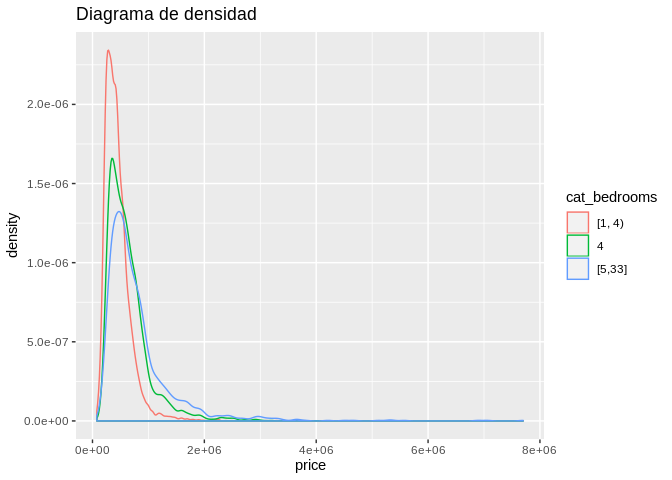<!-- -->

Comentar resultados

**Estudio de la variable "bathrooms" (número de baños/aseos por vivienda):**

```r
old = "bathrooms"
new = "cat_bathrooms"

#categorizamos la variable y mostramos su tabla de frecuencias
price_tplusc[[new]] = cut2(price_tplusc[[old]], g=3)
table(price_tplusc[[new]])
```

```
## 
## [0.50,2.00) [2.00,2.75) [2.75,8.00] 
##        7585        8413        3406
```

```r
#visualización de los datos categorizados con respecto a la variable "price"
p_densidad(price_tplusc, new)
```

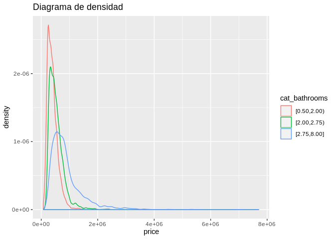<!-- -->

Comentar resultados

**Estudio de la variable "floors" (número de plantas por vivienda):**

```r
old = "floors"
new = "cat_floors"

#categorizamos la variable y mostramos su tabla de frecuencias
price_tplusc[[new]] = cut2(price_tplusc[[old]], g=3)
table(price_tplusc[[new]])
```

```
## 
##       1.0 [1.5,2.5) [2.5,3.5] 
##      9587      9145       684
```

```r
#visualización de los datos categorizados con respecto a la variable "price"
p_densidad(price_tplusc, new)
```

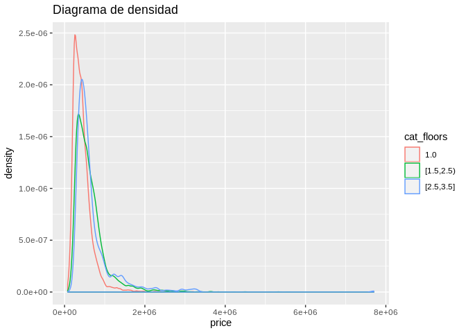<!-- -->

Comentar los resultados

**Estudio de la variable "waterfront" (número de plantas por vivienda):**

```r
name = "waterfront"

#mostramos su tabla de frecuencias
table(price_tplusc[[name]])
```

```
## 
##     0     1 
## 19267   149
```

```r
#visualización de los datos categorizados con respecto a la variable "price"
p_densidad(price_tplusc, name)
```

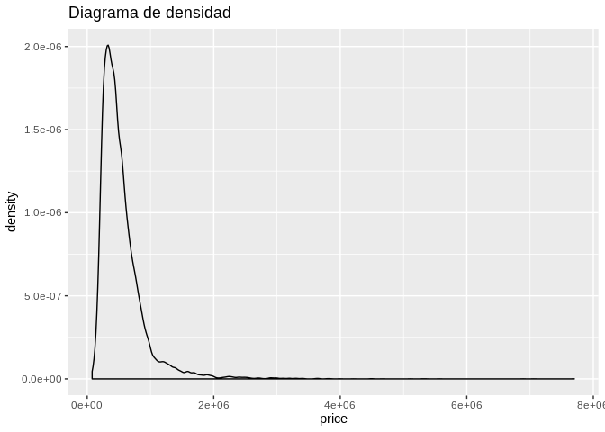<!-- -->

```r
#visualización de los datos categorizados con respecto a la variable "long"
p1 = p_densidad2(price_tplusc, name, 'long')
#visualización de los datos categorizados con respecto a la variable "lat"
p2 = p_densidad2(price_tplusc, name, 'lat')

# Creación de grid
grid.arrange(p1, p2, nrow=1)
```

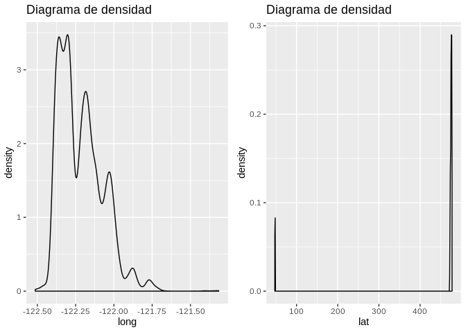<!-- -->

Comentar los resultados

**Estudio de la variable "view" (número de plantas por vivienda):**

```r
old = "view"
new = "cat_view"

#categorizamos la variable y mostramos su tabla de frecuencias
price_tplusc[[new]] = cut2(price_tplusc[[old]], g=3)
table(price_tplusc[[new]])
```

```
## 
##     0 [1,4] 
## 17505  1916
```

```r
#visualización de los datos categorizados con respecto a la variable "price"
p_densidad(price_tplusc, new)
```

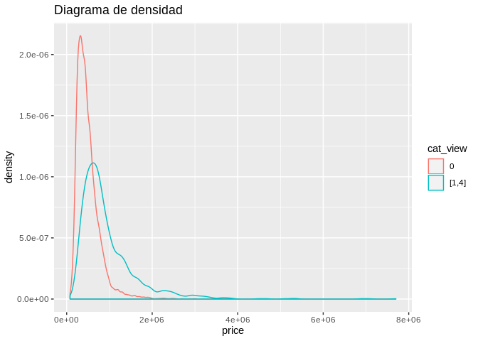<!-- -->

Comentar los resultados

**Estudio de la variable "condition" (número de plantas por vivienda):**

```r
old = "condition"
new = "cat_condition"

#categorizamos la variable y mostramos su tabla de frecuencias
price_tplusc[[new]] = cut2(price_tplusc[[old]], g=3)
table(price_tplusc[[new]])
```

```
## 
## [1,4)     4     5 
## 12753  5120  1539
```

```r
#visualización de los datos categorizados con respecto a la variable "price"
p_densidad(price_tplusc, new)
```

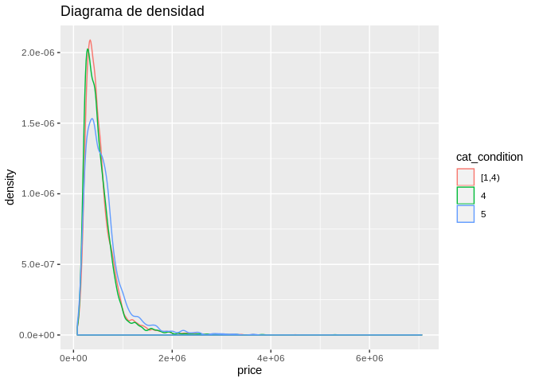<!-- -->

Comentar los resultados

**Estudio de la variable "grade" (número de plantas por vivienda):**

```r
old = "grade"
new = "cat_grade"

#corrección reemplazando el string s por un "NA"
table(price_tplusc[[old]])
```

```
## 
##   10   11   12   13    3    4    5    6    7    8    9    s 
## 1018  368   79   12    1   26  217 1839 8081 5446 2333    1
```

```r
price_tplusc[[old]][price_tplusc[[old]] == "s"] <- NA
price_tplusc[[old]] = as.numeric(price_tplusc[[old]])
table(price_tplusc[[old]])
```

```
## 
##    1    2    3    4    5    6    7    8    9   10   11 
## 1018  368   79   12    1   26  217 1839 8081 5446 2333
```

```r
#categorizamos la variable y mostramos su tabla de frecuencias
price_tplusc[[new]] = cut2(price_tplusc[[old]], g=4)
table(price_tplusc[[new]])
```

```
## 
## [ 1,10)      10      11 
##   11641    5446    2333
```

```r
#visualización de los datos categorizados con respecto a la variable "price"
p_densidad(price_tplusc, new)
```

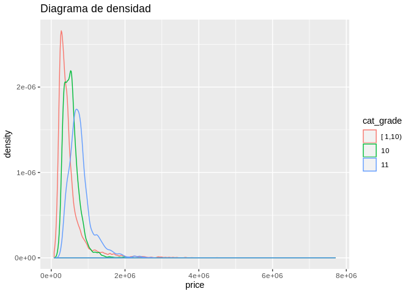<!-- -->

Comentar los resultados

**Estudio de la variable "zipcode" (código postal):**

```r
old = "zipcode"
new = "cat_zipcode"

#categorizamos la variable y mostramos su tabla de frecuencias
price_tplusc[[new]] = cut2(price_tplusc[[old]], g=3)
table(price_tplusc[[new]])
```

```
## 
## [98001,98042) [98042,98112) [98112,98199] 
##          6518          6463          6458
```

```r
#visualización de los datos categorizados con respecto a la variable "price"
p_densidad(price_tplusc, new)
```

<!-- -->

Comentar los resultados


## 04 Detección, tratamiento e imputación de datos faltantes
### Análisis previo

```r
aggr_plot <- aggr(price_tplusc, col=c('#464159','#c7f0db'), numbers=TRUE, sortVars=TRUE,
                  labels=names(price_tplusc), cex.axis=.7, gap=1, 
                  ylab=c("Histogram of missing data","Pattern"))
```

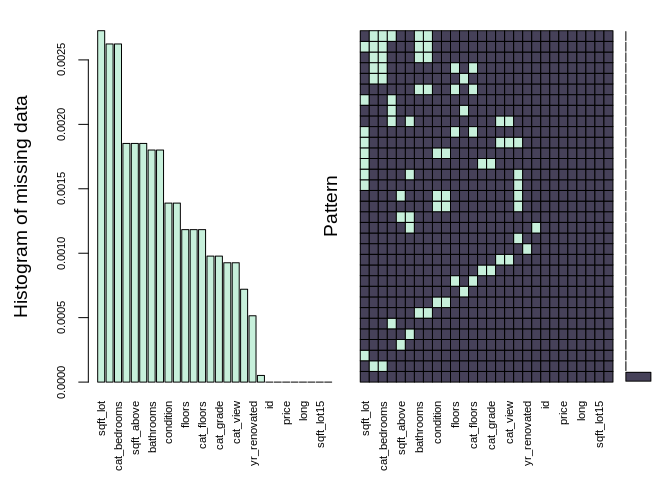<!-- -->

```
## 
##  Variables sorted by number of missings: 
##       Variable        Count
##       sqft_lot 2.726478e-03
##       bedrooms 2.623592e-03
##   cat_bedrooms 2.623592e-03
##    sqft_living 1.851947e-03
##     sqft_above 1.851947e-03
##  sqft_basement 1.851947e-03
##      bathrooms 1.800504e-03
##  cat_bathrooms 1.800504e-03
##      condition 1.388960e-03
##  cat_condition 1.388960e-03
##         floors 1.183188e-03
##     waterfront 1.183188e-03
##     cat_floors 1.183188e-03
##          grade 9.774165e-04
##      cat_grade 9.774165e-04
##           view 9.259736e-04
##       cat_view 9.259736e-04
##       yr_built 7.202017e-04
##   yr_renovated 5.144298e-04
##            lat 5.144298e-05
##             id 0.000000e+00
##           date 0.000000e+00
##          price 0.000000e+00
##        zipcode 0.000000e+00
##           long 0.000000e+00
##  sqft_living15 0.000000e+00
##     sqft_lot15 0.000000e+00
##    cat_zipcode 0.000000e+00
```

#### Imputación de las variables contínuas:

```r
#Muestra de variables de la base de datos seleccionada
structure(df_cuantitativas)
```

<table class="table" style="margin-left: auto; margin-right: auto;">
 <thead>
  <tr>
   <th style="text-align:left;"> variable </th>
   <th style="text-align:left;"> classe </th>
   <th style="text-align:left;"> first_values </th>
  </tr>
 </thead>
<tbody>
  <tr>
   <td style="text-align:left;"> price </td>
   <td style="text-align:left;"> double </td>
   <td style="text-align:left;"> 538000, 180000, 604000, 510000, 1230000, 257500 </td>
  </tr>
  <tr>
   <td style="text-align:left;"> sqft_living </td>
   <td style="text-align:left;"> integer </td>
   <td style="text-align:left;"> 2570, 770, NA, 1680, 5420, 1715 </td>
  </tr>
  <tr>
   <td style="text-align:left;"> sqft_lot </td>
   <td style="text-align:left;"> integer </td>
   <td style="text-align:left;"> 7242, 10000, 5000, 8080, 101930, 6819 </td>
  </tr>
  <tr>
   <td style="text-align:left;"> sqft_above </td>
   <td style="text-align:left;"> integer </td>
   <td style="text-align:left;"> 2170, 770, 1050, 1680, 3890, 1715 </td>
  </tr>
  <tr>
   <td style="text-align:left;"> sqft_basement </td>
   <td style="text-align:left;"> integer </td>
   <td style="text-align:left;"> 400, 0, 910, 0, 1530, 0 </td>
  </tr>
  <tr>
   <td style="text-align:left;"> yr_built </td>
   <td style="text-align:left;"> integer </td>
   <td style="text-align:left;"> 1951, 1933, 1965, 1987, 2001, 1995 </td>
  </tr>
  <tr>
   <td style="text-align:left;"> yr_renovated </td>
   <td style="text-align:left;"> integer </td>
   <td style="text-align:left;"> 1991, 0, 0, 0, 0, 0 </td>
  </tr>
  <tr>
   <td style="text-align:left;"> lat </td>
   <td style="text-align:left;"> double </td>
   <td style="text-align:left;"> 47.721, 477.379, 475.208, 476.168, 476.561, 473.097 </td>
  </tr>
  <tr>
   <td style="text-align:left;"> long </td>
   <td style="text-align:left;"> double </td>
   <td style="text-align:left;"> -122.319, -122.233, -122.393, -122.045, -122.005, -122.327 </td>
  </tr>
  <tr>
   <td style="text-align:left;"> sqft_living15 </td>
   <td style="text-align:left;"> integer </td>
   <td style="text-align:left;"> 1690, 2720, 1360, 1800, 4760, 2238 </td>
  </tr>
  <tr>
   <td style="text-align:left;"> sqft_lot15 </td>
   <td style="text-align:left;"> integer </td>
   <td style="text-align:left;"> 7639, 8062, 5000, 7503, 101930, 6819 </td>
  </tr>
</tbody>
</table>

```r
#Muestra de variables missing
sapply(df_cuantitativas, function(x) sum(is.na(x))) %>% kable()
```

<table>
 <thead>
  <tr>
   <th style="text-align:left;">   </th>
   <th style="text-align:right;"> x </th>
  </tr>
 </thead>
<tbody>
  <tr>
   <td style="text-align:left;"> price </td>
   <td style="text-align:right;"> 0 </td>
  </tr>
  <tr>
   <td style="text-align:left;"> sqft_living </td>
   <td style="text-align:right;"> 36 </td>
  </tr>
  <tr>
   <td style="text-align:left;"> sqft_lot </td>
   <td style="text-align:right;"> 53 </td>
  </tr>
  <tr>
   <td style="text-align:left;"> sqft_above </td>
   <td style="text-align:right;"> 36 </td>
  </tr>
  <tr>
   <td style="text-align:left;"> sqft_basement </td>
   <td style="text-align:right;"> 36 </td>
  </tr>
  <tr>
   <td style="text-align:left;"> yr_built </td>
   <td style="text-align:right;"> 14 </td>
  </tr>
  <tr>
   <td style="text-align:left;"> yr_renovated </td>
   <td style="text-align:right;"> 10 </td>
  </tr>
  <tr>
   <td style="text-align:left;"> lat </td>
   <td style="text-align:right;"> 1 </td>
  </tr>
  <tr>
   <td style="text-align:left;"> long </td>
   <td style="text-align:right;"> 0 </td>
  </tr>
  <tr>
   <td style="text-align:left;"> sqft_living15 </td>
   <td style="text-align:right;"> 0 </td>
  </tr>
  <tr>
   <td style="text-align:left;"> sqft_lot15 </td>
   <td style="text-align:right;"> 0 </td>
  </tr>
</tbody>
</table>
<br/>
<br/>

### Imputación de variables

**Imputación de la variable "sqft_living" (superficie de la vivienda):**
La variable "sqft_living" es una de las más importantes debído a su alta correlación con la variable "price". Para asegurarnos de que no haya sesgo vamos a usar el método knn sobre las variables más relaciondas. Una de las variables que más nos va a ayudar a la imputación será "sqft_living15" ya que esla superficie de la vivienda medida en 2015.

```r
#método de imputación knn
imputed <- price_tplusc %>% select(price, sqft_living, sqft_living15, bedrooms, sqft_lot, sqft_above, sqft_living15) %>% VIM::kNN(variable='sqft_living')

#guardado de la variable
price_tplusc$sqft_living_im = imputed$sqft_living

#Visualización y comprobación de la varaible
columns <- c("price", "sqft_living", "sqft_living15")
imputed %>% select(columns) %>%
  na.omit() %>%
  ggpairs(columns=1:length(columns))
```

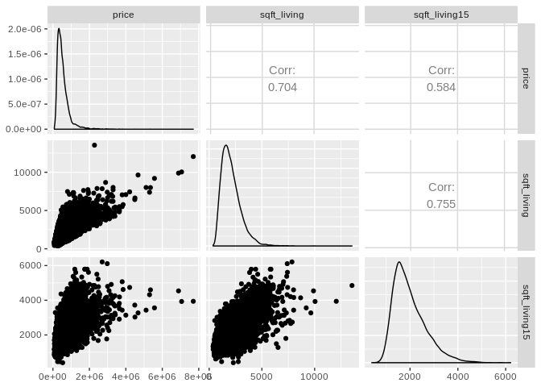<!-- -->

```r
#Visualización y comprobación de los datos imputados
imputed %>% select(sqft_living15, sqft_living, sqft_living_imp)  %>% marginplot(., delimiter = '_imp')
```

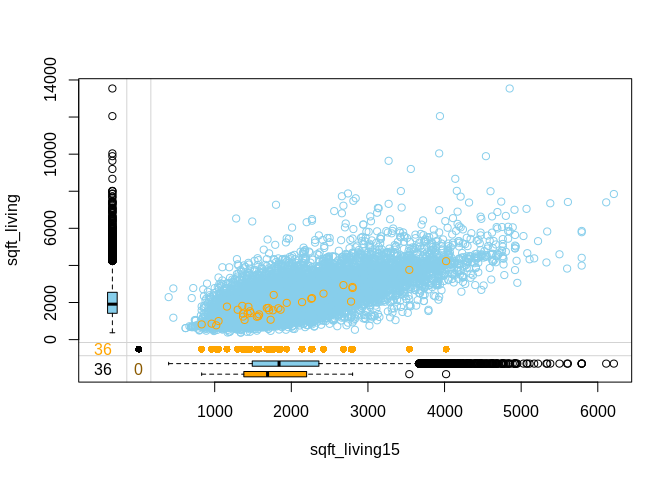<!-- -->
<br/>
Tras imputar la variable podemos ver que la correlación se mantiene y que no se producen grandes cambios.

**Imputación de la variable "sqft_basement" (superficie del sótano):**
La variable "sqft_basement" es una variable dificil de imputar debido a que si la vivienda no tiene sótano su valor es cero. Por ello para su correcta imputación debe estudiarse el análisis multivariante.

Podemos observar que las variables con mayor correlación con respecto a "sqft_basement" son:
- sqft_living con un 0.43
- bedrooms con un 0.30
- price con un 0.32
- bathrooms con un 0.28

Por ello usaremos estas variables para su imputación.

```r
#método de imputación knn
imputed <- price_tplusc %>% select(sqft_basement, price, sqft_living, bedrooms, bathrooms) %>%
  VIM::kNN(variable='sqft_basement')

#guardado de la variable
price_tplusc$sqft_basement_im = imputed$sqft_basement
head(price_tplusc)
```

```
##           id       date   price bedrooms bathrooms sqft_living sqft_lot floors
## 1 6414100192 12/09/2014  538000        3      2.25        2570     7242      2
## 2 5631500400  2/25/2015  180000        2      1.00         770    10000      1
## 3 2487200875 12/09/2014  604000        4      3.00          NA     5000      1
## 4 1954400510  2/18/2015  510000        3      2.00        1680     8080      1
## 5 7237550310 05/12/2014 1230000        4      4.50        5420   101930      1
## 6 1321400060  6/27/2014  257500        3      2.25        1715     6819      2
##   waterfront view condition grade sqft_above sqft_basement yr_built
## 1          0    0         3     9       2170           400     1951
## 2          0    0         3     8        770             0     1933
## 3          0    0         5     9       1050           910     1965
## 4         NA    0         3    10       1680             0     1987
## 5          0    0         3     2       3890          1530     2001
## 6          0    0         3     9       1715             0     1995
##   yr_renovated zipcode     lat     long sqft_living15 sqft_lot15 cat_bedrooms
## 1         1991   98125  47.721 -122.319          1690       7639       [1, 4)
## 2            0   98028 477.379 -122.233          2720       8062       [1, 4)
## 3            0   98136 475.208 -122.393          1360       5000            4
## 4            0   98074 476.168 -122.045          1800       7503       [1, 4)
## 5            0   98053 476.561 -122.005          4760     101930            4
## 6            0   98003 473.097 -122.327          2238       6819       [1, 4)
##   cat_bathrooms cat_floors cat_view cat_condition cat_grade   cat_zipcode
## 1   [2.00,2.75)  [1.5,2.5)        0         [1,4)   [ 1,10) [98112,98199]
## 2   [0.50,2.00)        1.0        0         [1,4)   [ 1,10) [98001,98042)
## 3   [2.75,8.00]        1.0        0             5   [ 1,10) [98112,98199]
## 4   [2.00,2.75)        1.0        0         [1,4)        10 [98042,98112)
## 5   [2.75,8.00]        1.0        0         [1,4)   [ 1,10) [98042,98112)
## 6   [2.00,2.75)  [1.5,2.5)        0         [1,4)   [ 1,10) [98001,98042)
##   sqft_living_im sqft_basement_im
## 1           2570              400
## 2            770                0
## 3           1820              910
## 4           1680                0
## 5           5420             1530
## 6           1715                0
```

```r
#Visualización y comprobación de la varaible
columns <- c("price", "sqft_basement", "sqft_living")
imputed %>% select(columns) %>%
  na.omit() %>%
  ggpairs(columns=1:length(columns))
```

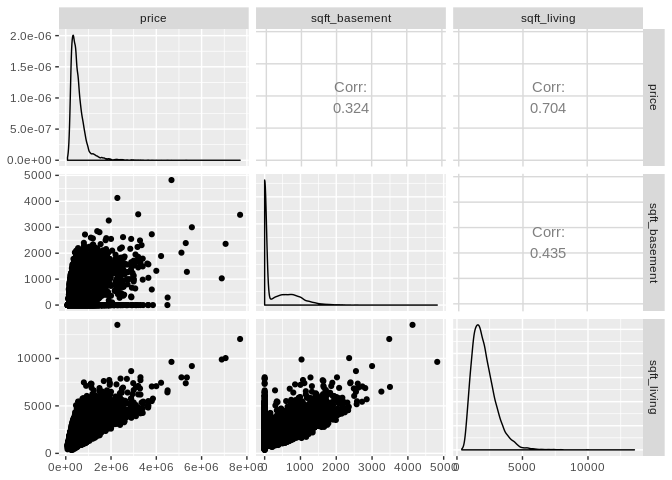<!-- -->

```r
#Visualización y comprobación de los datos imputados
imputed %>% select(sqft_living, sqft_basement, sqft_basement_imp)  %>% marginplot(., delimiter = '_imp')
```

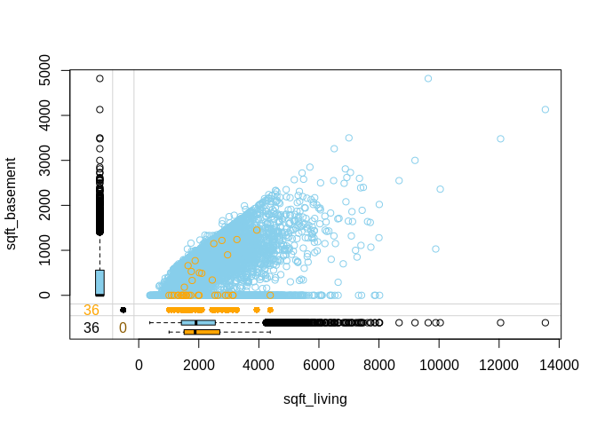<!-- -->
<br/>
**Imputación de la variable "sqft_lot" (superficie de la parcela):**
La variable "sqft_lot" es una variable con baja correlación entre las demás salvo con "sqft_lot15" ya que es la misma variable actualizada en el año 2015, puediendo usarla directamente para imputarla.

```r
#método de imputación knn
imputed <- price_tplusc %>% select(price, sqft_lot, sqft_lot15) %>%
  VIM::kNN(variable="sqft_lot")

#guardado de la variable
price_tplusc$sqft_lot_im = imputed$sqft_lot

#Visualización y comprobación de la varaible
columns <- c("price", "sqft_lot", "sqft_lot15")
imputed %>% select(columns) %>%
  na.omit() %>%
  ggpairs(columns=1:length(columns))
```

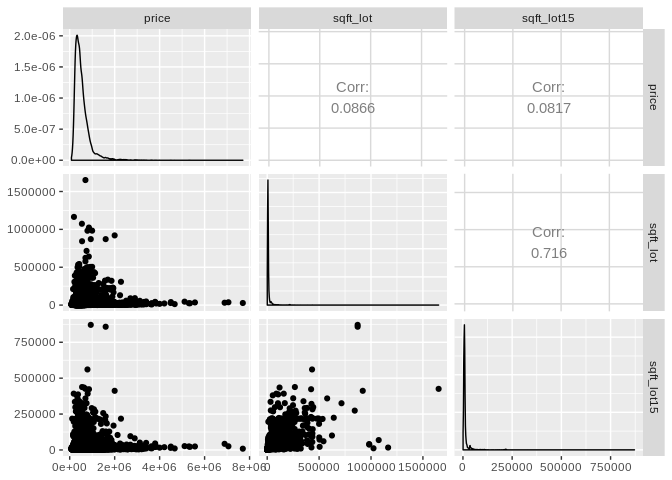<!-- -->

```r
#Visualización y comprobación de los datos imputados
imputed %>% select(sqft_lot15, sqft_lot, sqft_lot_imp)  %>% marginplot(., delimiter = '_imp')
```

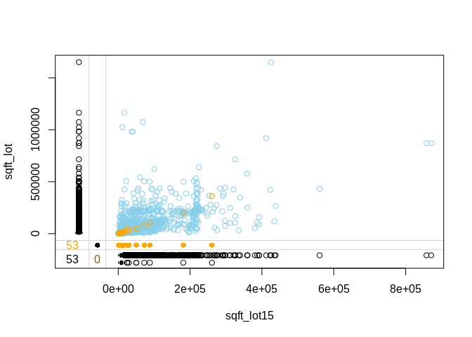<!-- -->
<br/>
**Imputación de la variable "sqft_above" (superficie de la parcela):**
La variable "sqft_above" es una variable....

```r
#método de imputación knn
imputed <- price_tplusc %>% select(price, sqft_above, sqft_living, sqft_living15) %>%
  VIM::kNN(variable="sqft_above")

#guardado de la variable
price_tplusc$sqft_above_im = imputed$sqft_above

#Visualización y comprobación de la varaible
columns <- c("price", "sqft_above")
imputed %>% select(columns) %>%
  na.omit() %>%
  ggpairs(columns=1:length(columns))
```

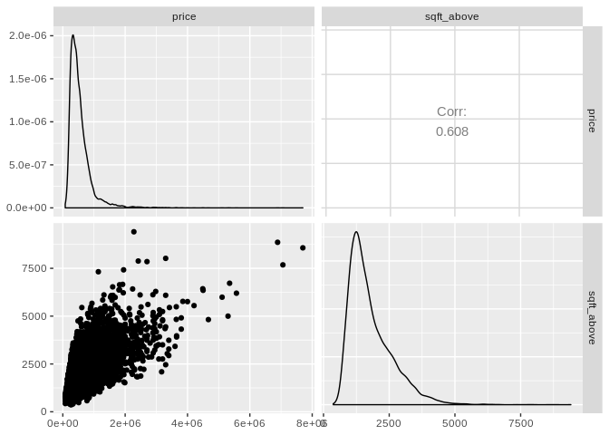<!-- -->

```r
#Visualización y comprobación de los datos imputados
imputed %>% select(price, sqft_above, sqft_above_imp)  %>% marginplot(., delimiter = '_imp')
```

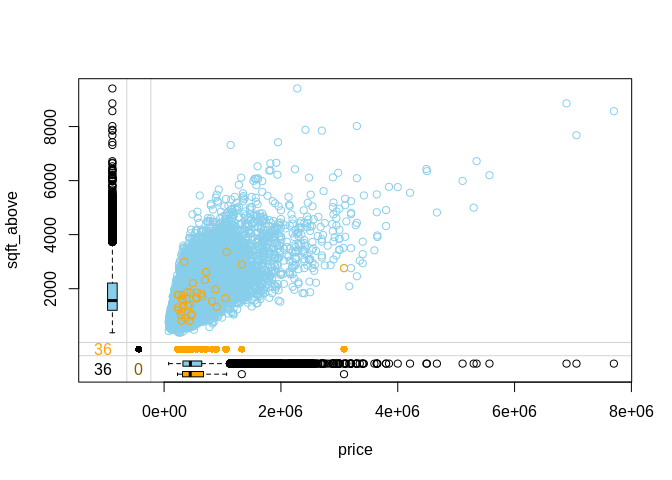<!-- -->

<br/>
**Imputación de la variable "yr_built" (superficie de la parcela):**
La variable "yr_built" es una variable con baja correlación entre las demás salvo con "long" probablemente por el crecimiento del barrio de manera direccional y con "yr_renovated" debido a que a más antiguo es el año de construcción más probable es su renovación.

```r
#método de imputación knn
imputed <- price_tplusc %>% select(price, yr_built, long, yr_renovated) %>%
  VIM::kNN(variable="yr_built")

#guardado de la variable
price_tplusc$yr_built_im = imputed$yr_built

#Visualización y comprobación de la varaible
columns <- c("price", "yr_built")
imputed %>% select(columns) %>%
  na.omit() %>%
  ggpairs(columns=1:length(columns))
```

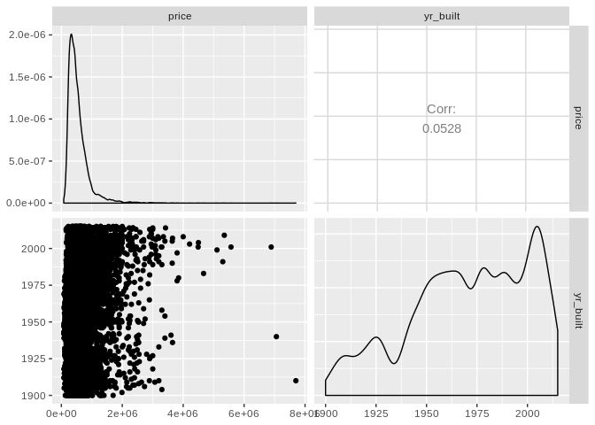<!-- -->

```r
#Visualización y comprobación de los datos imputados
imputed %>% select(long, yr_built, yr_built_imp)  %>% marginplot(., delimiter = '_imp')
```

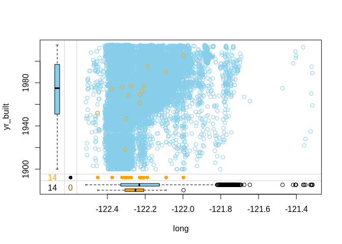<!-- -->
<br/>

#### Imputación de las variables discretas:

```r
#Muestra de variables de la base de datos seleccionada
structure(df_cualitativas)
```

<table class="table" style="margin-left: auto; margin-right: auto;">
 <thead>
  <tr>
   <th style="text-align:left;"> variable </th>
   <th style="text-align:left;"> classe </th>
   <th style="text-align:left;"> first_values </th>
  </tr>
 </thead>
<tbody>
  <tr>
   <td style="text-align:left;"> date </td>
   <td style="text-align:left;"> integer </td>
   <td style="text-align:left;"> 12/09/2014, 2/25/2015, 12/09/2014, 2/18/2015, 05/12/2014, 6/27/2014 </td>
  </tr>
  <tr>
   <td style="text-align:left;"> bedrooms </td>
   <td style="text-align:left;"> integer </td>
   <td style="text-align:left;"> 3, 2, 4, 3, 4, 3 </td>
  </tr>
  <tr>
   <td style="text-align:left;"> bathrooms </td>
   <td style="text-align:left;"> double </td>
   <td style="text-align:left;"> 2.25, 1, 3, 2, 4.5, 2.25 </td>
  </tr>
  <tr>
   <td style="text-align:left;"> floors </td>
   <td style="text-align:left;"> double </td>
   <td style="text-align:left;"> 2, 1, 1, 1, 1, 2 </td>
  </tr>
  <tr>
   <td style="text-align:left;"> waterfront </td>
   <td style="text-align:left;"> integer </td>
   <td style="text-align:left;"> 0, 0, 0, NA, 0, 0 </td>
  </tr>
  <tr>
   <td style="text-align:left;"> view </td>
   <td style="text-align:left;"> integer </td>
   <td style="text-align:left;"> 0, 0, 0, 0, 0, 0 </td>
  </tr>
  <tr>
   <td style="text-align:left;"> condition </td>
   <td style="text-align:left;"> integer </td>
   <td style="text-align:left;"> 3, 3, 5, 3, 3, 3 </td>
  </tr>
  <tr>
   <td style="text-align:left;"> grade </td>
   <td style="text-align:left;"> integer </td>
   <td style="text-align:left;"> 7, 6, 7, 8, 11, 7 </td>
  </tr>
  <tr>
   <td style="text-align:left;"> zipcode </td>
   <td style="text-align:left;"> integer </td>
   <td style="text-align:left;"> 98125, 98028, 98136, 98074, 98053, 98003 </td>
  </tr>
  <tr>
   <td style="text-align:left;"> dates_m </td>
   <td style="text-align:left;"> list </td>
   <td style="text-align:left;"> c("12", "02", "12", "02", "05", "06") </td>
  </tr>
  <tr>
   <td style="text-align:left;"> dates_y </td>
   <td style="text-align:left;"> list </td>
   <td style="text-align:left;"> c("2014", "2015", "2014", "2015", "2014", "2014") </td>
  </tr>
</tbody>
</table>

```r
#Muestra de variables missing
sapply(df_cualitativas, function(x) sum(is.na(x))) %>% kable()
```

<table>
 <thead>
  <tr>
   <th style="text-align:left;">   </th>
   <th style="text-align:right;"> x </th>
  </tr>
 </thead>
<tbody>
  <tr>
   <td style="text-align:left;"> date </td>
   <td style="text-align:right;"> 0 </td>
  </tr>
  <tr>
   <td style="text-align:left;"> bedrooms </td>
   <td style="text-align:right;"> 51 </td>
  </tr>
  <tr>
   <td style="text-align:left;"> bathrooms </td>
   <td style="text-align:right;"> 35 </td>
  </tr>
  <tr>
   <td style="text-align:left;"> floors </td>
   <td style="text-align:right;"> 23 </td>
  </tr>
  <tr>
   <td style="text-align:left;"> waterfront </td>
   <td style="text-align:right;"> 23 </td>
  </tr>
  <tr>
   <td style="text-align:left;"> view </td>
   <td style="text-align:right;"> 18 </td>
  </tr>
  <tr>
   <td style="text-align:left;"> condition </td>
   <td style="text-align:right;"> 27 </td>
  </tr>
  <tr>
   <td style="text-align:left;"> grade </td>
   <td style="text-align:right;"> 18 </td>
  </tr>
  <tr>
   <td style="text-align:left;"> zipcode </td>
   <td style="text-align:right;"> 0 </td>
  </tr>
  <tr>
   <td style="text-align:left;"> dates_m </td>
   <td style="text-align:right;"> 0 </td>
  </tr>
  <tr>
   <td style="text-align:left;"> dates_y </td>
   <td style="text-align:right;"> 0 </td>
  </tr>
</tbody>
</table>

```r
#Correlaciones entre variables discretas numéricas
discretas_col <- c("bedrooms", "bathrooms", 'price', 'floors')

price_tplusc %>% select(discretas_col) %>%
  na.omit() %>%
  ggpairs(columns=1:4)
```

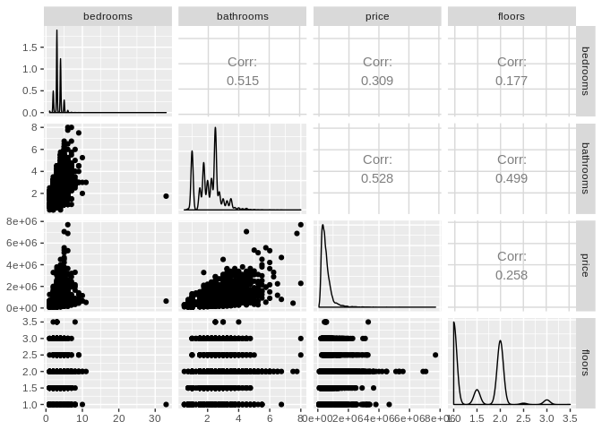<!-- -->

<br/>
**Imputación de la variable "bedrooms" (habitaciones por vivienda):**
La variable "berooms" es una variable importante ya que está altamente relacionada con la superficie de la vivienda, con el número de baños y con el número de plantas.

```r
#método de imputación knn
imputed <- price_tplusc %>% select(bedrooms, bathrooms, floors, sqft_living) %>%
  VIM::kNN(variable="bedrooms")

#guardado de la variable
price_tplusc$bedrooms_im = imputed$bedrooms

#Visualización y comprobación de la varaible
columns <- c('sqft_living', 'bathrooms')
imputed %>% select(columns) %>%
  na.omit() %>%
  ggpairs(columns=1:length(columns))
```

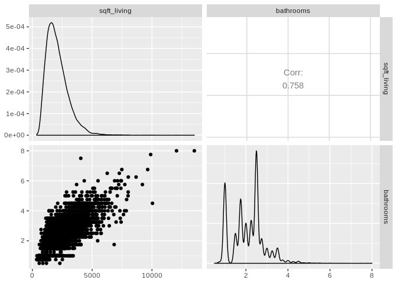<!-- -->

```r
#Visualización y comprobación de los datos imputados
imputed %>% select(sqft_living, bedrooms, bedrooms_imp)  %>% marginplot(., delimiter = '_imp')
```

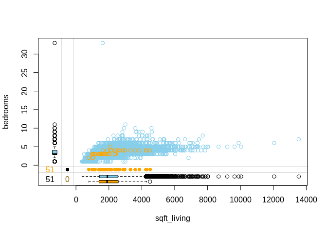<!-- -->

<br/>
**Imputación de la variable "bathrooms" (baños/aseos por vivienda):**
La variable "bathrooms" es una variable importante ya que está altamente relacionada con la superficie de la vivienda y el número de habitaciones.

```r
#método de imputación knn
imputed <- price_tplusc %>% select(bedrooms, bathrooms, sqft_living, floors) %>%
  VIM::kNN(variable="bathrooms")

#guardado de la variable
price_tplusc$bathrooms_im = imputed$bathrooms

#Visualización y comprobación de la varaible
columns <- c("bedrooms", "bathrooms")
imputed %>% select(columns) %>%
  na.omit() %>%
  ggpairs(columns=1:length(columns))
```

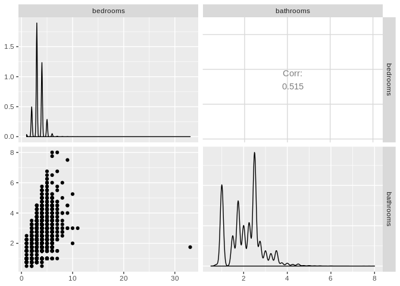<!-- -->

```r
#Visualización y comprobación de los datos imputados
imputed %>% select(bedrooms, bathrooms, bathrooms_imp)  %>% marginplot(., delimiter = '_imp')
```

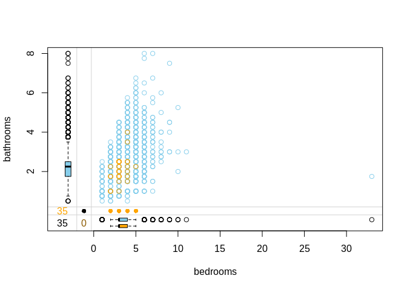<!-- -->

<br/>
**Imputación de la variable "floors" (baños/aseos por vivienda):**
La variable "floors" es una variable importante ya que está altamente relacionada con la superficie de la vivienda, habitaciones y baños.

```r
#método de imputación knn
imputed <- price_tplusc %>% select(bedrooms, bathrooms, floors, sqft_living) %>%
  VIM::kNN(variable="floors")

#guardado de la variable
price_tplusc$floors_im = imputed$floors

#Visualización y comprobación de la varaible
columns <- c("sqft_living", "floors")
imputed %>% select(columns) %>%
  na.omit() %>%
  ggpairs(columns=1:length(columns))
```

<!-- -->

```r
#Visualización y comprobación de los datos imputados
imputed %>% select(sqft_living, floors, floors_imp)  %>% marginplot(., delimiter = '_imp')
```

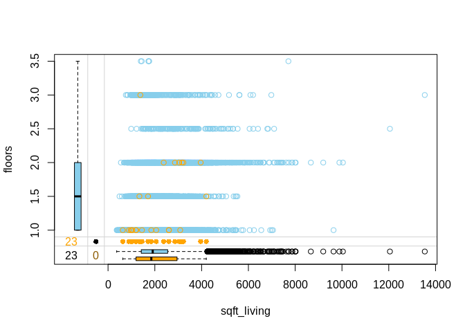<!-- -->

<br/>
**Imputación de la variable "waterfront" (vivienda con vistas):**
La variable "waterfront" es una variable que influye de manera directa sobre el precio de la vivienda pero que no puede obtenerse de manera segura. Podríamos seleccionar las variables de "long" y de "grade" ya que las vistas al mar están relacionadas con la ubicación y con la nota dada por el vecindario.

```r
#método de imputación knn
imputed <- price_tplusc %>% select(waterfront, long, grade) %>%
  VIM::kNN(variable="waterfront")

#guardado de la variable
price_tplusc$waterfront_im = imputed$waterfront

#Visualización y comprobación de los datos imputados
imputed %>% select(grade, waterfront, waterfront_imp)  %>% marginplot(., delimiter = '_imp')
```

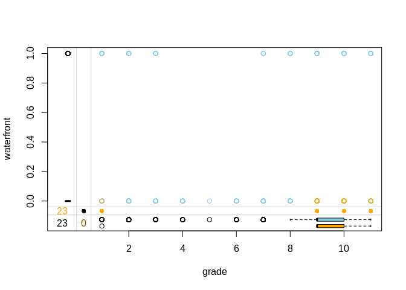<!-- -->

<br/>
**Imputación de la variable "view" (vivienda con vistas):**
La variable "view" es una variable que influye de manera directa sobre el precio de la vivienda pero que no puede obtenerse de manera segur dado que es el número de veces que se ha visitado una vivienda en venta. Podríamos seleccionar las variables de "condition" y de "grade" ya que estarán muy relacionadas con las calidades de la vivienda, y las variables de superficie de vivienda y de huella dado que al estar muy relacionadas con el precio influiran en las visitas para su venta.

```r
#método de imputación knn
imputed <- price_tplusc %>% select(view, sqft_above, sqft_living, grade, condition) %>%
  VIM::kNN(variable="view")

#guardado de la variable
price_tplusc$view_im = imputed$view

#Visualización y comprobación de los datos imputados
imputed %>% select(grade, view, view_imp)  %>% marginplot(., delimiter = '_imp')
```

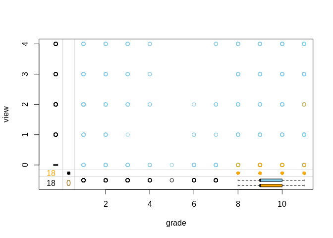<!-- -->

<br/>
**Imputación de la variable "condition":**
La variable "condition" probablmente esté muy relacionada con la variable "grade" ya que es la calificación del vecindario, el año de construcción "yr_built" y la variable "long" que responde al año de construcción.

```r
numeric_cols4 <- c("condition", "grade", "yr_built", 'yr_renovated', 'long')

price_tplusc %>% select(numeric_cols4) %>%
  na.omit() %>%
  ggpairs(columns=1:5)
```

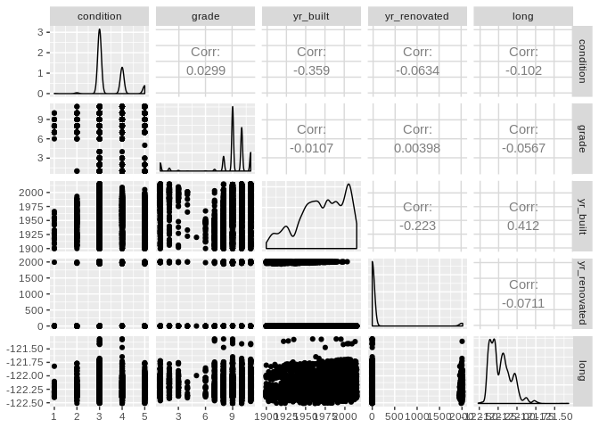<!-- -->

```r
describe(price_tplusc$condition)
```

```
## price_tplusc$condition 
##        n  missing distinct     Info     Mean      Gmd 
##    19412       27        5     0.71    3.411   0.6189 
## 
## lowest : 1 2 3 4 5, highest: 1 2 3 4 5
##                                         
## Value          1     2     3     4     5
## Frequency     28   161 12564  5120  1539
## Proportion 0.001 0.008 0.647 0.264 0.079
```

```r
#método de imputación knn
imputed <- price_tplusc %>% select(condition, grade, long, yr_built, bathrooms) %>%
  VIM::kNN(variable="condition")

#guardado de la variable
price_tplusc$condition_im = imputed$condition

#Visualización y comprobación de los datos imputados
imputed %>% select(grade, condition, condition_imp)  %>% marginplot(., delimiter = '_imp')
```

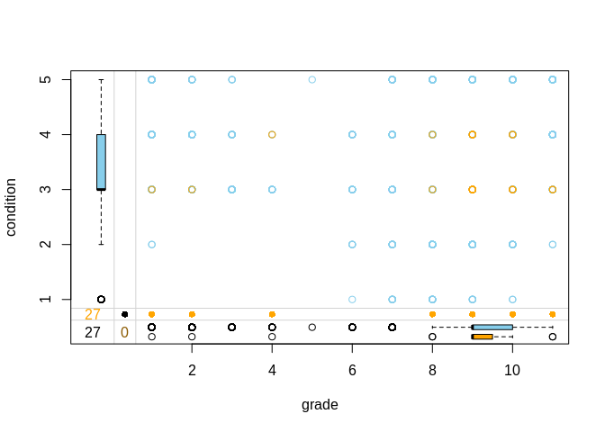<!-- -->

<br/>
**Imputación de la variable "grade":**

```r
numeric_cols4 <- c('condition', 'grade', 'yr_built', 'yr_renovated', 'long', 'bathrooms', 'view', 'waterfront')

price_tplusc %>% select(numeric_cols4) %>%
  na.omit() %>%
  ggpairs(columns=1:5)
```

<!-- -->

```r
describe(price_tplusc$grade)
```

```
## price_tplusc$grade 
##        n  missing distinct     Info     Mean      Gmd      .05      .10 
##    19420       19       11    0.903     8.82    1.948        1        8 
##      .25      .50      .75      .90      .95 
##        9        9       10       11       11 
## 
## lowest :  1  2  3  4  5, highest:  7  8  9 10 11
##                                                                             
## Value          1     2     3     4     5     6     7     8     9    10    11
## Frequency   1018   368    79    12     1    26   217  1839  8081  5446  2333
## Proportion 0.052 0.019 0.004 0.001 0.000 0.001 0.011 0.095 0.416 0.280 0.120
```

```r
price_tplusc %>% select(condition, grade)  %>% marginplot()
```

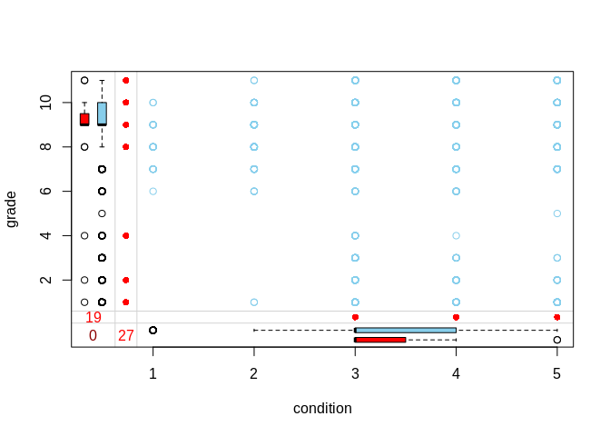<!-- -->

```r
#método de imputación knn
imputed <- price_tplusc %>% select(numeric_cols4) %>%
  VIM::kNN(variable="grade")

#guardado de la variable
price_tplusc$grade_im = imputed$grade

#Visualización y comprobación de los datos imputados
imputed %>% select(condition, grade, grade_imp)  %>% marginplot(., delimiter = '_imp')
```

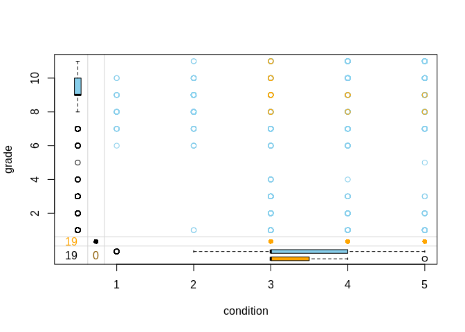<!-- -->

<br/>
<br/>

## 05 Transformación de variables

```r
#Muestra de variables de la base de datos seleccionada
show_df = data.frame(variable = names(price_tplusc),
           classe = sapply(price_tplusc, typeof),
           first_values = sapply(price_tplusc, function(x) paste0(head(x),  collapse = ", ")),
           row.names = NULL)
kable(show_df) %>%
  kable_styling()
```

<table class="table" style="margin-left: auto; margin-right: auto;">
 <thead>
  <tr>
   <th style="text-align:left;"> variable </th>
   <th style="text-align:left;"> classe </th>
   <th style="text-align:left;"> first_values </th>
  </tr>
 </thead>
<tbody>
  <tr>
   <td style="text-align:left;"> id </td>
   <td style="text-align:left;"> double </td>
   <td style="text-align:left;"> 6414100192, 5631500400, 2487200875, 1954400510, 7237550310, 1321400060 </td>
  </tr>
  <tr>
   <td style="text-align:left;"> date </td>
   <td style="text-align:left;"> integer </td>
   <td style="text-align:left;"> 12/09/2014, 2/25/2015, 12/09/2014, 2/18/2015, 05/12/2014, 6/27/2014 </td>
  </tr>
  <tr>
   <td style="text-align:left;"> price </td>
   <td style="text-align:left;"> double </td>
   <td style="text-align:left;"> 538000, 180000, 604000, 510000, 1230000, 257500 </td>
  </tr>
  <tr>
   <td style="text-align:left;"> bedrooms </td>
   <td style="text-align:left;"> integer </td>
   <td style="text-align:left;"> 3, 2, 4, 3, 4, 3 </td>
  </tr>
  <tr>
   <td style="text-align:left;"> bathrooms </td>
   <td style="text-align:left;"> double </td>
   <td style="text-align:left;"> 2.25, 1, 3, 2, 4.5, 2.25 </td>
  </tr>
  <tr>
   <td style="text-align:left;"> sqft_living </td>
   <td style="text-align:left;"> integer </td>
   <td style="text-align:left;"> 2570, 770, NA, 1680, 5420, 1715 </td>
  </tr>
  <tr>
   <td style="text-align:left;"> sqft_lot </td>
   <td style="text-align:left;"> integer </td>
   <td style="text-align:left;"> 7242, 10000, 5000, 8080, 101930, 6819 </td>
  </tr>
  <tr>
   <td style="text-align:left;"> floors </td>
   <td style="text-align:left;"> double </td>
   <td style="text-align:left;"> 2, 1, 1, 1, 1, 2 </td>
  </tr>
  <tr>
   <td style="text-align:left;"> waterfront </td>
   <td style="text-align:left;"> integer </td>
   <td style="text-align:left;"> 0, 0, 0, NA, 0, 0 </td>
  </tr>
  <tr>
   <td style="text-align:left;"> view </td>
   <td style="text-align:left;"> integer </td>
   <td style="text-align:left;"> 0, 0, 0, 0, 0, 0 </td>
  </tr>
  <tr>
   <td style="text-align:left;"> condition </td>
   <td style="text-align:left;"> integer </td>
   <td style="text-align:left;"> 3, 3, 5, 3, 3, 3 </td>
  </tr>
  <tr>
   <td style="text-align:left;"> grade </td>
   <td style="text-align:left;"> double </td>
   <td style="text-align:left;"> 9, 8, 9, 10, 2, 9 </td>
  </tr>
  <tr>
   <td style="text-align:left;"> sqft_above </td>
   <td style="text-align:left;"> integer </td>
   <td style="text-align:left;"> 2170, 770, 1050, 1680, 3890, 1715 </td>
  </tr>
  <tr>
   <td style="text-align:left;"> sqft_basement </td>
   <td style="text-align:left;"> integer </td>
   <td style="text-align:left;"> 400, 0, 910, 0, 1530, 0 </td>
  </tr>
  <tr>
   <td style="text-align:left;"> yr_built </td>
   <td style="text-align:left;"> integer </td>
   <td style="text-align:left;"> 1951, 1933, 1965, 1987, 2001, 1995 </td>
  </tr>
  <tr>
   <td style="text-align:left;"> yr_renovated </td>
   <td style="text-align:left;"> integer </td>
   <td style="text-align:left;"> 1991, 0, 0, 0, 0, 0 </td>
  </tr>
  <tr>
   <td style="text-align:left;"> zipcode </td>
   <td style="text-align:left;"> integer </td>
   <td style="text-align:left;"> 98125, 98028, 98136, 98074, 98053, 98003 </td>
  </tr>
  <tr>
   <td style="text-align:left;"> lat </td>
   <td style="text-align:left;"> double </td>
   <td style="text-align:left;"> 47.721, 477.379, 475.208, 476.168, 476.561, 473.097 </td>
  </tr>
  <tr>
   <td style="text-align:left;"> long </td>
   <td style="text-align:left;"> double </td>
   <td style="text-align:left;"> -122.319, -122.233, -122.393, -122.045, -122.005, -122.327 </td>
  </tr>
  <tr>
   <td style="text-align:left;"> sqft_living15 </td>
   <td style="text-align:left;"> integer </td>
   <td style="text-align:left;"> 1690, 2720, 1360, 1800, 4760, 2238 </td>
  </tr>
  <tr>
   <td style="text-align:left;"> sqft_lot15 </td>
   <td style="text-align:left;"> integer </td>
   <td style="text-align:left;"> 7639, 8062, 5000, 7503, 101930, 6819 </td>
  </tr>
  <tr>
   <td style="text-align:left;"> cat_bedrooms </td>
   <td style="text-align:left;"> integer </td>
   <td style="text-align:left;"> [1, 4), [1, 4), 4, [1, 4), 4, [1, 4) </td>
  </tr>
  <tr>
   <td style="text-align:left;"> cat_bathrooms </td>
   <td style="text-align:left;"> integer </td>
   <td style="text-align:left;"> [2.00,2.75), [0.50,2.00), [2.75,8.00], [2.00,2.75), [2.75,8.00], [2.00,2.75) </td>
  </tr>
  <tr>
   <td style="text-align:left;"> cat_floors </td>
   <td style="text-align:left;"> integer </td>
   <td style="text-align:left;"> [1.5,2.5), 1.0, 1.0, 1.0, 1.0, [1.5,2.5) </td>
  </tr>
  <tr>
   <td style="text-align:left;"> cat_view </td>
   <td style="text-align:left;"> integer </td>
   <td style="text-align:left;"> 0, 0, 0, 0, 0, 0 </td>
  </tr>
  <tr>
   <td style="text-align:left;"> cat_condition </td>
   <td style="text-align:left;"> integer </td>
   <td style="text-align:left;"> [1,4), [1,4), 5, [1,4), [1,4), [1,4) </td>
  </tr>
  <tr>
   <td style="text-align:left;"> cat_grade </td>
   <td style="text-align:left;"> integer </td>
   <td style="text-align:left;"> [ 1,10), [ 1,10), [ 1,10), 10, [ 1,10), [ 1,10) </td>
  </tr>
  <tr>
   <td style="text-align:left;"> cat_zipcode </td>
   <td style="text-align:left;"> integer </td>
   <td style="text-align:left;"> [98112,98199], [98001,98042), [98112,98199], [98042,98112), [98042,98112), [98001,98042) </td>
  </tr>
  <tr>
   <td style="text-align:left;"> sqft_living_im </td>
   <td style="text-align:left;"> integer </td>
   <td style="text-align:left;"> 2570, 770, 1820, 1680, 5420, 1715 </td>
  </tr>
  <tr>
   <td style="text-align:left;"> sqft_basement_im </td>
   <td style="text-align:left;"> integer </td>
   <td style="text-align:left;"> 400, 0, 910, 0, 1530, 0 </td>
  </tr>
  <tr>
   <td style="text-align:left;"> sqft_lot_im </td>
   <td style="text-align:left;"> integer </td>
   <td style="text-align:left;"> 7242, 10000, 5000, 8080, 101930, 6819 </td>
  </tr>
  <tr>
   <td style="text-align:left;"> sqft_above_im </td>
   <td style="text-align:left;"> integer </td>
   <td style="text-align:left;"> 2170, 770, 1050, 1680, 3890, 1715 </td>
  </tr>
  <tr>
   <td style="text-align:left;"> yr_built_im </td>
   <td style="text-align:left;"> integer </td>
   <td style="text-align:left;"> 1951, 1933, 1965, 1987, 2001, 1995 </td>
  </tr>
  <tr>
   <td style="text-align:left;"> bedrooms_im </td>
   <td style="text-align:left;"> integer </td>
   <td style="text-align:left;"> 3, 2, 4, 3, 4, 3 </td>
  </tr>
  <tr>
   <td style="text-align:left;"> bathrooms_im </td>
   <td style="text-align:left;"> double </td>
   <td style="text-align:left;"> 2.25, 1, 3, 2, 4.5, 2.25 </td>
  </tr>
  <tr>
   <td style="text-align:left;"> floors_im </td>
   <td style="text-align:left;"> double </td>
   <td style="text-align:left;"> 2, 1, 1, 1, 1, 2 </td>
  </tr>
  <tr>
   <td style="text-align:left;"> waterfront_im </td>
   <td style="text-align:left;"> integer </td>
   <td style="text-align:left;"> 0, 0, 0, 0, 0, 0 </td>
  </tr>
  <tr>
   <td style="text-align:left;"> view_im </td>
   <td style="text-align:left;"> integer </td>
   <td style="text-align:left;"> 0, 0, 0, 0, 0, 0 </td>
  </tr>
  <tr>
   <td style="text-align:left;"> condition_im </td>
   <td style="text-align:left;"> integer </td>
   <td style="text-align:left;"> 3, 3, 5, 3, 3, 3 </td>
  </tr>
  <tr>
   <td style="text-align:left;"> grade_im </td>
   <td style="text-align:left;"> double </td>
   <td style="text-align:left;"> 9, 8, 9, 10, 2, 9 </td>
  </tr>
</tbody>
</table>

### Transformación de variables cuantitativas
<br/>
**Transformación de la variable "price" (valor de venta de la vivienda):**

```r
# Posibles soluciones
# 1.-Transformacion logaritmico 10
# 2.-Raiz cuadrada
# 3.-Inversa 1/x

# Prueba 1 . Logaritmo
price_log10 <- log10(price_tplusc$price)
#Prueba 2 . Raiz cuadrada
price_sqrt <- sqrt(price_tplusc$price)

# Variable transformada
price_tplusc$price_trans <- price_log10

# Histogramas
h1 <- phist(price_tplusc, ., 'price')
h2 <- phist(price_tplusc, ., 'price_trans')
grid.arrange(h1, h2, nrow=1)
```

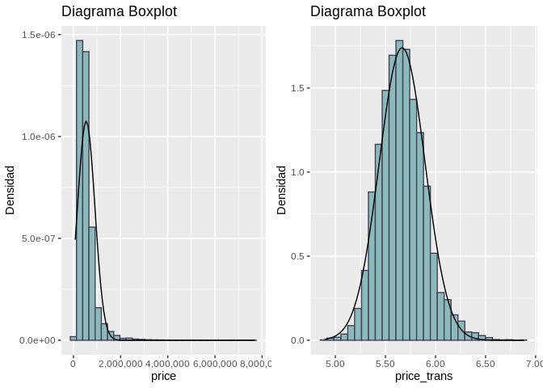<!-- -->

```r
# Quantil-quantil plot
q1 <- qqplot.data(price_tplusc$price)
q2 <- qqplot.data(price_log10)
q3 <- qqplot.data(price_sqrt)
grid.arrange(q1, q2, q3, nrow=1)
```

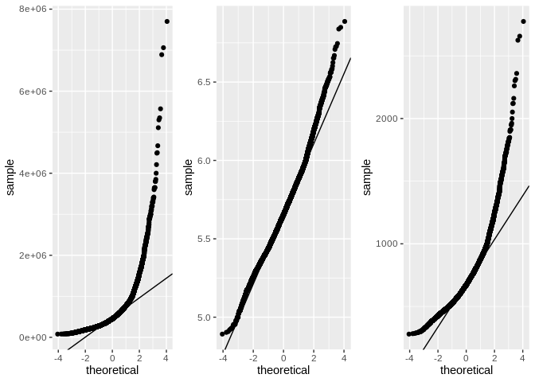<!-- -->

```r
# test de normalidad
lillie.test(price_log10)
```

```
## 
## 	Lilliefors (Kolmogorov-Smirnov) normality test
## 
## data:  price_log10
## D = 0.026553, p-value < 2.2e-16
```

Aunque tras aplicar la transformación logarítmica y el test de Kolmogorov-Smirnov el resultado a una distribución normal sigue siendo negativo, se puede ver un gran avance en el gráfico quantil-quantil.

<br/>
**Transformación de la variable "sqft_living" (Superficie de la vivienda):**

```r
# posibles soluciones
# 1.-Transformacion logaritmico 10
# 2.-Raiz cuadrada
# 3.-Inversa 1/x
# 4.-Box-Cox

#Prueba 1 . Logaritmo
price_tplusc$sqft_living_trans = log10(price_tplusc$sqft_living_im)

h1 = phist(price_tplusc, ., 'sqft_living_im')
h2 = phist(price_tplusc, ., 'sqft_living_trans')
grid.arrange(h1, h2, nrow=1)
```

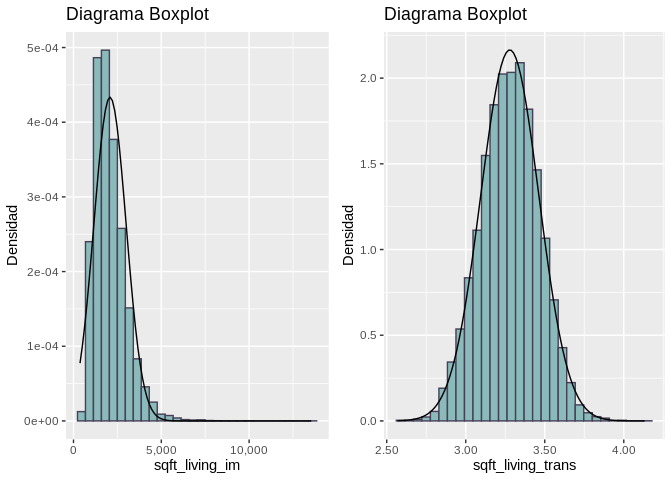<!-- -->

```r
q1 = qqplot.data(price_tplusc$sqft_living_im)
q2 = qqplot.data(price_tplusc$sqft_living_trans)
grid.arrange(q1, q2, nrow=1)
```

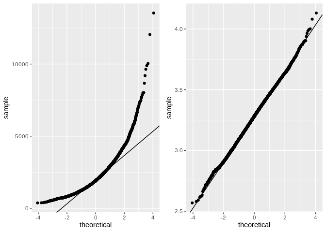<!-- -->

```r
# test de normalidad
lillie.test(price_tplusc$price_trans)
```

```
## 
## 	Lilliefors (Kolmogorov-Smirnov) normality test
## 
## data:  price_tplusc$price_trans
## D = 0.026553, p-value < 2.2e-16
```

Aunque tras aplicar la transformación logarítmica y el test de Kolmogorov-Smirnov el resultado a una distribución normal sigue siendo negativo se puede ver un gran avance en el gráfico quantil-quantil. Se esta manera nos quedaremos con la variable transformada

<br/>
**Transformación de la variable "sqft_basement" (Superficie del sótano):**

```r
# posibles soluciones
# 1.-Transformacion logaritmico 10
# 2.-Raiz cuadrada
# 3.-Inversa 1/x
# 4.-Box-Cox

#Prueba 2 . Raiz cuadrada
price_tplusc$sqft_basement_trans = sqrt(price_tplusc$sqft_basement_im)

h1 = phist(price_tplusc, ., 'sqft_basement_im')
h2 = phist(price_tplusc, ., 'sqft_basement_trans')
grid.arrange(h1, h2, nrow=1)
```

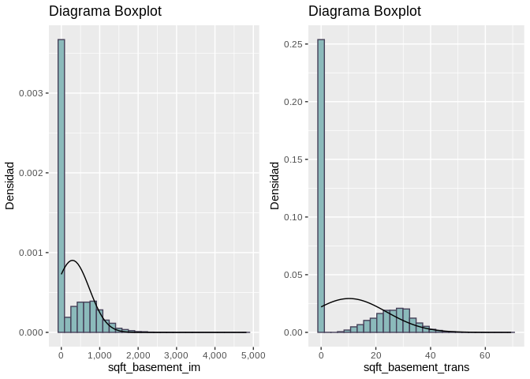<!-- -->

```r
q1 = qqplot.data(price_tplusc$sqft_basement_im)
q2 = qqplot.data(price_tplusc$sqft_basement_trans)
grid.arrange(q1, q2, nrow=1)
```

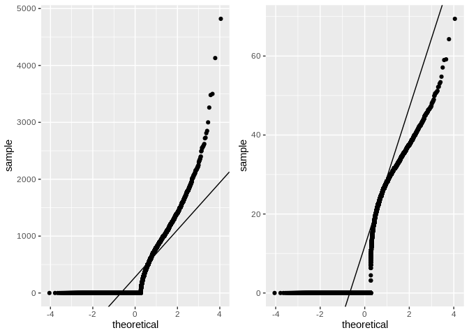<!-- -->

### Transformación de variables cualitativas
<br/>


```r
#dado que la variable contiene muchos ceros cuando la casa no tiene sótano esta variable va a ser categorizada.
old = "basement_im"
new = "sqft_basement_trans"

# Convertimos la variable en categórica
price_tplusc$sqft_basement_trans <- price_tplusc$sqft_basement_im
price_tplusc$sqft_basement_trans[price_tplusc$sqft_basement_im == 0] = "no_base"
price_tplusc$sqft_basement_trans[price_tplusc$sqft_basement_im <= 1000 & price_tplusc$sqft_basement_im != 0] = "base(0:1000]"
price_tplusc$sqft_basement_trans[price_tplusc$sqft_basement_im > 1000] = "base(1000, inf)"
price_tplusc$sqft_basement_trans <- as.factor(price_tplusc$sqft_basement_trans)

# Diagrama de densidad
p_densidad2(price_tplusc, new, 'price_trans')
```

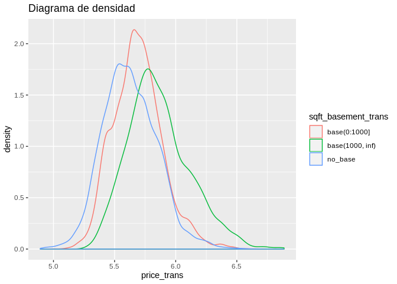<!-- -->

<br/>
**Transformación de la variable "sqft_lot" (Superficie de la vivienda):**

```r
# posibles soluciones
# 1.-Transformacion logaritmico 10
# 2.-Raiz cuadrada
# 3.-Inversa 1/
# 4.-Box-Cox

summary(price_tplusc$sqft_lot_im)
```

```
##    Min. 1st Qu.  Median    Mean 3rd Qu.    Max. 
##     520    5040    7620   15109   10650 1651359
```

```r
#Prueba 1 . Logaritmo
lot_log10 <- log10(price_tplusc$sqft_lot_im)
#Prueba 2 . Raiz cuadrada
lot_sqrt <- sqrt(price_tplusc$sqft_lot_im)
price_tplusc$sqft_lot_trans <- lot_log10

h1 <- phist(price_tplusc, ., 'sqft_lot_im')
h2 <- phist(price_tplusc, ., 'sqft_lot_trans')
grid.arrange(h1, h2, nrow=1)
```

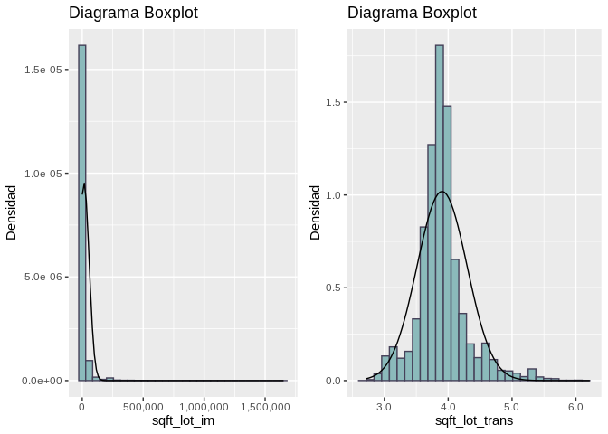<!-- -->

```r
q1 <- qqplot.data(price_tplusc$sqft_lot_im)
q2 <- qqplot.data(lot_sqrt)
q3 <- qqplot.data(lot_log10)
grid.arrange(q1, q2, q3, nrow=1)
```

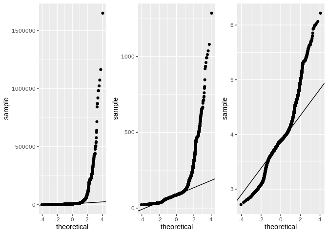<!-- -->

```r
# Dado que la varaible es muy desigual vamos a categorizarla
old = "sqft_lot_im"
new = "sqft_lot_trans"

#categorizamos la variable y mostramos su tabla de frecuencias
price_tplusc[[new]] = cut2(price_tplusc[[old]], g=4)
table(price_tplusc[[new]])
```

```
## 
## [  520,   5042) [ 5042,   7621) [ 7621,  10652) [10652,1651359] 
##            4866            4875            4841            4857
```

```r
#visualización de los datos categorizados con respecto a la variable "price"
p_densidad2(price_tplusc, new, 'price_trans')
```

<!-- -->
<br/>
**Transformación de la variable "sqft_above" (Superficie de la vivienda):**

```r
# posibles soluciones
# 1.-Transformacion logaritmico 10
# 2.-Raiz cuadrada
# 3.-Inversa 1/x
# 4.-Box-Cox

summary(price_tplusc$sqft_above_im)
```

```
##    Min. 1st Qu.  Median    Mean 3rd Qu.    Max. 
##     370    1200    1560    1788    2210    9410
```

```r
#Prueba 2 . Raiz cuadrada
price_tplusc$sqft_above_trans = sqrt(price_tplusc$sqft_above_im)

h1 = phist(price_tplusc, ., 'sqft_above_im')
h2 = phist(price_tplusc, ., 'sqft_above_trans')
grid.arrange(h1, h2, nrow=1)
```

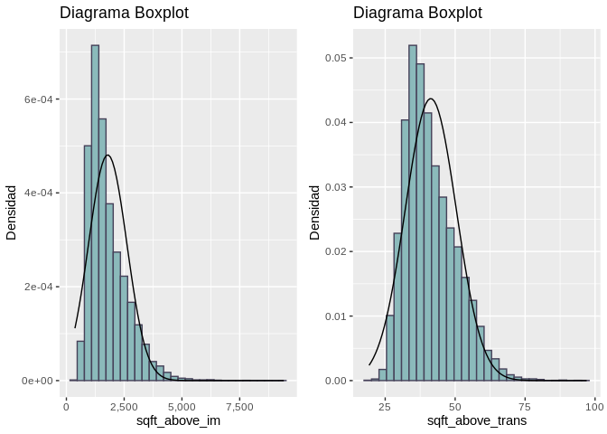<!-- -->

```r
q1 = qqplot.data(price_tplusc$sqft_above_im)
q2 = qqplot.data(price_tplusc$sqft_above_trans)
grid.arrange(q1, q2, nrow=1)
```

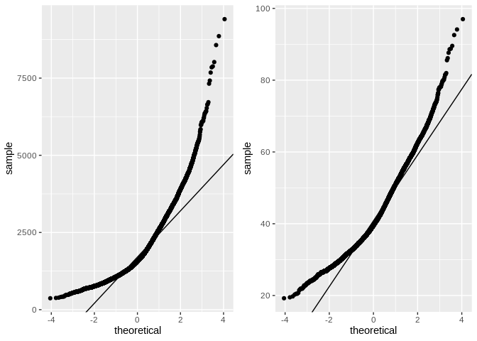<!-- -->

```r
# Dado que la varaible es muy desigual vamos a categorizarla
old = "sqft_above_im"
new = "sqft_above_trans"

#categorizamos la variable y mostramos su tabla de frecuencias
price_tplusc[[new]] = cut2(price_tplusc[[old]], g=4)
table(price_tplusc[[new]])
```

```
## 
## [ 370,1210) [1210,1564) [1564,2216) [2216,9410] 
##        5036        4710        4865        4828
```

```r
#visualización de los datos categorizados con respecto a la variable "price"
p_densidad2(price_tplusc, new, 'price_trans')
```

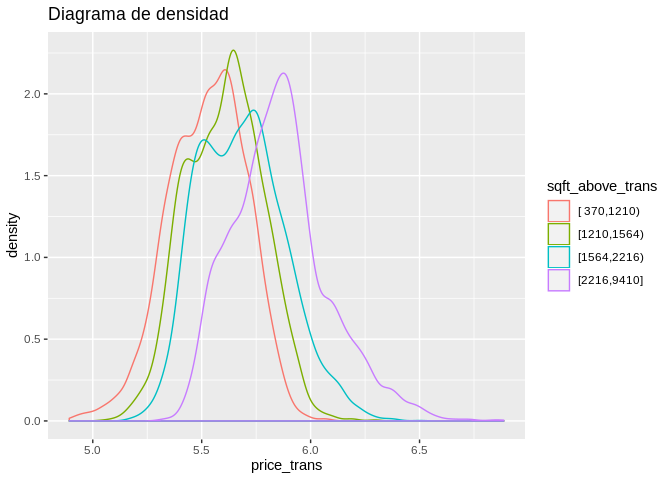<!-- -->
<br/>
**Transformación de la variable "yr_build" (Superficie de la vivienda):**

```r
# posibles soluciones
# 1.-Transformacion logaritmico 10
# 2.-Raiz cuadrada
# 3.-Inversa 1/x
# 4.-Box-Cox

summary(price_tplusc$yr_built_im)
```

```
##    Min. 1st Qu.  Median    Mean 3rd Qu.    Max. 
##    1900    1951    1975    1971    1997    2015
```

```r
#Prueba 1. Transformacion logaritmico 10.
price_tplusc$yr_built_trans0 = log10(price_tplusc$yr_built_im)

h1 = phist(price_tplusc, ., 'yr_built_im')
h2 = phist(price_tplusc, ., 'yr_built_trans0')
grid.arrange(h1, h2, nrow=1)
```

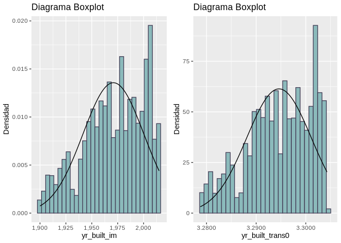<!-- -->

```r
q1 = qqplot.data(price_tplusc$yr_built_im)
q2 = qqplot.data(price_tplusc$yr_built_trans)
grid.arrange(q1, q2, nrow=1)
```

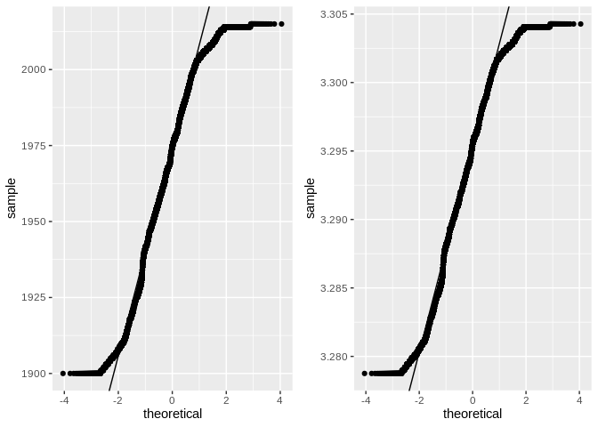<!-- -->

```r
#Categorizamos la variable
# Dado que la varaible es muy desigual vamos a categorizarla
old = "yr_built_im"
new = "yr_built_trans"

#categorizamos la variable y mostramos su tabla de frecuencias
price_tplusc[[new]] = cut2(price_tplusc[[old]], g=3)
table(price_tplusc[[new]])
```

```
## 
## [1900,1960) [1960,1990) [1990,2015] 
##        6686        6500        6253
```

```r
#visualización de los datos categorizados con respecto a la variable "price"
p_densidad2(price_tplusc, new, 'price_trans')
```

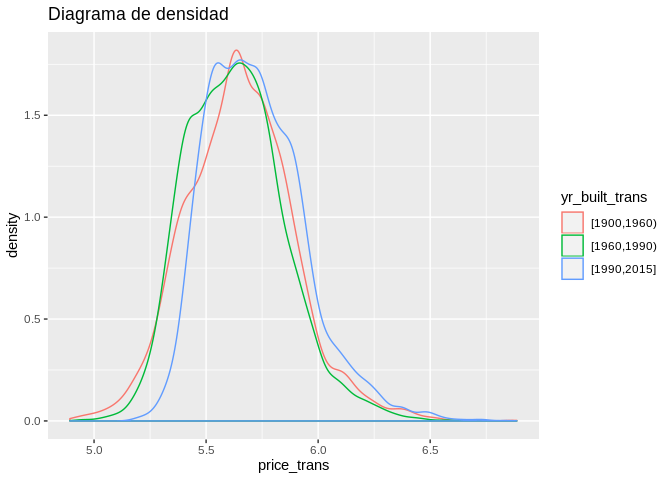<!-- -->
<br/>
<br/>
### Trasformaciṕn de variables cualitativas

```r
colors = c('#6c7b95', '#8bbabb', '#c7f0db')
```
<br/>

**Transformación de la variable "bedrooms_im":**

```r
price_tplusc <- price_tplusc %>% mutate(bedrooms_trans = cut2(bedrooms_im, g=3))

price_tplusc %>%
  select(bedrooms_trans) %>% table()
```

```
## .
## [1, 4)      4 [5,33] 
##  11518   6185   1736
```

```r
q1 <- price_tplusc %>%
          select(price_trans, bedrooms_trans) %>%
          ggplot(aes(x=price_trans, colour=bedrooms_trans)) +
          geom_density() + scale_color_manual(values=colors)

q2 <- price_tplusc %>%
          select(price_trans, bedrooms_trans) %>%
          ggplot(aes(y=price_trans, fill=bedrooms_trans)) +
          geom_boxplot() + scale_fill_manual(values=colors)

grid.arrange(q1, q2, nrow=1)
```

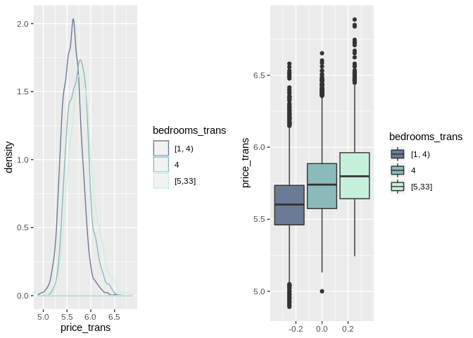<!-- -->
<br/>

**Transformación de la variable "bathrooms_im":**

```r
price_tplusc$bathrooms_im <- ceiling(price_tplusc$bathrooms_im)

price_tplusc <- price_tplusc %>% mutate(bathrooms_trans = cut2(bathrooms_im, g=3))

price_tplusc %>%
  select(bathrooms_trans) %>% table()
```

```
## .
## [1,3)     3 [4,8] 
##  9324  8410  1705
```

```r
q1 <- price_tplusc %>%
          select(price_trans, bathrooms_trans) %>%
          ggplot(aes(x=price_trans, colour=bathrooms_trans)) +
          geom_density() + scale_color_manual(values=colors)

q2 <- price_tplusc %>%
          select(price_trans, bathrooms_trans) %>%
          ggplot(aes(y=price_trans, fill=bathrooms_trans)) +
          geom_boxplot() + scale_fill_manual(values=colors)

grid.arrange(q1, q2, nrow=1)
```

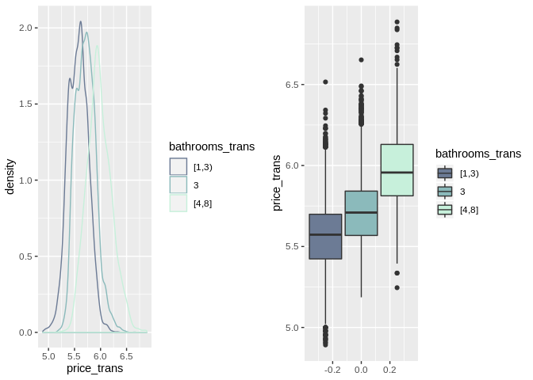<!-- -->
<br/>

**Transformación de la variable "floors_im":**

```r
# Categorizamos la variable de plantas de vivienda en 2 grupos
price_tplusc <- price_tplusc %>% mutate(floors_trans = cut2(floors_im, g=2))

price_tplusc %>%
  select(floors_trans) %>% table()
```

```
## .
## [1,2.0) [2,3.5] 
##   11318    8121
```

```r
q1 <- price_tplusc %>%
          select(price_trans, floors_trans) %>%
          ggplot(aes(x=price_trans, colour=floors_trans)) +
          geom_density() + scale_color_manual(values=colors)

q2 <- price_tplusc %>%
          select(price_trans, floors_trans) %>%
          ggplot(aes(y=price_trans, fill=floors_trans)) +
          geom_boxplot() + scale_fill_manual(values=colors)

grid.arrange(q1, q2, nrow=1)
```

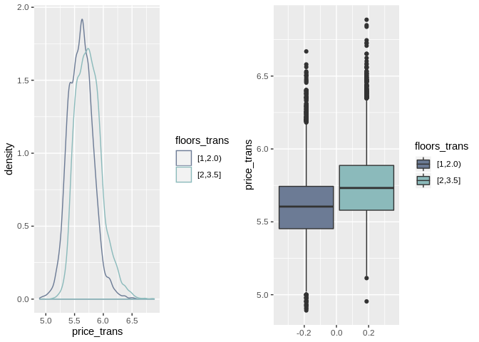<!-- -->

```r
# Categorizamos la variable de plantas de vivienda en 3 grupos
price_tplusc <- price_tplusc %>% mutate(floors_trans = cut2(floors_im, g=3))

price_tplusc %>%
  select(floors_trans) %>% table()
```

```
## .
##       1.0 [1.5,2.5) [2.5,3.5] 
##      9600      9154       685
```

```r
q1 <- price_tplusc %>%
          select(price_trans, floors_trans) %>%
          ggplot(aes(x=price_trans, colour=floors_trans)) +
          geom_density() + scale_color_manual(values=colors)

q2 <- price_tplusc %>%
          select(price_trans, floors_trans) %>%
          ggplot(aes(y=price_trans, fill=floors_trans)) +
          geom_boxplot() + scale_fill_manual(values=colors)

grid.arrange(q1, q2, nrow=1)
```

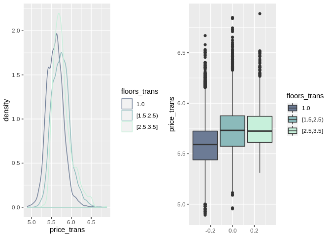<!-- -->
<br/>

**Transformación de la variable "condition_im":**

```r
 price_tplusc <- price_tplusc %>% mutate(condition_trans = cut2(condition_im, g=3))

 price_tplusc %>%
   select(condition_trans) %>% table()
```

```
## .
## [1,4)     4     5 
## 12771  5129  1539
```

```r
 price_tplusc %>%
           select(price_trans, condition_trans) %>%
           ggplot(aes(x=price_trans, colour=condition_trans)) +
           geom_density() + scale_color_manual(values=colors)
```

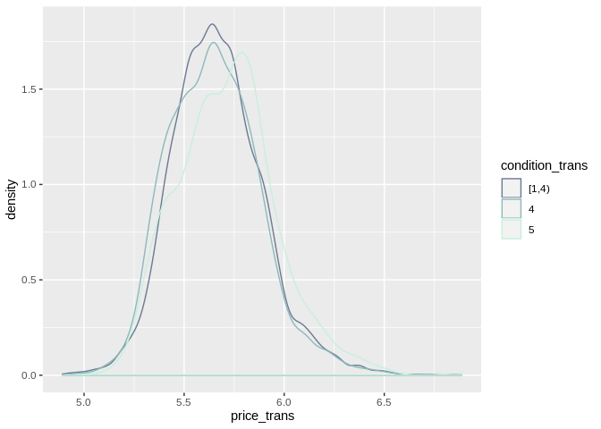<!-- -->

```r
price_tplusc %>%
          select(price_trans, condition_trans) %>%
          ggplot(aes(y=price_trans, fill=condition_trans)) +
          geom_boxplot() + scale_fill_manual(values=colors)
```

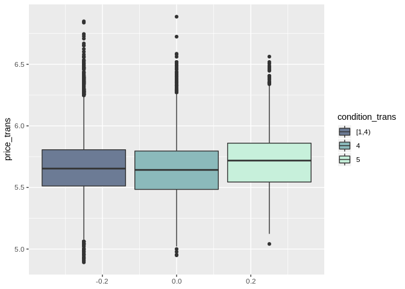<!-- -->
<br/>

**Transformación de la variable "grade_im":**

```r
 price_tplusc <- price_tplusc %>% mutate(grade_trans = cut2(grade_im, g=3))

 price_tplusc %>%
   select(grade_trans) %>% table()
```

```
## .
## [ 1,10)      10      11 
##   11655    5449    2335
```

```r
 price_tplusc %>%
           select(price_trans, grade_trans) %>%
           ggplot(aes(x=price_trans, colour=grade_trans)) +
           geom_density() + scale_color_manual(values=colors)
```

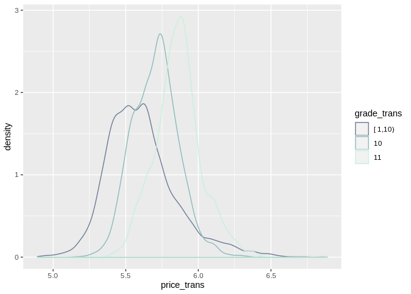<!-- -->

```r
price_tplusc %>%
          select(price_trans, grade_trans) %>%
          ggplot(aes(y=price_trans, fill=grade_trans)) +
          geom_boxplot() + scale_fill_manual(values=colors)
```

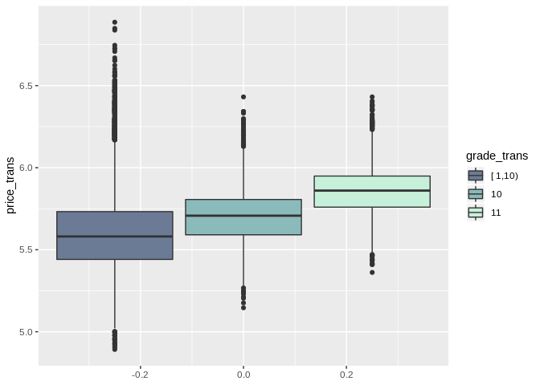<!-- -->
<br/>

**Transformación de la variable "waterfront_im":**

```r
 price_tplusc <- price_tplusc %>% mutate(waterfront_trans = cut2(waterfront_im, g=2))

 price_tplusc %>%
   select(waterfront_trans) %>% table()
```

```
## .
##     0     1 
## 19290   149
```

```r
 price_tplusc %>%
           select(price_trans, waterfront_trans) %>%
           ggplot(aes(x=price_trans, colour=waterfront_trans)) +
           geom_density() + scale_color_manual(values=colors)
```

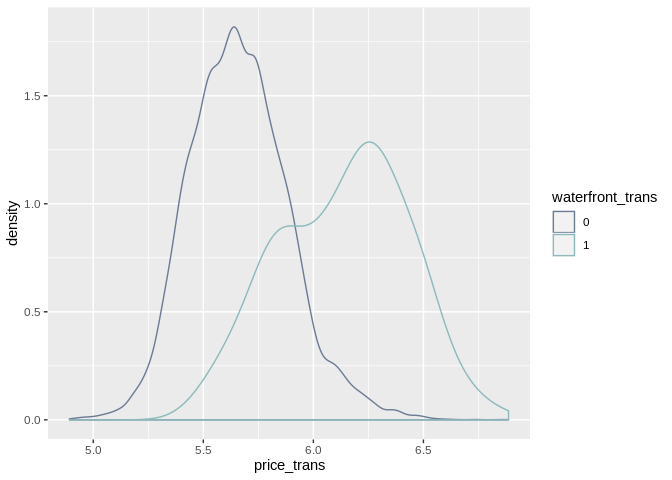<!-- -->

```r
price_tplusc %>%
          select(price_trans, waterfront_trans) %>%
          ggplot(aes(y=price_trans, fill=waterfront_trans)) +
          geom_boxplot() + scale_fill_manual(values=colors)
```

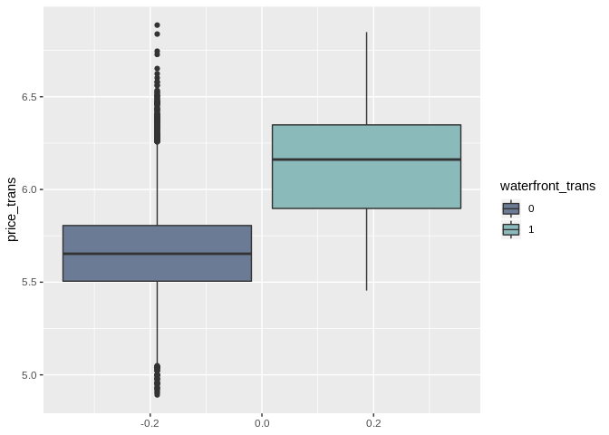<!-- -->
<br/>

**Transformación de la variable "view_im":**

```r
 price_tplusc <- price_tplusc %>% mutate(view_trans = cut2(view_im, g=2))

 price_tplusc %>%
   select(view_trans) %>% table()
```

```
## .
##     0 [1,4] 
## 17522  1917
```

```r
 price_tplusc %>%
           select(price_trans, view_trans) %>%
           ggplot(aes(x=price_trans, colour=view_trans)) +
           geom_density() + scale_color_manual(values=colors)
```

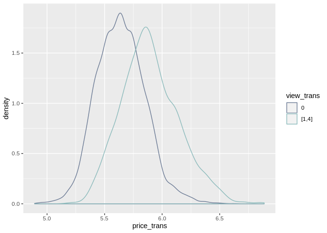<!-- -->

```r
price_tplusc %>%
          select(price_trans, view_trans) %>%
          ggplot(aes(y=price_trans, fill=view_trans)) +
          geom_boxplot() + scale_fill_manual(values=colors)
```

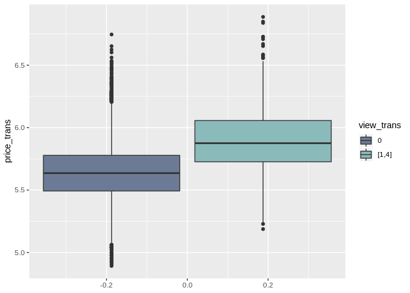<!-- -->
<br/>

### Resumen final
Comentarios sobre las variables a estudiar tras el análisis y la transformación de cada una:
1. id: no será usada ya que no se considera un parámetro de la vivienda.
2. date: la fecha de venta de la vivienda no será usada inicialmente.
3. price: se usará la variable sin convertir y la variable convertida mediante el logaritmo.
4. bedrooms: se categoriza esta variable en 3 grupos.
5. bathrooms: se redondea la variable a la alza y la categorizaremos en 3 grupos.
6. sqft_living: se aplica la conversion de logaritmo.
7. sqft_lot: debido al número tan alto de outliars se categoriza la variable en 3 grupos.
8. floors: se categoriza la variable en 3 grupos.
9. waterfront: variable dummy.
10. view: se categoriza la variable en dummy.
11. condition: se categoriza la variable en 3 grupos.
12. grade: se categoriza la varaible en 3 grupos
13. sqft_above: se categoriza la variable en 4 grupos.
14. sqft_basement: se categoriza la variable en 3 grupos.
15. yr_built: se categoriza la variable en 3 grupos.
16. yr_renovated: se categoriza la variable en 2 grupos.
17. zip_code: no será usada esta variable.
18. lat: no será usada esta variable.
19. long: no será usada esta variable.
20. sqft_living15: no será usada esta variable ya que es prácticamente la misma que sqft_living.
21. sqft_lot15:no será usada esta variable ya que es prácticamente la misma que sqft_lot.
<br/>

## 06 Comprobación de los datos

```r
columns <- c('price', 'price_trans', 'sqft_living_trans', 'sqft_basement_trans', 'sqft_lot_trans', 'sqft_above_trans', 'yr_built_trans', 'bedrooms_trans', 'bathrooms_trans', 'floors_trans', 'condition_trans', 'grade_trans', 'waterfront_trans', 'view_trans')

# Creación de la nueva tabla
df_transformadas <- select(price_tplusc, columns)

# Estructura
df_transformadas  %>% structure()
```

<table class="table" style="margin-left: auto; margin-right: auto;">
 <thead>
  <tr>
   <th style="text-align:left;"> variable </th>
   <th style="text-align:left;"> classe </th>
   <th style="text-align:left;"> first_values </th>
  </tr>
 </thead>
<tbody>
  <tr>
   <td style="text-align:left;"> price </td>
   <td style="text-align:left;"> double </td>
   <td style="text-align:left;"> 538000, 180000, 604000, 510000, 1230000, 257500 </td>
  </tr>
  <tr>
   <td style="text-align:left;"> price_trans </td>
   <td style="text-align:left;"> double </td>
   <td style="text-align:left;"> 5.73078227566639, 5.25527250510331, 5.78103693862113, 5.70757017609794, 6.0899051114394, 5.41077723337721 </td>
  </tr>
  <tr>
   <td style="text-align:left;"> sqft_living_trans </td>
   <td style="text-align:left;"> double </td>
   <td style="text-align:left;"> 3.40993312333129, 2.88649072517248, 3.26007138798507, 3.22530928172586, 3.73399928653839, 3.23426412437879 </td>
  </tr>
  <tr>
   <td style="text-align:left;"> sqft_basement_trans </td>
   <td style="text-align:left;"> integer </td>
   <td style="text-align:left;"> base(0:1000], no_base, base(0:1000], no_base, base(1000, inf), no_base </td>
  </tr>
  <tr>
   <td style="text-align:left;"> sqft_lot_trans </td>
   <td style="text-align:left;"> integer </td>
   <td style="text-align:left;"> [ 5042,   7621), [ 7621,  10652), [  520,   5042), [ 7621,  10652), [10652,1651359], [ 5042,   7621) </td>
  </tr>
  <tr>
   <td style="text-align:left;"> sqft_above_trans </td>
   <td style="text-align:left;"> integer </td>
   <td style="text-align:left;"> [1564,2216), [ 370,1210), [ 370,1210), [1564,2216), [2216,9410], [1564,2216) </td>
  </tr>
  <tr>
   <td style="text-align:left;"> yr_built_trans </td>
   <td style="text-align:left;"> integer </td>
   <td style="text-align:left;"> [1900,1960), [1900,1960), [1960,1990), [1960,1990), [1990,2015], [1990,2015] </td>
  </tr>
  <tr>
   <td style="text-align:left;"> bedrooms_trans </td>
   <td style="text-align:left;"> integer </td>
   <td style="text-align:left;"> [1, 4), [1, 4), 4, [1, 4), 4, [1, 4) </td>
  </tr>
  <tr>
   <td style="text-align:left;"> bathrooms_trans </td>
   <td style="text-align:left;"> integer </td>
   <td style="text-align:left;"> 3, [1,3), 3, [1,3), [4,8], 3 </td>
  </tr>
  <tr>
   <td style="text-align:left;"> floors_trans </td>
   <td style="text-align:left;"> integer </td>
   <td style="text-align:left;"> [1.5,2.5), 1.0, 1.0, 1.0, 1.0, [1.5,2.5) </td>
  </tr>
  <tr>
   <td style="text-align:left;"> condition_trans </td>
   <td style="text-align:left;"> integer </td>
   <td style="text-align:left;"> [1,4), [1,4), 5, [1,4), [1,4), [1,4) </td>
  </tr>
  <tr>
   <td style="text-align:left;"> grade_trans </td>
   <td style="text-align:left;"> integer </td>
   <td style="text-align:left;"> [ 1,10), [ 1,10), [ 1,10), 10, [ 1,10), [ 1,10) </td>
  </tr>
  <tr>
   <td style="text-align:left;"> waterfront_trans </td>
   <td style="text-align:left;"> integer </td>
   <td style="text-align:left;"> 0, 0, 0, 0, 0, 0 </td>
  </tr>
  <tr>
   <td style="text-align:left;"> view_trans </td>
   <td style="text-align:left;"> integer </td>
   <td style="text-align:left;"> 0, 0, 0, 0, 0, 0 </td>
  </tr>
</tbody>
</table>

```r
view_cols <- c('price_trans', 'sqft_living_trans', 'sqft_basement_trans')

#numeric
df_transformadas %>% select(view_cols) %>%
  ggpairs(columns=1:3)
```

<!-- -->
<br/>

## 07 Ajuste, interpretación y diagnosis del modelo de regresión lineal múltiple
En este apartado entrenaremos el modelo MLR mediante la variable "price" sin convertir, convertida mediante logaritmo, aplicación de Lasso y y la aplicación de Best Subset para búsqueda de variables automática.
<br/>

### Entrenamiento del modelo ML con todas las variables
**Entrenamiento del logaritmo con variable "price" sin transformar**

```r
lm_model_std = lm(price ~ sqft_living_trans + bedrooms_trans + bathrooms_trans + sqft_basement_trans + sqft_above_trans + grade_trans + condition_trans + view_trans + waterfront_trans + sqft_above_trans + yr_built_trans + sqft_lot_trans, data=df_transformadas)

summary(lm_model_std)
```

```
## 
## Call:
## lm(formula = price ~ sqft_living_trans + bedrooms_trans + bathrooms_trans + 
##     sqft_basement_trans + sqft_above_trans + grade_trans + condition_trans + 
##     view_trans + waterfront_trans + sqft_above_trans + yr_built_trans + 
##     sqft_lot_trans, data = df_transformadas)
## 
## Residuals:
##      Min       1Q   Median       3Q      Max 
## -1348541  -128892   -15169   103553  5719200 
## 
## Coefficients:
##                                    Estimate Std. Error t value Pr(>|t|)    
## (Intercept)                        -3227134      86410 -37.347  < 2e-16 ***
## sqft_living_trans                   1185140      27710  42.769  < 2e-16 ***
## bedrooms_trans4                      -47991       4690 -10.234  < 2e-16 ***
## bedrooms_trans[5,33]                 -52898       7520  -7.034 2.07e-12 ***
## bathrooms_trans3                      17186       5467   3.144 0.001670 ** 
## bathrooms_trans[4,8]                 289994       9198  31.526  < 2e-16 ***
## sqft_basement_transbase(1000, inf)    32592       7781   4.189 2.82e-05 ***
## sqft_basement_transno_base            44164       5779   7.642 2.23e-14 ***
## sqft_above_trans[1210,1564)          -60925       6316  -9.646  < 2e-16 ***
## sqft_above_trans[1564,2216)          -85081       8627  -9.862  < 2e-16 ***
## sqft_above_trans[2216,9410]          -16487      12918  -1.276 0.201847    
## grade_trans10                        -15629       4638  -3.370 0.000753 ***
## grade_trans11                         35099       6548   5.360 8.41e-08 ***
## condition_trans4                      22815       4568   4.994 5.95e-07 ***
## condition_trans5                      59723       7171   8.329  < 2e-16 ***
## view_trans[1,4]                      162160       6684  24.261  < 2e-16 ***
## waterfront_trans1                    704083      21599  32.597  < 2e-16 ***
## yr_built_trans[1960,1990)           -114509       4978 -23.002  < 2e-16 ***
## yr_built_trans[1990,2015]           -151687       6182 -24.536  < 2e-16 ***
## sqft_lot_trans[ 5042,   7621)        -94989       5364 -17.708  < 2e-16 ***
## sqft_lot_trans[ 7621,  10652)        -98198       5703 -17.219  < 2e-16 ***
## sqft_lot_trans[10652,1651359]        -66784       6035 -11.067  < 2e-16 ***
## ---
## Signif. codes:  0 '***' 0.001 '**' 0.01 '*' 0.05 '.' 0.1 ' ' 1
## 
## Residual standard error: 252000 on 19417 degrees of freedom
## Multiple R-squared:  0.539,	Adjusted R-squared:  0.5385 
## F-statistic:  1081 on 21 and 19417 DF,  p-value: < 2.2e-16
```

```r
# Residuals normality
plot(lm_model_std, 1)
```

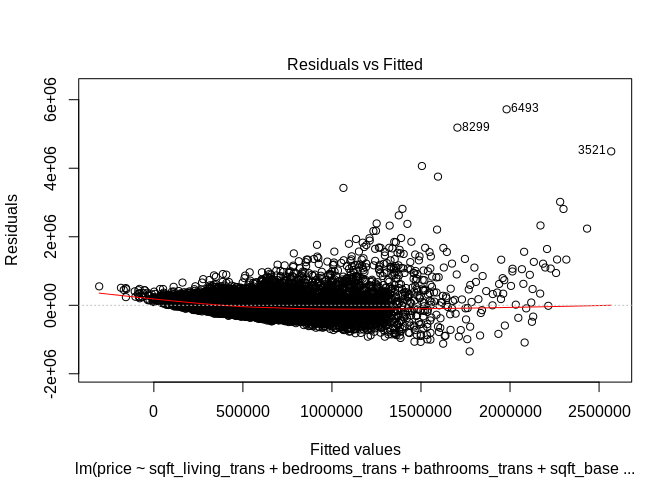<!-- -->

```r
# Residuals qq plot
plot(lm_model_std, 2)
```

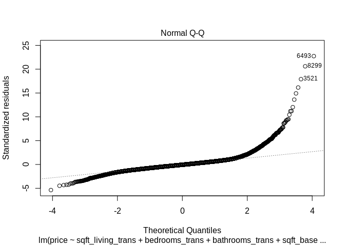<!-- -->

Se puede observar que en este caso al aplicar el precio sin la conversión logarítimica el gráfico Q-Q sobre los residuos no se acerca a una distribución normal. Por otro lado, el error R2 es de 0.54.

**Entrenamiento del logaritmo con variable "price" transformada mediante logaritmo**

```r
lm_model_log = lm(price_trans ~ sqft_living_trans + bedrooms_trans + bathrooms_trans + sqft_basement_trans + sqft_above_trans + grade_trans + condition_trans + view_trans + waterfront_trans + sqft_above_trans + yr_built_trans + sqft_lot_trans, data=df_transformadas)


summary(lm_model_log)
```

```
## 
## Call:
## lm(formula = price_trans ~ sqft_living_trans + bedrooms_trans + 
##     bathrooms_trans + sqft_basement_trans + sqft_above_trans + 
##     grade_trans + condition_trans + view_trans + waterfront_trans + 
##     sqft_above_trans + yr_built_trans + sqft_lot_trans, data = df_transformadas)
## 
## Residuals:
##      Min       1Q   Median       3Q      Max 
## -0.64371 -0.10293  0.00503  0.10233  0.65169 
## 
## Coefficients:
##                                      Estimate Std. Error t value Pr(>|t|)    
## (Intercept)                         3.1834456  0.0508965  62.547  < 2e-16 ***
## sqft_living_trans                   0.7829506  0.0163218  47.970  < 2e-16 ***
## bedrooms_trans4                    -0.0240736  0.0027622  -8.715  < 2e-16 ***
## bedrooms_trans[5,33]               -0.0400963  0.0044296  -9.052  < 2e-16 ***
## bathrooms_trans3                    0.0149778  0.0032200   4.651 3.32e-06 ***
## bathrooms_trans[4,8]                0.1198488  0.0054180  22.120  < 2e-16 ***
## sqft_basement_transbase(1000, inf) -0.0114566  0.0045830  -2.500  0.01244 *  
## sqft_basement_transno_base         -0.0001795  0.0034038  -0.053  0.95795    
## sqft_above_trans[1210,1564)        -0.0122009  0.0037204  -3.279  0.00104 ** 
## sqft_above_trans[1564,2216)        -0.0224536  0.0050815  -4.419 9.98e-06 ***
## sqft_above_trans[2216,9410]         0.0219629  0.0076087   2.887  0.00390 ** 
## grade_trans10                       0.0382870  0.0027317  14.016  < 2e-16 ***
## grade_trans11                       0.0836074  0.0038570  21.677  < 2e-16 ***
## condition_trans4                    0.0169452  0.0026907   6.298 3.08e-10 ***
## condition_trans5                    0.0434966  0.0042237  10.298  < 2e-16 ***
## view_trans[1,4]                     0.0873905  0.0039370  22.197  < 2e-16 ***
## waterfront_trans1                   0.2096667  0.0127223  16.480  < 2e-16 ***
## yr_built_trans[1960,1990)          -0.0840429  0.0029323 -28.661  < 2e-16 ***
## yr_built_trans[1990,2015]          -0.1082314  0.0036415 -29.722  < 2e-16 ***
## sqft_lot_trans[ 5042,   7621)      -0.0830848  0.0031596 -26.296  < 2e-16 ***
## sqft_lot_trans[ 7621,  10652)      -0.0932985  0.0033590 -27.775  < 2e-16 ***
## sqft_lot_trans[10652,1651359]      -0.0689835  0.0035545 -19.408  < 2e-16 ***
## ---
## Signif. codes:  0 '***' 0.001 '**' 0.01 '*' 0.05 '.' 0.1 ' ' 1
## 
## Residual standard error: 0.1484 on 19417 degrees of freedom
## Multiple R-squared:  0.5812,	Adjusted R-squared:  0.5808 
## F-statistic:  1283 on 21 and 19417 DF,  p-value: < 2.2e-16
```

```r
# Residuals normality
plot(lm_model_log, 1)
```

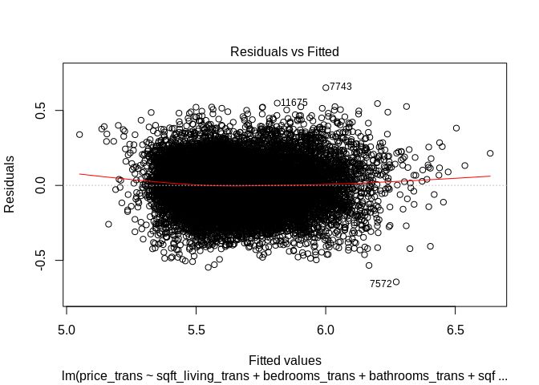<!-- -->

```r
# Residuals qq plot
plot(lm_model_log, 2)
```

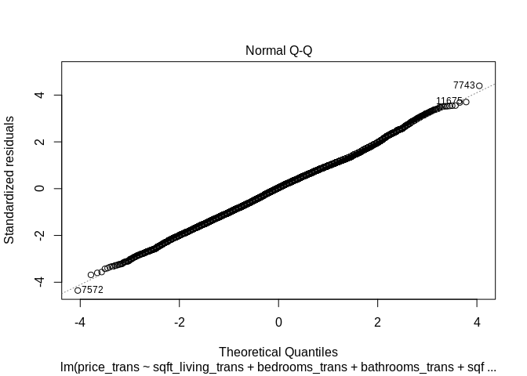<!-- -->

```r
# Normality test
lillie.test(lm_model_log$residuals)
```

```
## 
## 	Lilliefors (Kolmogorov-Smirnov) normality test
## 
## data:  lm_model_log$residuals
## D = 0.017163, p-value = 7.249e-14
```

Podemos observar que tras entrenar el modelo LMR sobre la variable precio convertida mediante el logaritmo se obtiene una gráfica Q-Q con una distribución más ajustada a ser normal, a pesar de que tras el test de kolmogorov Smirnov no se acepta la normalidad. Además se puede observar que el error R2 aumenta a 0.58.
<br/>

### Selección de varibles mediante Lasso

```r
data_lasso <- df_transformadas[,-1] 
lambdas <- model.matrix(price_trans~., data = data_lasso)
y <- df_transformadas$price_trans

# Funciones de error por variable
models_lasso <- glmnet(x = lambdas, y = y, alpha = 1)
plot(models_lasso, xvar = "lambda", label = TRUE)
```

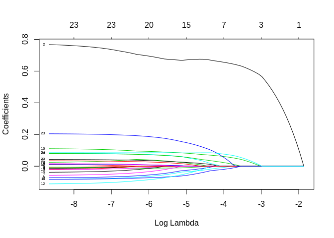<!-- -->

```r
set.seed(737)

# Ajuste de la función de error
cv_lasso <- cv.glmnet(x = lambdas, y = y, alpha = 1)
plot(cv_lasso)
```

<!-- -->

```r
# Registro resumen con variables seleccionadas por Lasso != 0
out_eleven <- glmnet(lambdas,y,alpha=1,lambda = cv_lasso$lambda.1se)
lasso_coef_eleven <- predict(out_eleven, type="coefficients")[1:21,]
lasso_coef_eleven
```

```
##                        (Intercept)                        (Intercept) 
##                       3.427094e+00                       0.000000e+00 
##                  sqft_living_trans sqft_basement_transbase(1000, inf) 
##                       6.973286e-01                       0.000000e+00 
##         sqft_basement_transno_base      sqft_lot_trans[ 5042,   7621) 
##                      -1.219528e-02                      -5.643702e-02 
##      sqft_lot_trans[ 7621,  10652)      sqft_lot_trans[10652,1651359] 
##                      -6.543591e-02                      -3.562403e-02 
##        sqft_above_trans[1210,1564)        sqft_above_trans[1564,2216) 
##                      -4.904879e-05                       0.000000e+00 
##        sqft_above_trans[2216,9410]          yr_built_trans[1960,1990) 
##                       4.073876e-02                      -7.316130e-02 
##          yr_built_trans[1990,2015]                    bedrooms_trans4 
##                      -8.639597e-02                      -7.789614e-03 
##               bedrooms_trans[5,33]                   bathrooms_trans3 
##                      -1.530957e-02                       0.000000e+00 
##               bathrooms_trans[4,8]              floors_trans[1.5,2.5) 
##                       9.399933e-02                       7.921263e-03 
##              floors_trans[2.5,3.5]                   condition_trans4 
##                       7.418065e-02                       9.470070e-03 
##                   condition_trans5 
##                       3.609647e-02
```
Podemos observar que Lasso selecciona aquellas variables que permiten reducir la función de error llegando lo antes posible al mínimo sin penalizar en exceso a las predicciones del modelo.
<br/>


```r
# Lambdas mínimos vs lambdas seleccionados
cv_lasso
```

```
## 
## Call:  cv.glmnet(x = lambdas, y = y, alpha = 1) 
## 
## Measure: Mean-Squared Error 
## 
##        Lambda Measure        SE Nonzero
## min 0.0001739 0.02189 0.0002533      23
## 1se 0.0023532 0.02212 0.0002605      20
```
Podemos ver como para el error que considera Lasso como mínimo usa 23 variables, en cambio ha obtenido muy buenos resultados quitando 3 variables.
<br/>


```r
# Test de normalidad de residuos
preds_lasso <- predict(out_eleven,lambdas)
residuals_lasso <- y - preds_lasso
lillie.test(residuals_lasso)
```

```
## 
## 	Lilliefors (Kolmogorov-Smirnov) normality test
## 
## data:  residuals_lasso
## D = 0.021656, p-value < 2.2e-16
```
<br/>

```r
# Error de R2 tras la selección mediante Lasso
rsq_lasso <- cor(y, preds_lasso)^2
sprintf("R2 = %f", rsq_lasso)
```

```
## [1] "R2 = 0.580651"
```
Finalmente podemos observar que el error R2 obtenido mediante Lasso es muy similar al obtenido manualmente en los apartados anteriores.

<br/>
<br/>

### Selección de variables automática mediante Best Subset

**Método 01: Best Subset.**

```r
best_subsets_models <- regsubsets(price_trans~., data = df_transformadas[,-1], nvmax = 22)
summary(best_subsets_models)
```

```
## Subset selection object
## Call: regsubsets.formula(price_trans ~ ., data = df_transformadas[, 
##     -1], nvmax = 22)
## 23 Variables  (and intercept)
##                                    Forced in Forced out
## sqft_living_trans                      FALSE      FALSE
## sqft_basement_transbase(1000, inf)     FALSE      FALSE
## sqft_basement_transno_base             FALSE      FALSE
## sqft_lot_trans[ 5042,   7621)          FALSE      FALSE
## sqft_lot_trans[ 7621,  10652)          FALSE      FALSE
## sqft_lot_trans[10652,1651359]          FALSE      FALSE
## sqft_above_trans[1210,1564)            FALSE      FALSE
## sqft_above_trans[1564,2216)            FALSE      FALSE
## sqft_above_trans[2216,9410]            FALSE      FALSE
## yr_built_trans[1960,1990)              FALSE      FALSE
## yr_built_trans[1990,2015]              FALSE      FALSE
## bedrooms_trans4                        FALSE      FALSE
## bedrooms_trans[5,33]                   FALSE      FALSE
## bathrooms_trans3                       FALSE      FALSE
## bathrooms_trans[4,8]                   FALSE      FALSE
## floors_trans[1.5,2.5)                  FALSE      FALSE
## floors_trans[2.5,3.5]                  FALSE      FALSE
## condition_trans4                       FALSE      FALSE
## condition_trans5                       FALSE      FALSE
## grade_trans10                          FALSE      FALSE
## grade_trans11                          FALSE      FALSE
## waterfront_trans1                      FALSE      FALSE
## view_trans[1,4]                        FALSE      FALSE
## 1 subsets of each size up to 22
## Selection Algorithm: exhaustive
##           sqft_living_trans sqft_basement_transbase(1000, inf)
## 1  ( 1 )  "*"               " "                               
## 2  ( 1 )  "*"               " "                               
## 3  ( 1 )  "*"               " "                               
## 4  ( 1 )  "*"               " "                               
## 5  ( 1 )  "*"               " "                               
## 6  ( 1 )  "*"               " "                               
## 7  ( 1 )  "*"               " "                               
## 8  ( 1 )  "*"               " "                               
## 9  ( 1 )  "*"               " "                               
## 10  ( 1 ) "*"               " "                               
## 11  ( 1 ) "*"               " "                               
## 12  ( 1 ) "*"               " "                               
## 13  ( 1 ) "*"               " "                               
## 14  ( 1 ) "*"               " "                               
## 15  ( 1 ) "*"               " "                               
## 16  ( 1 ) "*"               " "                               
## 17  ( 1 ) "*"               " "                               
## 18  ( 1 ) "*"               " "                               
## 19  ( 1 ) "*"               " "                               
## 20  ( 1 ) "*"               " "                               
## 21  ( 1 ) "*"               " "                               
## 22  ( 1 ) "*"               "*"                               
##           sqft_basement_transno_base sqft_lot_trans[ 5042,   7621)
## 1  ( 1 )  " "                        " "                          
## 2  ( 1 )  " "                        " "                          
## 3  ( 1 )  " "                        " "                          
## 4  ( 1 )  " "                        " "                          
## 5  ( 1 )  " "                        " "                          
## 6  ( 1 )  " "                        " "                          
## 7  ( 1 )  " "                        " "                          
## 8  ( 1 )  " "                        "*"                          
## 9  ( 1 )  " "                        "*"                          
## 10  ( 1 ) " "                        "*"                          
## 11  ( 1 ) " "                        "*"                          
## 12  ( 1 ) " "                        "*"                          
## 13  ( 1 ) " "                        "*"                          
## 14  ( 1 ) " "                        "*"                          
## 15  ( 1 ) " "                        "*"                          
## 16  ( 1 ) " "                        "*"                          
## 17  ( 1 ) " "                        "*"                          
## 18  ( 1 ) " "                        "*"                          
## 19  ( 1 ) " "                        "*"                          
## 20  ( 1 ) " "                        "*"                          
## 21  ( 1 ) " "                        "*"                          
## 22  ( 1 ) " "                        "*"                          
##           sqft_lot_trans[ 7621,  10652) sqft_lot_trans[10652,1651359]
## 1  ( 1 )  " "                           " "                          
## 2  ( 1 )  " "                           " "                          
## 3  ( 1 )  " "                           " "                          
## 4  ( 1 )  " "                           " "                          
## 5  ( 1 )  " "                           " "                          
## 6  ( 1 )  " "                           " "                          
## 7  ( 1 )  " "                           " "                          
## 8  ( 1 )  "*"                           " "                          
## 9  ( 1 )  "*"                           "*"                          
## 10  ( 1 ) "*"                           "*"                          
## 11  ( 1 ) "*"                           "*"                          
## 12  ( 1 ) "*"                           "*"                          
## 13  ( 1 ) "*"                           "*"                          
## 14  ( 1 ) "*"                           "*"                          
## 15  ( 1 ) "*"                           "*"                          
## 16  ( 1 ) "*"                           "*"                          
## 17  ( 1 ) "*"                           "*"                          
## 18  ( 1 ) "*"                           "*"                          
## 19  ( 1 ) "*"                           "*"                          
## 20  ( 1 ) "*"                           "*"                          
## 21  ( 1 ) "*"                           "*"                          
## 22  ( 1 ) "*"                           "*"                          
##           sqft_above_trans[1210,1564) sqft_above_trans[1564,2216)
## 1  ( 1 )  " "                         " "                        
## 2  ( 1 )  " "                         " "                        
## 3  ( 1 )  " "                         " "                        
## 4  ( 1 )  " "                         " "                        
## 5  ( 1 )  " "                         " "                        
## 6  ( 1 )  " "                         " "                        
## 7  ( 1 )  " "                         " "                        
## 8  ( 1 )  " "                         " "                        
## 9  ( 1 )  " "                         " "                        
## 10  ( 1 ) " "                         " "                        
## 11  ( 1 ) " "                         " "                        
## 12  ( 1 ) " "                         " "                        
## 13  ( 1 ) " "                         " "                        
## 14  ( 1 ) " "                         " "                        
## 15  ( 1 ) " "                         " "                        
## 16  ( 1 ) " "                         " "                        
## 17  ( 1 ) " "                         " "                        
## 18  ( 1 ) " "                         " "                        
## 19  ( 1 ) "*"                         "*"                        
## 20  ( 1 ) "*"                         "*"                        
## 21  ( 1 ) "*"                         "*"                        
## 22  ( 1 ) "*"                         "*"                        
##           sqft_above_trans[2216,9410] yr_built_trans[1960,1990)
## 1  ( 1 )  " "                         " "                      
## 2  ( 1 )  " "                         " "                      
## 3  ( 1 )  " "                         "*"                      
## 4  ( 1 )  " "                         "*"                      
## 5  ( 1 )  " "                         "*"                      
## 6  ( 1 )  " "                         "*"                      
## 7  ( 1 )  " "                         "*"                      
## 8  ( 1 )  " "                         "*"                      
## 9  ( 1 )  " "                         "*"                      
## 10  ( 1 ) " "                         "*"                      
## 11  ( 1 ) " "                         "*"                      
## 12  ( 1 ) "*"                         "*"                      
## 13  ( 1 ) "*"                         "*"                      
## 14  ( 1 ) "*"                         "*"                      
## 15  ( 1 ) "*"                         "*"                      
## 16  ( 1 ) "*"                         "*"                      
## 17  ( 1 ) "*"                         "*"                      
## 18  ( 1 ) "*"                         "*"                      
## 19  ( 1 ) " "                         "*"                      
## 20  ( 1 ) " "                         "*"                      
## 21  ( 1 ) "*"                         "*"                      
## 22  ( 1 ) "*"                         "*"                      
##           yr_built_trans[1990,2015] bedrooms_trans4 bedrooms_trans[5,33]
## 1  ( 1 )  " "                       " "             " "                 
## 2  ( 1 )  " "                       " "             " "                 
## 3  ( 1 )  " "                       " "             " "                 
## 4  ( 1 )  "*"                       " "             " "                 
## 5  ( 1 )  "*"                       " "             " "                 
## 6  ( 1 )  "*"                       " "             " "                 
## 7  ( 1 )  "*"                       " "             " "                 
## 8  ( 1 )  "*"                       " "             " "                 
## 9  ( 1 )  "*"                       " "             " "                 
## 10  ( 1 ) "*"                       " "             " "                 
## 11  ( 1 ) "*"                       " "             " "                 
## 12  ( 1 ) "*"                       " "             " "                 
## 13  ( 1 ) "*"                       " "             " "                 
## 14  ( 1 ) "*"                       " "             " "                 
## 15  ( 1 ) "*"                       " "             "*"                 
## 16  ( 1 ) "*"                       "*"             "*"                 
## 17  ( 1 ) "*"                       "*"             "*"                 
## 18  ( 1 ) "*"                       "*"             "*"                 
## 19  ( 1 ) "*"                       "*"             "*"                 
## 20  ( 1 ) "*"                       "*"             "*"                 
## 21  ( 1 ) "*"                       "*"             "*"                 
## 22  ( 1 ) "*"                       "*"             "*"                 
##           bathrooms_trans3 bathrooms_trans[4,8] floors_trans[1.5,2.5)
## 1  ( 1 )  " "              " "                  " "                  
## 2  ( 1 )  " "              " "                  " "                  
## 3  ( 1 )  " "              " "                  " "                  
## 4  ( 1 )  " "              " "                  " "                  
## 5  ( 1 )  " "              "*"                  " "                  
## 6  ( 1 )  " "              "*"                  " "                  
## 7  ( 1 )  " "              "*"                  " "                  
## 8  ( 1 )  " "              "*"                  " "                  
## 9  ( 1 )  " "              "*"                  " "                  
## 10  ( 1 ) " "              "*"                  " "                  
## 11  ( 1 ) " "              "*"                  " "                  
## 12  ( 1 ) " "              "*"                  " "                  
## 13  ( 1 ) " "              "*"                  " "                  
## 14  ( 1 ) " "              "*"                  " "                  
## 15  ( 1 ) " "              "*"                  " "                  
## 16  ( 1 ) " "              "*"                  " "                  
## 17  ( 1 ) " "              "*"                  " "                  
## 18  ( 1 ) "*"              "*"                  " "                  
## 19  ( 1 ) " "              "*"                  "*"                  
## 20  ( 1 ) "*"              "*"                  "*"                  
## 21  ( 1 ) "*"              "*"                  "*"                  
## 22  ( 1 ) "*"              "*"                  "*"                  
##           floors_trans[2.5,3.5] condition_trans4 condition_trans5 grade_trans10
## 1  ( 1 )  " "                   " "              " "              " "          
## 2  ( 1 )  " "                   " "              " "              " "          
## 3  ( 1 )  " "                   " "              " "              " "          
## 4  ( 1 )  " "                   " "              " "              " "          
## 5  ( 1 )  " "                   " "              " "              " "          
## 6  ( 1 )  " "                   " "              " "              " "          
## 7  ( 1 )  "*"                   " "              " "              " "          
## 8  ( 1 )  " "                   " "              " "              " "          
## 9  ( 1 )  " "                   " "              " "              " "          
## 10  ( 1 ) " "                   " "              " "              " "          
## 11  ( 1 ) " "                   " "              " "              "*"          
## 12  ( 1 ) " "                   " "              " "              "*"          
## 13  ( 1 ) "*"                   " "              " "              "*"          
## 14  ( 1 ) "*"                   " "              "*"              "*"          
## 15  ( 1 ) "*"                   " "              "*"              "*"          
## 16  ( 1 ) "*"                   " "              "*"              "*"          
## 17  ( 1 ) "*"                   "*"              "*"              "*"          
## 18  ( 1 ) "*"                   "*"              "*"              "*"          
## 19  ( 1 ) "*"                   "*"              "*"              "*"          
## 20  ( 1 ) "*"                   "*"              "*"              "*"          
## 21  ( 1 ) "*"                   "*"              "*"              "*"          
## 22  ( 1 ) "*"                   "*"              "*"              "*"          
##           grade_trans11 waterfront_trans1 view_trans[1,4]
## 1  ( 1 )  " "           " "               " "            
## 2  ( 1 )  " "           " "               "*"            
## 3  ( 1 )  " "           " "               "*"            
## 4  ( 1 )  " "           " "               "*"            
## 5  ( 1 )  " "           " "               "*"            
## 6  ( 1 )  "*"           " "               "*"            
## 7  ( 1 )  "*"           " "               "*"            
## 8  ( 1 )  "*"           " "               "*"            
## 9  ( 1 )  "*"           " "               "*"            
## 10  ( 1 ) "*"           "*"               "*"            
## 11  ( 1 ) "*"           "*"               "*"            
## 12  ( 1 ) "*"           "*"               "*"            
## 13  ( 1 ) "*"           "*"               "*"            
## 14  ( 1 ) "*"           "*"               "*"            
## 15  ( 1 ) "*"           "*"               "*"            
## 16  ( 1 ) "*"           "*"               "*"            
## 17  ( 1 ) "*"           "*"               "*"            
## 18  ( 1 ) "*"           "*"               "*"            
## 19  ( 1 ) "*"           "*"               "*"            
## 20  ( 1 ) "*"           "*"               "*"            
## 21  ( 1 ) "*"           "*"               "*"            
## 22  ( 1 ) "*"           "*"               "*"
```

```r
for (metric in c("r2", "adjr2", "Cp", "bic")){plot(best_subsets_models,scale=metric)}
```

<!-- --><!-- -->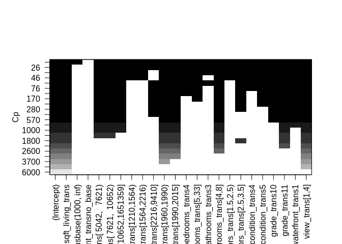<!-- -->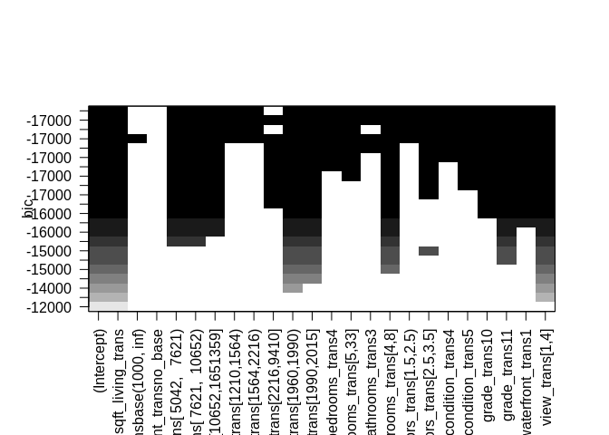<!-- -->

**Método 02: forward.**

```r
regfit_fwd <- leaps::regsubsets(price_trans~., df_transformadas[,-1], method="forward")
for (metric in c("r2", "adjr2", "Cp", "bic")){plot(regfit_fwd, scale=metric)}
```

<!-- --><!-- -->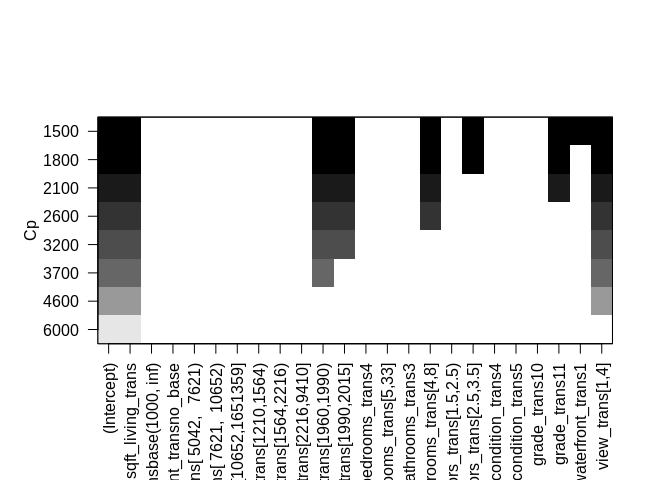<!-- -->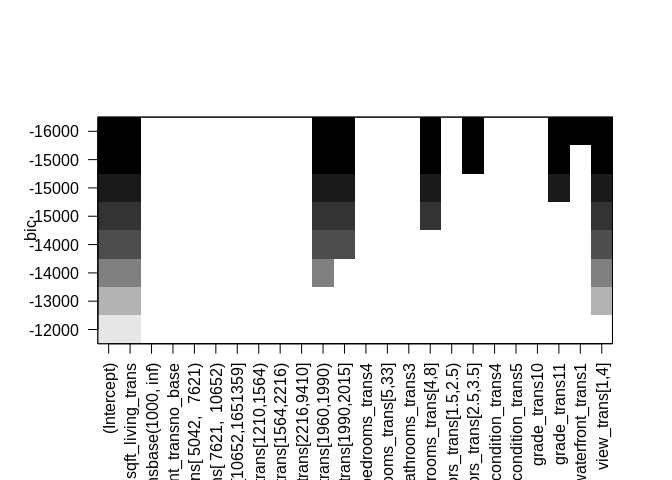<!-- -->

**Método 03: backward.**

```r
regfit_fwd <- leaps::regsubsets(price_trans~., df_transformadas, method="backward")
for (metric in c("r2", "adjr2", "Cp", "bic")){plot(regfit_fwd, scale=metric)}
```

<!-- -->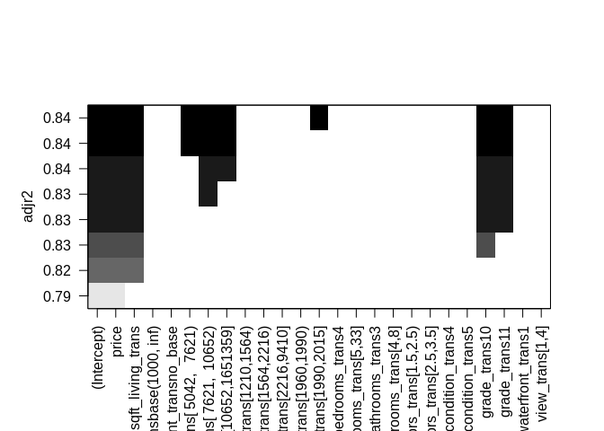<!-- --><!-- --><!-- -->

Tras la aplicación de los siguientes métodos automáticos de selección de parámetros podemos observar que se acercan bastante a la selección de variable escogidas por el método Lasso.
